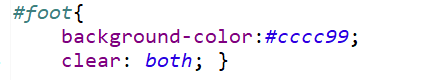

## Box Model


----


### position


```html
border-radius : 20px; /*둥근 가장자리*/
```

---

### overflow


이렇게 글자가 너무 많아서 넘쳐 흐를 경우 다음과 같이 해결한다.


---


### Position

* `relative` :  원래 있어야하는 위치에서부터 상대적 위치로 이동 (평행이동)
* `static` :  원래 기본 흐름대로 보여진다. 원래 있어야 하는 위치에 있다.
  * 위에서 아래로, 왼쪽에서 오른쪽으로 부모의 위치에 영향을 받는다. 
* `absolute` : 부모의 위치로부터 절대적 위치로이동
  * absolute 는 다큐먼트 기준이라. 따라서 해상도와 상관없이 무조건 보인다. 
    현재 화면에서 안보이면, 스크롤 움직여서 볼 수 있다. 
* `fixed` : 부모의 포지션과 상관없이 지정한 위치로 이동. 윈도우 기준으로 이동
  * fixed은 내가 화면을 내려도 계속 보인다. 윈도우 기준으로 무조건 지정된 위치에서 보여진다. 내가화면을 계속 내려도 위에 둥둥 떠서 보인다. 
  * 하지만 만약 윈도우 해상도를 벗어나는 fixed 개체라면, 윈도우 기준이므로 스크롤을 아무리 움직여도 볼 수 없다. 
  * 윈도우 해상도를 벗어나지 않으면 스크롤 해도 화면에서 지정한 위치에 계속 고정된다. 


---


**<오류해결>** 톰캣 포트와 충돌이 일어나는 경우 작업관리자에서 Java선택해서 작업끝내기 하면 된다. 


---

width 할때 픽셀로 잡으면 해상도 변경 시 문제가 될 수 있으므로 퍼센트로 적어주었다.

float의 영향을 제거하고, 다음 영역으로 하고 싶을땐 `clear` : 속성을 사용한다. 




footer 고정하고 싶을때 방법 찾아보기  (만약 위 div의 텍스트가 줄어들 경우, footer가 올라갈 수도 있기 때문에)


