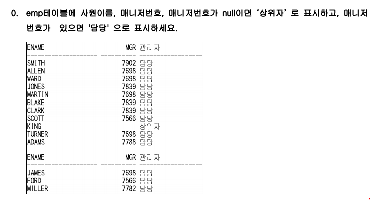
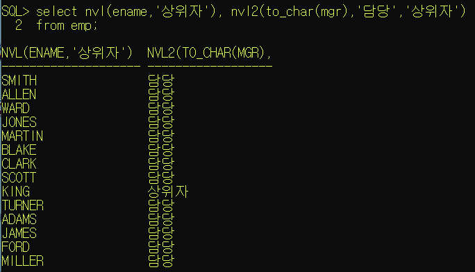
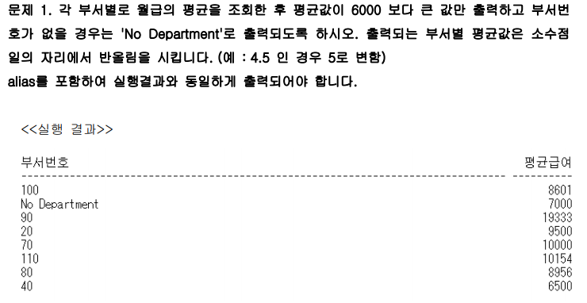
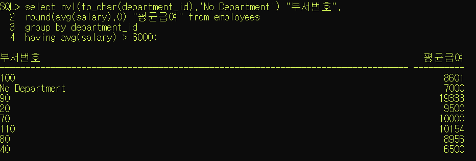
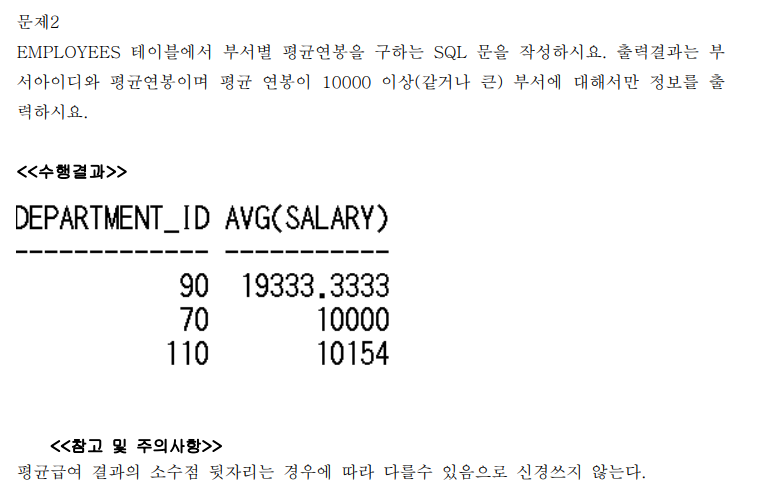
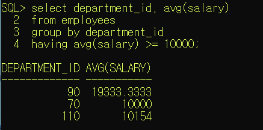
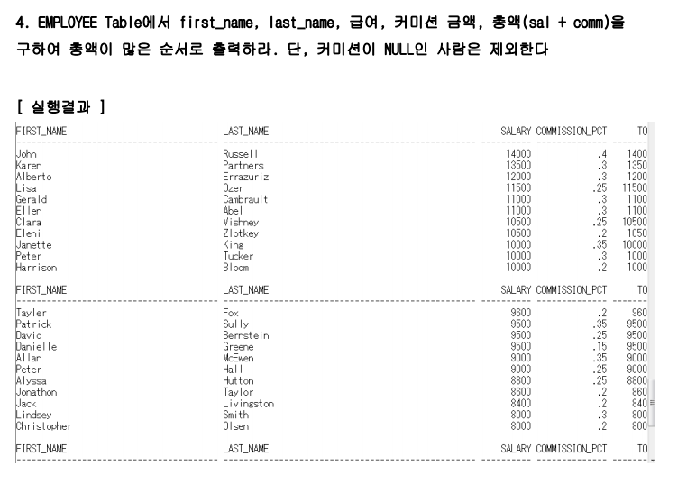
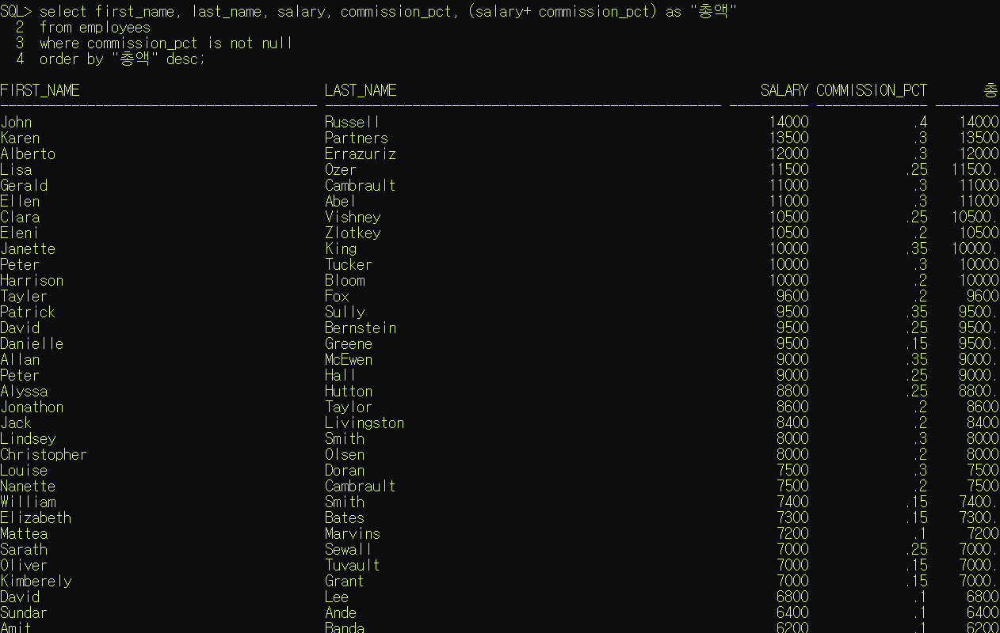

\1. "SMITH의 급여 800만원"의 유형으로 출력할 수 있도록 concat함수를 써서 작업하세요.   단, 급여가 1000만원 미만인 직원에 대해서 작업

```bash
select concat(concat(ename,'의 급여'),concat(sal,'만원'))
from emp
where sal<1000
```

---


\2. 입사일이 81년인 직원에 대해서 각 직원의 이름과 입사일을 나타내시오. (substr이용)

```bash
select ename,hiredate
from emp
where substr(hiredate,1,2)=81;
```


---


\3. 각 직원의 이름,job,급여를 나타내되 급여는 5자리로 나타내며 부족한 자릿수는 *로 표시한다.    급여가 2000만원 이하인 직원만 나타내기

---

```bash
select ename,job,rpad(sal,5,'*')

from emp

where sal<=2000;

```

---


\4. 3번의 결과에서 *를 없애고 출력해보세요..단,함수를 이용하여 작업

```bash
select ename,job,trim('*' from rpad(sal,5,'*'))

from emp

where sal<=2000
[출처] 문자열함수|작성자 heaves1
```

---


\5. emp 테이블에서 scott의 사원번호, 성명, 담당업무(소문자로), 부서번호를조회한다.

```bash
select empno,ename,lower(job),deptno

from emp

where lower(ename) = 'scott'

```


---

\6. emp 테이블에서 이름의 첫글자가 'K'보다크고 'Y'보다 작은 사원의 사원번호, 이름, 업무, 급여,    부서번호를 조회한다. 단, 이름순으로 정렬하여라.

```bash
select empno,ename,job,sal,deptno

from emp

where substr(ename,1,1)>'K' and

substr(ename,1,1)<'Y'

order by ename

```


---


\7. emp 테이블에서 10번부서의 사원에 대하여 담당업무 중 좌측에 'A'를 삭제하고 급여 중   좌측의 1을 삭제하여 출력하여라.

**[출처]** [문자열함수](https://blog.naver.com/heaves1/221742342910)|**작성자** [heaves1](https://blog.naver.com/heaves1)

```bash
select deptno,ename,ltrim(job,'A') 담당업무,ltrim(sal,1) 급여

from emp

where deptno=10;

```

---








---







```bash
select nvl(to_char(department_id_,'No Department') 부서번호,
round(avg(salary),0) "평균 급여"
from employees
group by department_id
having round(avg(salary),0) > 6000;
```

원래 select뒤에 있는 거랑 group by 뒤에 있는 것이랑 같아야 하는데

`nvl(to_char(department_id_,'No Department')` 는 null 값을 채워준 것이고, group by 뒤에는 그냥 컬럼값인 `department_id` 만 써줘도 된다. 


---







---


---







---