1. SALESMAN의사원번호, 이름, 급여, 부서명, 근무지코드를조회

```bash

```


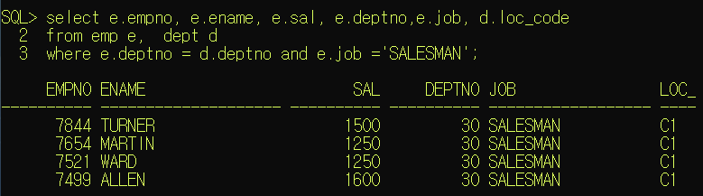


2.사원이름,부서명, 급여, 근무도시명을조회

//emp의 deptno를 통해 dept의 ,deptno를 가서, dept로 접근 후 dept 의 loc_code에서 locations테이블의 loc_code로

```bash

```


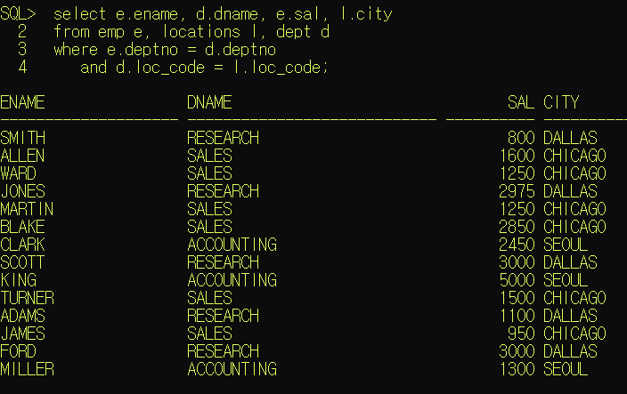


3.DALLAS에근무하는사원중급여1500 이상인사원의이름,급여,업무, 입사일, 보너스를조회

```bash

```


4.  EMP 테이블과 DEPT 테이블에있는모든자료를 다음과 같이 조회합니다. 사원번호, 이름, 업무, EMP 테이블의부서번호, DEPT 테이블의부서번호, 부서명을조회

   ```bas
   
   ```

   

   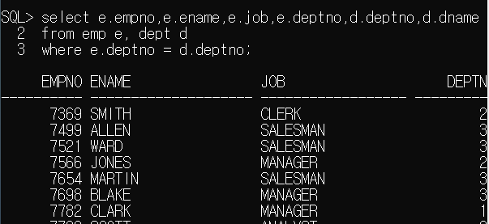


5.DEPT 테이블, LOCATIONS 테이블을이용하여 부서번호, 부서명, 해당부서의city 정보를조회

```bash

```


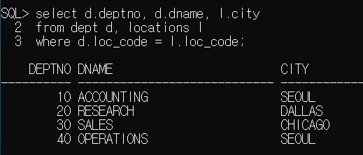


---

### hr계정 조인연습


1. 부서별 인원수를 출력하세요

   ```bash
   select e.first_name, e.last_name,e.salary
   from departments d, employees e
   where e.department_id = d.department_id
   and d.department_name = 'IT'
   order by e.salary asc;
   ```

   

   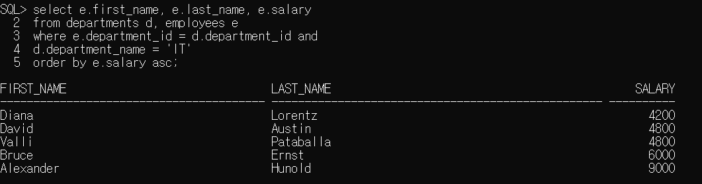

   

   

2. IT 부서에서 일하는 직원의 first_name, last_name, salary 를 출력하시요. 출력결과는 salary 가 낮은 사람부터 출력하시요. 전체 결과는 아래 수행결과처럼 하나의 문자열로 결합되어서 나와야 하며 전체 결과 하나의 컬럼으로 출력되도록 작성하세요

   

   ```bash
   select e.first_name || e.last_name || '의 연봉은'  || e.salary ||  '입니다.'
   from departments d, employees e
   where e.department_id = d.department_id and
   d.department_name = 'IT'
   order by e.salary asc;
   ```

   

   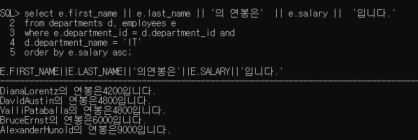

   

   

3. 각 사원(employee)에 대해서 사번(employee_id), 이름(first_name), 업무명(job_title), 부서명(department_name)를 조회하시오. 단 도시명(city)이 ‘Seattle’인 지역(location)의 부서(department)에 근무하는 직원만 출력하시오.

   ```b
   select e.employee_id, e.first_name, j.job_title, d.department_name
   from employees e, jobs j, departments d, locations l
   where e.department_id = d.department_id 
   and e.job_id = j.job_id
   and d.location_id = l.location_id
   and l.city = 'Seattle'
   ```

   

   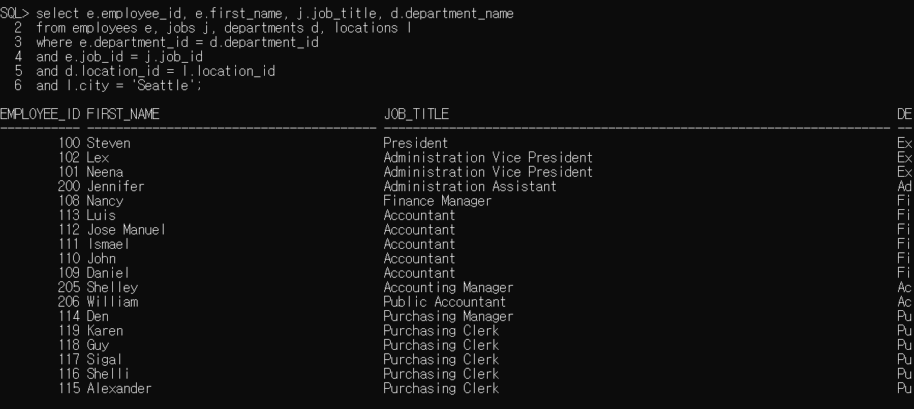


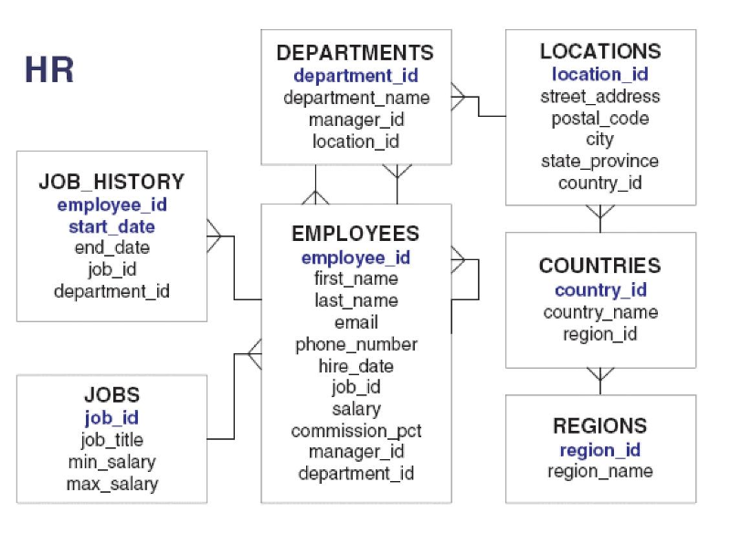

4.

각 직책 별(job_title)로 급여의 총합을 구하되 직책이 Representative 인 사람은 제외하십시오. 단, 급여 총합이 30000 초과인 직책만 나타내며, 급여 총합에 대한 오름차순으로 정렬하십시오. 출력 결과의 컬럼명은 아래 결과와 동일하게 주십시오.


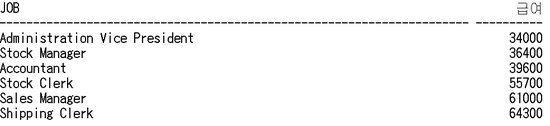


```bash
select j.job_title "Job", sum(e.salary) "급여"
from jobs j, employees e
where e.job_id = j.job_id and
j.job_title != 'Representative'
group by j.job_title
having sum(e.salary) > 30000
order by "급여" asc;
```


5. 각 부서 이름 별로 2005년 이전에 입사한 직원들의 인원수를 조회하시오

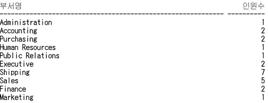

```bash
select d.department_name "부서명", count(e.employee_id) "인원수"
from employees e, departments d
where e.department_id = d.department_Id
and e.hire_date < '2005/01/01'
group by d.department_name;
```


6. 

사원수가 3명 이상의 사원을 포함하고 있는 부서의 부서번호(department_id), 부서이름(department_name), 사원 수, 최고급여, 최저급여, 평균급여, 급여총액을 조회하여 출력하십시오. 출력 결과는 부서에 속한 사원의 수가 많은 순서로 출력하고, 컬럼명은 아래 결과와 동일하게 출력하십시오. (평균급여 계산시 소수점 이하는 버리시오)

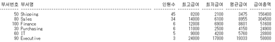

```bash
select d.department_id "부서번호", d.department_name "부서명", 
count(e.employee_id) "인원수", max(e.salary) "최고급여",
min(e.salary) "최저급여", floor(avg(e.salary)) "평균급여", sum(e.salary) "급여총액"
from employees e, departments d
where e.department_id = d.department_id 
group by d.department_id, d.department_name
having count(e.employee_id) >3
order by "인원수" desc;
```


### 그룹을 2 개 순서대로 묶을 때 , 로 구분해서 두 개를 차례대로 적어준다.

### 기준을 나눠놓고 또 소분류를 하는 것.


---

(서브쿼리)


1. 이름에 'T'를 포함하고 있는 사원과 같은 부서에서 근무하는 사원의 이름과 사원번호 출력

```bash
select ename, empno from emp
where deptno in (select deptno from emp
                   where ename like '%T%');
```


2. 20번 부서의 최고 급여보다 급여가 많은 사원들의 사원명, 부서코드, 급여 목록 출력하기

```bash
select ename, deptno, sal from emp
where sal > (select max(sal) from emp
				where deptno = 20);
```


3. 1982년에 입사한 직원의 평균 급여보다 급여가 높은 사원들의 사원명, 입사일, 급여의 목록을  출력하기


```bash
select ename, hiredate, sal from emp
where sal > (select avg(sal) from emp
				where hiredate like '82%');
```

