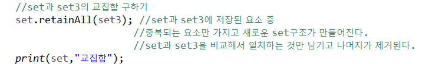
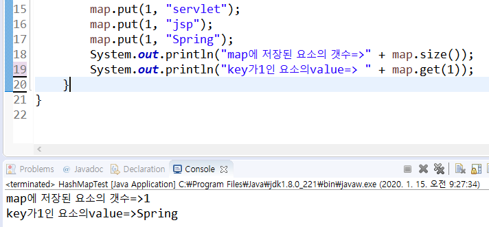

# collection

#### List : 순서가 있는 선형 배열 형태. 순서있는 작업 시 사용

#### Set : 집합, 중복을 허용하지 않고 순서가 없다. 

#### Map : key와 value가 한 쌍. 순서가 없다.


## Set - HashSet

집합, 중복을 허용하지 않는 collection

```java
HashSet<String> set = new HashSet<String>();
```


Iterator : 모든 자료구조에 담긴 데이터를 변환해서 담을 수 있도록 제공되는 추출전용 인터페이스.
				담을 때 무작위로 담긴다. 

`hasNext()` : 이터레이터에 담겨있는 정보를 찾는함수

`next()` : Iterator에 저장된 요소 꺼내서반환하는 작업




## HashMap

* key와 value를 한 쌍으로 저장한다.
* map에서는 key로 요소를구분하기 때문에 key가 같으면 덮어쓴다.




