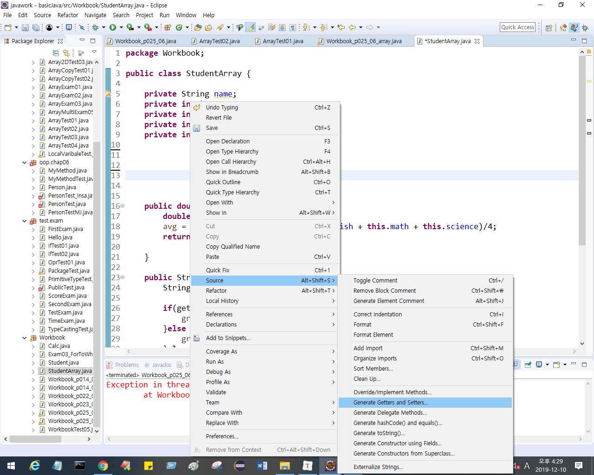
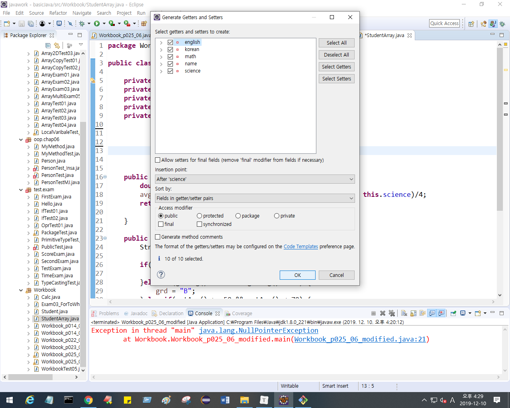

## 1. 클래스

* 시스템을 구성하는 구성 요소들 : `1) 데이터(멤버변수), 2) 기능(메소드)`

* 클래스에서 표현하고 싶은 데이터가 무엇인지 (어떤 시스템을 구축하느냐에 따라 같은 데이터라도 중요도가 달라진다.)
  * 은행의 '고객' 이라는 클래스에는 어떤 정보가 있어야 할까?
    -> 성명, 주민번호, 주소, 전화번호, 대출정보, 자산,  
  * 쇼핑몰의 '고객'이라는 클래스에는어떤 정보가 중요할까?
    -> 성별, 나이, 결혼유무, 자녀유무
* 이 클래스에서 처리할 수 있는 기능은 무엇이 있을까?
  * 은행의 '계좌'라는 클래스에서는?
    -> 계좌이체하기(), 내역조회하기(), 출금하기(), 입금하기()

* 클래스는 하나의 역할만 할 수 있어야 한다.
* **클래스의 기능, 데이터 정의, 데이터 처리 기능** 을 정한다.
* 클래스 형태는 다음과 같다.

```java
class 클래스명{
    데이터타입 데이터; // 여기서 데이터 == 멤버 변수.
    				// 데이터가 어떤 유형인지 타입을 정의
    	.
        .
        .
    기능(변수){		// 변수 : 외부에서 입력받아서 처리할 값
            		//기능 == 메소드
            		// 기능을 표현하고 묶기 위해 블럭으로 묶어준다.  
        }
}
```


### 접근 제어자 p348

일반 클래스에서는 멤버변수들은 외부에서 접근할 수 없게 private으로 막아놓는 작업을 한다.

만약 필요할 땐 적절한 인증 처리를 거쳐서 메소드를 통해서 받을 수 잇게(접근할 수 있게) 한다

데이터를 직접 액세스 하는 것이 아닌, 메소드를 통해 액세스 할 수 있도록.


대부분 메소드나 클래스 앞에는 public

멤버변수 앞에는private가 붙는다.


```java
	public void setEnglish(int english) {
		this.english = english;// this.멤버변수 = 지역변수;
	}
```


클래스는 public, default

멤버변수 앞에는 4개 모두 사용 가능

* 접근 제어자를 이용한 캡슐화


## 메소드

특정 작업을 수행하는 일련의 문장들을 하나로 묶은 것 (기능)

메소드를 사용하는 이유

1. 재사용성
2. 중복된 코드의 제거

```java
public 리턴타입 메소드명(데이터타입 변수명, ..., ... ,....){ 
    //main메소드는 무조건 실행해야 해서 public이 붙는다. 일단 누구나 실행해야 하니까
    // 리턴타입 : 메소드 실행 결과 값의 타입, 실행결과가 없는 경우는 void
    //"데이터타입 변수명" 은 메소드를 실행하기 위해서 외부에서 입력받아야 하는 값을 정의 
    
 여기에 처리할 명령문   
     
     //매개변수는 메소드를 처리하기 위해서 받아주는 역할 
    
}
```


* setter, getter 메소드 만드는 방법






* String은 참조형 변수이지만, 예외로 기본형처럼 리터럴의 형태로 값을 할당하는 것이 가능하다

