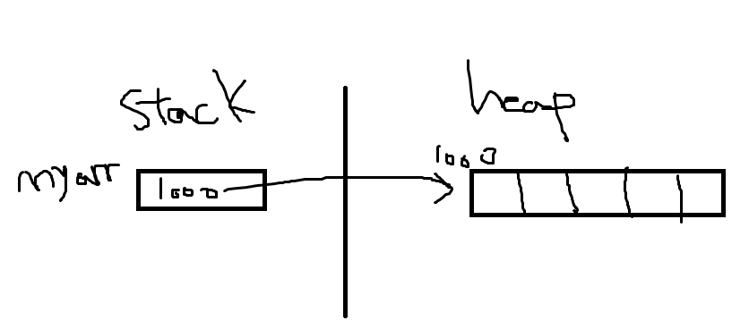
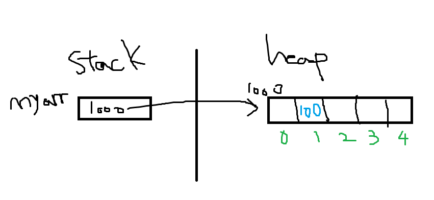
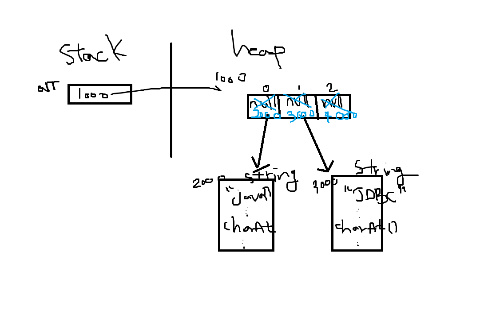
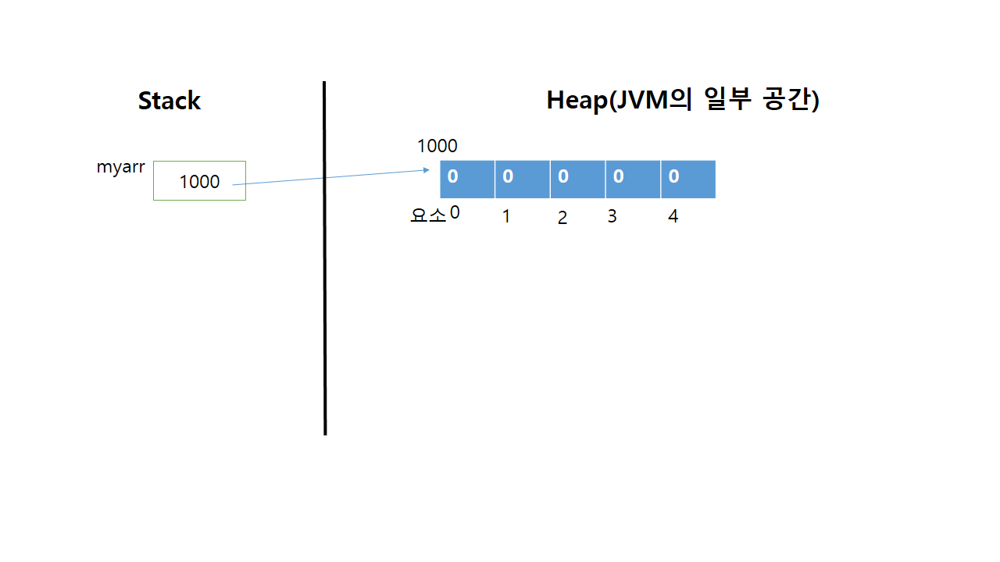
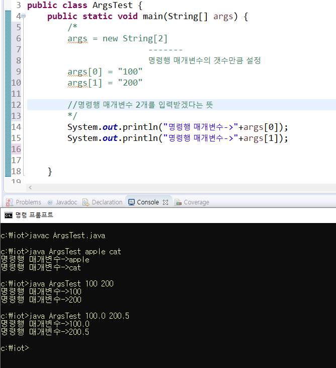
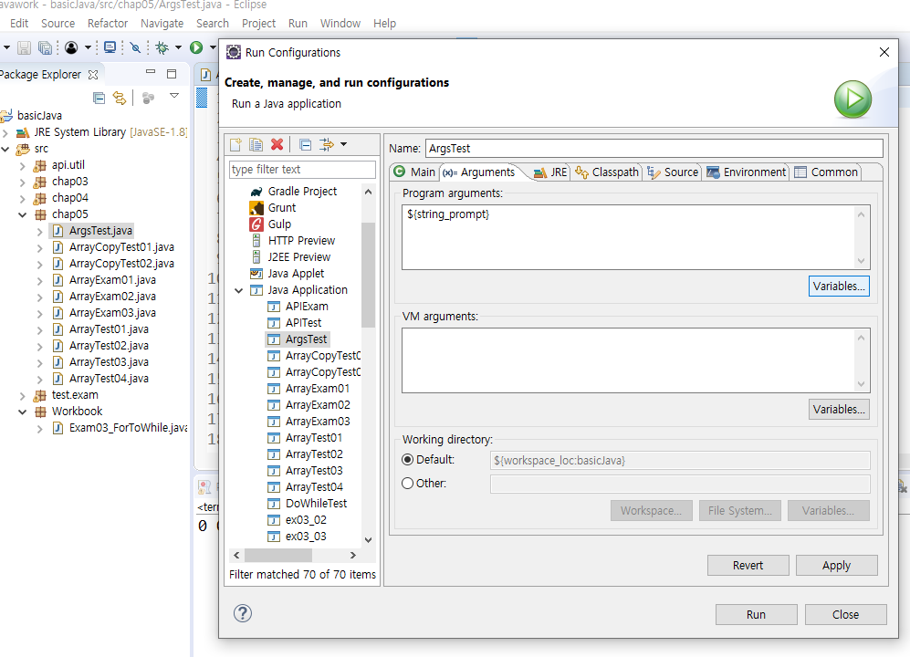
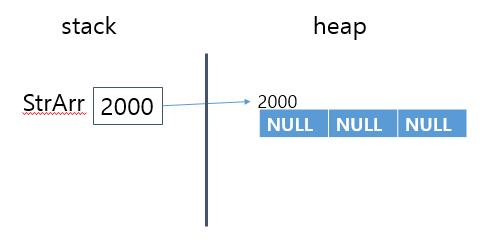
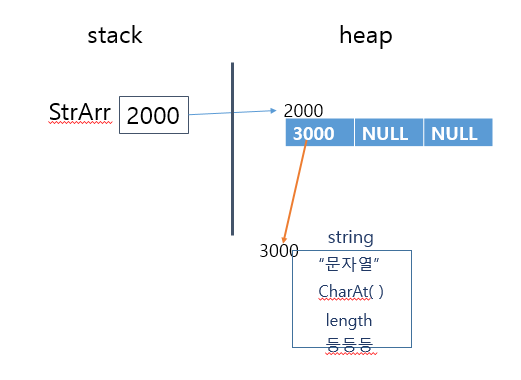
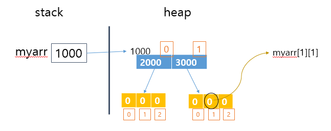
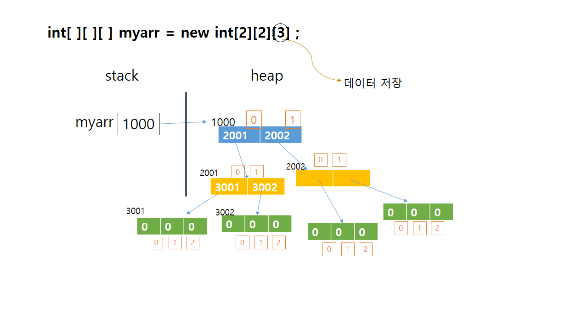

자바 라는인터프리터를 통해서 실행하는 것을 어플리케이션 이라고 한다.
자바라는 인터프리터 안에 public static void main 부터 실행하게끔 되어 있다.


## 1. 변수

```java
데이터타입 변수명 = 초기화작업
```

* 기본형
  * 문자, 숫자, boolean
* 참조형
  * API에 포함된 클래스를 메모리에 올릴 때
  * 내가 만든 클래스를 사용해야 할 때
  * 배열

```java
Class 클래스명{
    
    
}
```

사용하고 싶은 클래스파일을 jvm이 인식할 수 잇는 공간에 펼처놓고 작업을 해야한다.
JVM이 인식할 수 있는 공간은 stack, heap, static 영역.

* stack 과 heap
  heap은 api에서 제공하는 클래스를 올려놓는 곳
  stack은 현재 작업중인 작업 내용이 펼쳐지는 곳
  api는 heap으로 보내줘야 하기때문에 `String str = new String("조작할 문자열");` 

기본형 변수는 값이 직접 변수 안에 들어가있으나, 
참조형 변수는 heap에 할당되어 있는 클래스(=> 객체, 인스턴스)가 heap의 어디에 있는지를 나타내는 주소값을 저장하고 있다.

## 2. 기본형 리터럴

## 3. 연산자

## 4. 제어구문

* 순차형

* 선택형 - 조건문(if, switch)

  * if 

    ```java
    if(조건문){ // 조건문 : true of false로 나올 수 있는 조건
        조건을 만족할 때 실행할 명령문  //들여쓰기 필수
    }else{
        조건을 만족하지 않을 때 실행할 명령문
    }
    ```

  * switch

    ```java
    swtich(판단할 수 있는 값){//value로 환산되는 변수나 연산식 또는 메소드 호출문. int로 캐스팅 할 수 있는 타입과 String이 올 수 있다. 
    	case 값1 :
    		...
    		break;
    		
    	case 값2 :
    		...
    		break;
    		
    	default :
    
    }
    ```

    

* 순환형

  * for `for( int i=0 ; i<10 ; i=i+1 )`

    횟수가 정해져 있을 때 사용

    `for(초기값;조건;증감식)` 으로 구성

  * while 

    횟수가 정해져있지 않음

    ```java
    while(조건식){ //조건식은 참이 되는 것
        
    }
    ```

    

## 5. 배열

데이터 여러개를 한번에 액세스하고 저장하고 다룰 수 있다.
동일한 데이터 타입이어야 한다. 자바에서의 배열은 참조형이다.

* 배열 사용 방법

  **1) 배열의 선언**

  ```java
  int[] myarr; // int형 배열. 배열도 데이터 타입이기 때문에 앞에 써준다.
  ```

  **2) 배열의 생성**

  ```java
  myarr = new int[5];  // 만든 배열이 heap으로 올라가야 하기때문에 new연산자를 쓴다.
      //int형 배열이고, 몇 개의 데이터를 담을 것인지 숫자를 써준다.
  ```

  

  

  

  

  **3) 배열의 초기화**

  ```java
  myarr[1] = 100;
  ```

  







* 참조형 배열은 객체를 가리키는 주소를 배열로 한다.

* 배열은 무조건 참조형, 인트형 배열도 참조형이다.

* 배열 타입의 변수는 기본형이든 참조형이든무조건 참조형


### 차이점

```java
arr[3] = 100; //setter
```

배열의 요소에 값을 세팅


```java
int data = arr[3]; // getter
```

배열의 3번요소에 있는 것을 가져다가 data라는 변수에 할당


### String[] args

* String은 기본형데이터와 스트링 데이터 간에 변환하는 작업을 할 수 있다.

* 명령이 몇개인지 몰라서 []로 쓴다. (유동적)

* 기본형 타입을 레퍼런스형으로 바꿀 수 있게 메소드들 제공 (java.lang-> boolean, byte, Integer 클래스 등등)


* java 클래스명  을 실행할 때 필요한 값이 있으면`java 클래스명 ip port` 이런식으로 하게 된다.

  하지만 값이 다르면 안되기 때문에, ip 와 port를 String으로 간주한 뒤 변환한다.

* 클래스명 뒤에 매개변수가 몇 개인가 세는 것 -> 요소 개수 확인

  띄어쓰기로 구분한다!







## 5-2. 2차원 배열

### 1) String 배열

```java
String[] strArr = new String[3];
```



```java
StrArr[0] = new String("문자열")
```



### 2) String 배열의 선언, 생성, 초기화

```java
String[] strarr = { new String("java"),
                  new String("sevlet")
                  new String("spring")};

// 같은 표현
String[] strarr = new String[3];
strarr[0] = new String("java");
strarr[1] = new String("sevlet");
strarr[2] = new String("spring");
```


### 3) 2차원 배열

```java
int[] myarr;
myarr = int[2][3];
```



```java
int[][][] myarr = new int[2][2][3]; // 맨 마지막 대괄호 부분이 데이터 저장하는 부분
```



