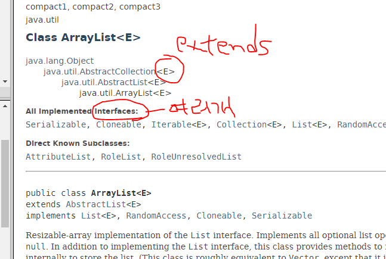

### 클래스 구성요소

* 멤버변수
* 메소드
* 생성자

### OOP 특성

* 캡슐화 (객체 정보를 보호하고, 객체 간 메소드를 통해 데이터 주고받음)
* 상속성
* 다형성

하나의 클래스는 하나의 역할만 수행해야 함.

## 인터페이스

추상메소드만 모아놓은 특별한 추상클래스

원래 자바는 단일상속인데, 인터페이스는 다중상속을 가능하게 한다.

인터페이스 목적 1.추상메소드만 모아놓을 목적, 2.다중상속 가능하게함

==> 다형성을 위해 사용

인터페이스를 설계한다  == 타입을 만든다. 

[Serializable](../../java/io/Serializable.html) => 패킷단위로 쪼개져서 네트워크를 통해 전달될 수 있는 특성의 인터페이스

API (라이브러리) 안에서 운영을 하기 위해서 기능만 갖고있는 게 아니라, 네트웍을 통해 주고받을 수 잇기때문에 Serializable 그룹도 있고 

복제 특성을 위해 Cloneable 그룹 인터페이스도 있다.

