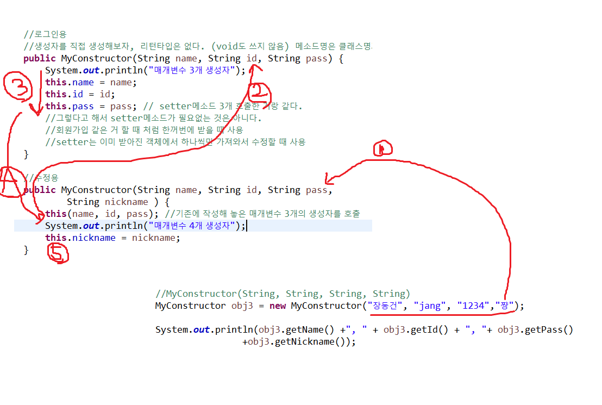
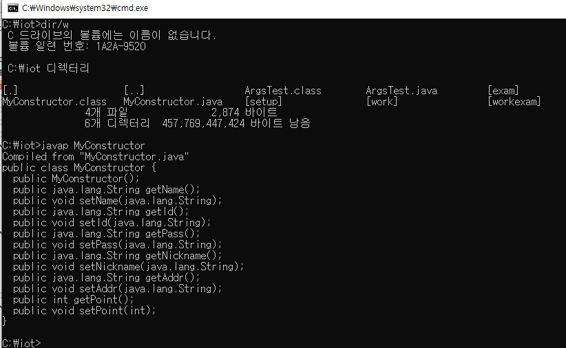
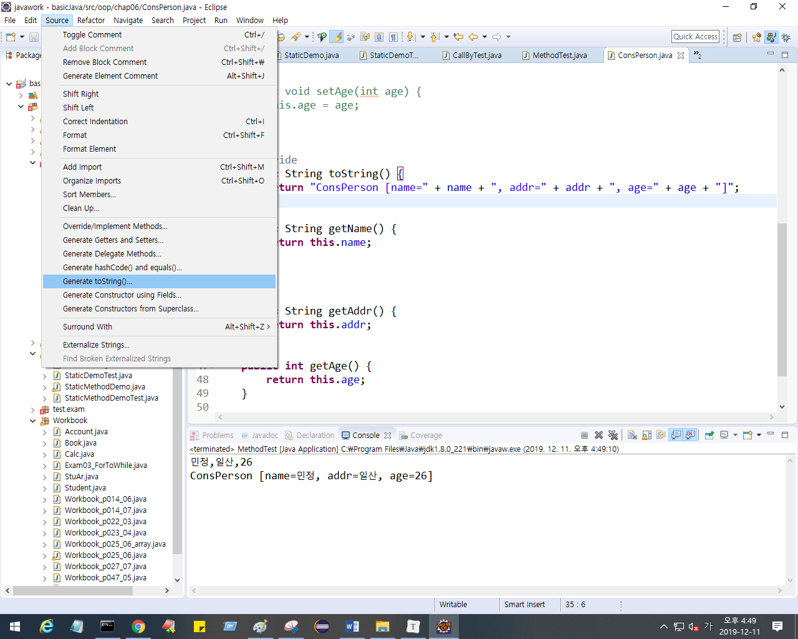

## OOP의 특징 - 1. 캡슐화

private로 데이터를 은닉하고, public 과 set/get메소드를 통해 실행

```java
class 클래스명{
    private 데이터;
    public 메소드(){
        
    }
    
}
```


## OOP의 특징 - 2. 상속성

일반적인 특징들을 뽑아 클래스를  만들어, 하위 클래스들이 상속하게 만든다.

* 코드의 양을 줄일 수 있다.

* 코드 재사용이 가능하다 : 요구사항이 달라져서 클래스가 추가될 경우, 슈퍼클래스(상위클래스)를 상속하도록 만들어 주면 편리하다.

* 상위클래스 하나에서만 수정하면, 나머지 하위 클래스를 굳이 수정하지 않아도 나머지 클래스를 수정한 것과 같은 효과를 얻는다.

  


## 오버로딩

한 클래스 내에서 같은 메소드 이름으로 여러 개 메소드 정의할 수 있다.

* 조건
  * 메소드 이름이 같다.
  * 매개변수의 개수 또는 타입이 달라야 한다. 


## 생성자 

생성자는 메소드이다. 객체가 생성될 때 호출되는 특별한 메소드이며, 주로 자원을 액세스하거나 사용하기위해 초기화, 
자원관련 작업을 하거나 객체가 갖고있는 멤버변수를 초기화 하는 작업을 정의한다. 

인스턴스가 생성될 때 호출되는 '인스턴스 초기화 메서드'


### [ 객체 생성 ]

`클래스타입 변수 = new 생성자메소드()` 
`클래스타입` : 사용할 클래스
여기서 `생성자메소드()` : 클래스 안에 미리 정의되어 있는 생성자 메소드를 호출
										일반 메소드처럼 생성자 메소드도 매개변수로 외부에서 값을 전달받아 사용할 수 있다.

### [규칙]

1. `생성자메소드`명은 클래스명과 대소문자까지 정확하게 동일한 이름으로 정의

   * 리턴타입을 명시하지 않는다.

2. `생성자메소드`를 정의하지 않으면 컴파일러가 `기본생성자`를 제공한다.

   * `기본생성자` : 매개변수가 없는생성자
   * `생성자메소드`를 개발자가 정의하면 컴파일러가 `기본생성자` 를 제공하지 않는다.
   * 처리되는 일이 없다고 하더라도 무조건 기본생성자는 정의해야 한다.

3. `생성자메소드`도 일반 메소드처럼 매개변수를 정의하고 외부에서 값을 전달받아 사용할 수 있다.

   * 주로 객체에 정의된 멤버변수의 값을 초기화하는 작업

4. `생성자메소드`도 일반 메소드처럼 오버로딩을 허용한다. (여러 개 정의 가능)

5. `생성자메소드` 내부에서 다른 생성자 메소드를 호출할 수 있다.

   * this(매개변수....)
   * 반드시 첫 번째 문장에서 호출해야 한다.

   


```java
Person p = new Person(); // new 뒤에 있는게 생성자!
//객체를 생성하는 new 연산자 뒤에만 올 수 있다.
//객체가 갖고있는 값들을 초기화 할 때
//객체가 생성될 때 생성자가 자동으로 만들어진다. 
//매개변수 없는 생성자를 기본생성자 라고 한다. 

자바에서 정의하는 모든 클래스들은 
    힙에다가 클래스를 올려놓는 방법은 new
    new를 통해 생성자 메소드를 호출해야 그 객체에 대한 내용이 초기화되면서 힙에 할당된다.
    따라서 클래스명과 무조건 동일하게 만들어야 한다. 
    실행되는 시점이 딱 한번.
    객체를 생성할 때 초기화 하는 작업으로 사용됨
    
```

일반메소드는 아무때나 쓸 수 있지만, 생성자메소드는 객체가 생성되는 시점에만 실행된다.

(보통은 인스턴스 변수 초기화)

생성자는 리턴값이 없어서 void도 아예 명시하지 않는다.


생성자 메소드도 오버로딩 가능


분명 기본생성자를 만들지 않았는데, 컴파일 하면서 자동으로 생성되었다.




프로그램을 실행하면 클래스로더에 의해 Static에 클래스와 클레스멤버들이 올라가고, Static이 붙은 static멤버들이 올라간다. (그리고 메인도 함께 올라가서 대기)

그리고 stack의 메인 실행하고 heap에 할당되는거 하고 등등등 





## OOP의 특징 - 3. 다형성

