## DBMS

데이터베이스를 저장하고 관리하는 시스템

DBMS에 저장된 데이터를 불러서 수정, 유지, 삭제 등 관리하기 위해 SQL언어를 사용한다.
이 시스템에서 어떤데이터들이 필요할 것인가 선별하는 작업이 중요

시스템분석설계를 하려면 주제잡기 -> 기능선택 -> DB기획 ->

DB2, Oracle, Mysql, MSsql, 티베로

(nosql은 비정형데이터 관리)

* 오라클 : 대용량의 데이터를 빠르게 관리할 수 있도록 도와줌 (관공서, 대기업)
* Mysql, MSsql : 중소기업에서 많이 사용

한글 경로로 설치하지 말 것!! ex.바탕화면...

Client : 요청을 하는 PC / Server: 요청을 받는 PC / DBMS가 있는 Server : DBServer


현재 서비스중인 것들 확인

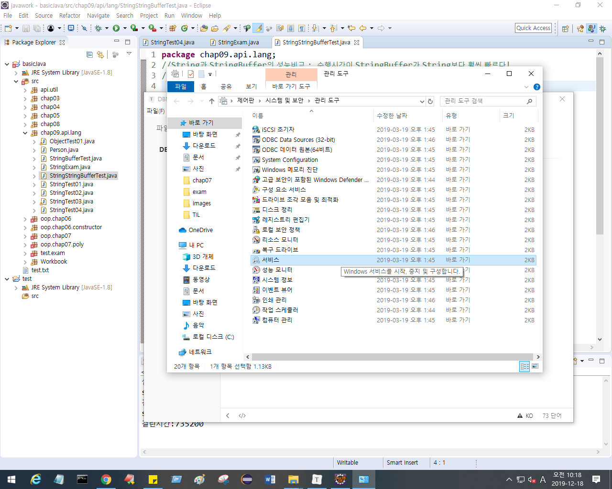


잘 안될 때 다시시작 해보자 ( OracleServiceXE, OracleXETSListener )

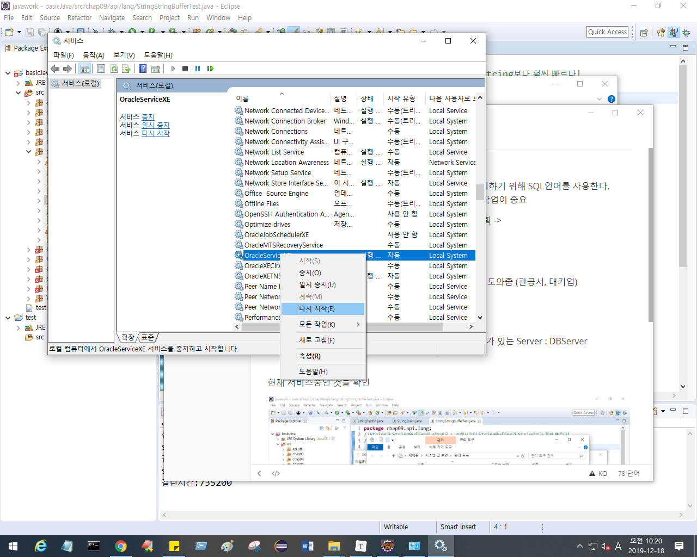


eidtplus없으면 워드패드로 열기


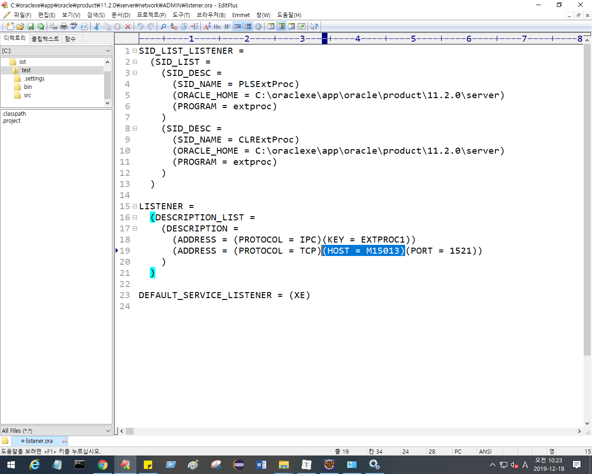

HOST 이름이 한글로되어있으면 안되므로 무조건 영어로 바꿔준다. 

바꾼 후 제어판에서 ( OracleServiceXE, OracleXETSListener ) 두 개 다시시작한다. 


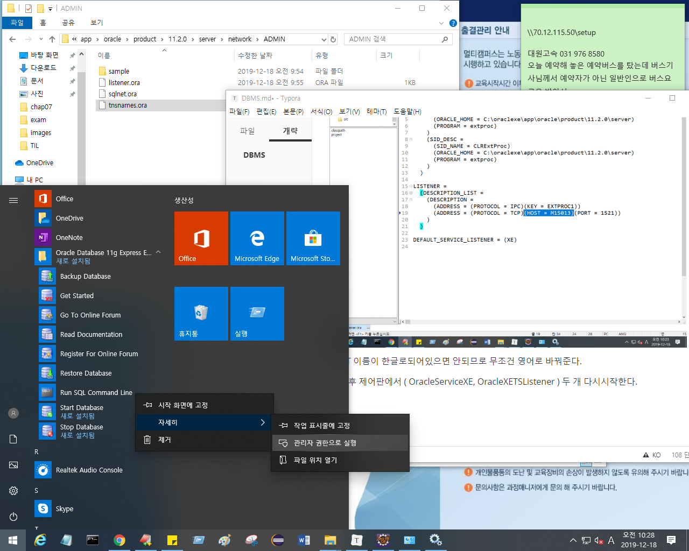

```bash
//계정만들기 명령어
//먼저 system 계정으로 연결하고, 유저 생성

conn system/manaer
create user 유저ID identified by 비밀번호;
```

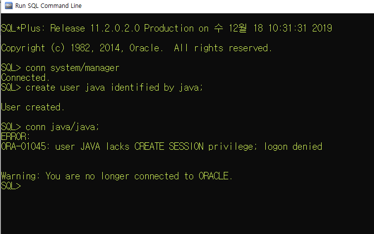

권한이 없어서, 에러가 났다.

에러 뜨면 시스템에 접속하지 않은 상태로 나와서, 다시 접속해야 한다...

Role을 줄 때는  grant를 사용해 Role을 나열한다.

```bash
grant connect,resource to java;
```

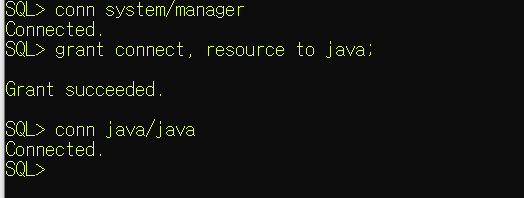

java(유저아이디)에게 연결하고 자원을 볼 수  있는 권한을 주었기때c문에 java는 접속이 가능해졌다. 

```bash
set linesize 300;
```

접속할때마다 라인사이즈를 300으로 설정해준다. 

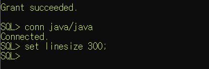

드래그해서 선택한 뒤 오른쪽버튼누르면 copy, 다른 곳에 오른쪽버튼누르면 paste.

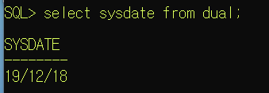

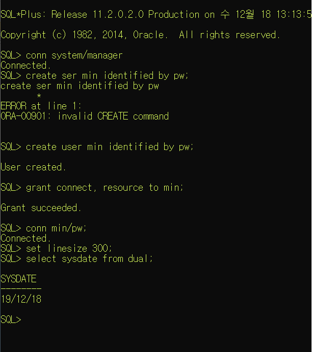


오라클 한글자가 3을 차지

`기본키(primary key)`는 한 테이블에서 대표할만한, 구분할만한 컬럼. 데이터들이  중복되면 안된다!
예를들면

* 고객데이터의 ID,
* 상품테이블에서는 상품번호
* 주문테이블에서는 주문 번호,
* 게시판에서는 게시판글번호 

제약조건인 `NULL 이면 안됨` 을 줄 때는 컬럼을 만들면서 준다 -> 컬럼에서 주는 제약조건

컬럼명 데이터타입 제약조건

```bash
create table customer(
       id varchar2(10) primary key,
       pass varchar2(10),
       name varchar2(15) not null,//컬럼명 데이터타입 제약조건(제약조건은 없어도됨)
       point number, //컬럼명, 데이터타입
       regdate date);
```

```bash
select * from tab; // *은 모든 것을 뜻함
```

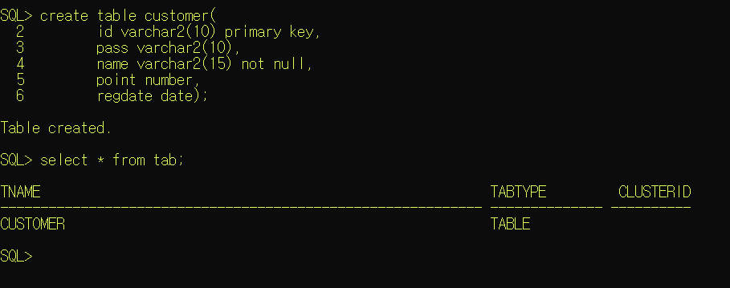

### 작업 중일 때는 현재 내가 어디 계정에서 작업 중인지 알고 있어야 한다.

### `conn ID/PW` 를 통해서 계정에 진입 가능


[테이블 컬럼 이름과 제약조건, 데이터 타입 확인 가능]

```bas
desc 테이블명
```


[테이블에 추가]

```bash
insert into 테이블명 valeus(컬럼에 맞는 값들);
```

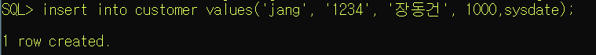


DML은 반드시 작업이 완료된 후에 정상적으로 작업되었습니다 라는 명령을내려야한다.

**`commit`**

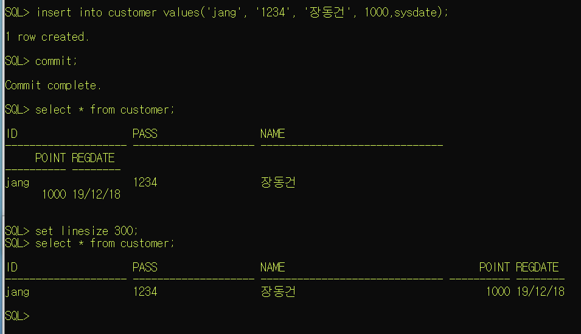

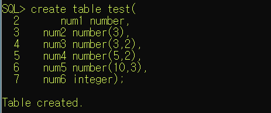

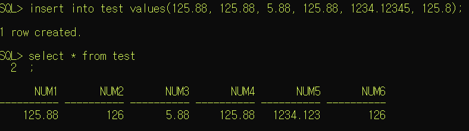


**[테이블 삭제]**

```bash
drop table 테이블명;
```


**[유저 정보 출력]**

```ba
select user from dual; //현재 접속중인 유저 정보 출력
```


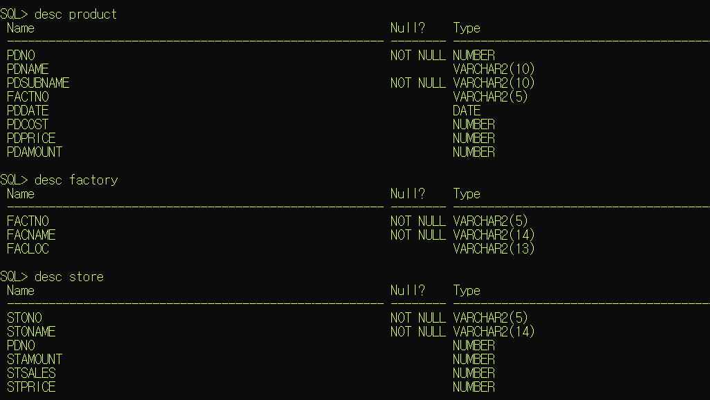


```bash
select * from tab; //모든 테이블 목록을 보여줌
```

select * from 테이블명; //해당 테이블의 정보를 보여줌


### 1. Query - 기본 select 

```bash
select 컬럼명1, 컬럼2 ...
	from 테이블;
```

* sql문은 대소문자를 구분하지 않는다.

* ;는 sql문의 종료를 의미

* ;를 입력하기 전에 여러 줄로 sql문을 작성할 수 있다.

* *는 모든 컬럼을 조회하겠다는 의미

* 컬럼에 null을 저장할 수 있다.

  -> null은 0이나 space만 입력해 놓은 값과는 다른 값
      null은 아무 값도 없는 것을 의미
  	사용할 수 없고 저장되어 있지 않은 상태 

* 컬러명 대신 alias를 정의해서 사용할 수 있다.

  ```bash
  select 컬럼명 alias명,컬럼명 as alisas명, 컬럼명 "alias명" //alias명에 공백이 있는 경우, " "구문을 사용한다. 
  from 테이블명
  ```

* 여러 컬럼을 합쳐서 하나의 컬럼으로 조회할 수 있다.

  || 연산자이용

```bash
select '나의 입사일은' ||컬럼명|| '입니다.'
```


* 오라클의 문자열, 날짜 데이터는 ' '로 표현한다.

* 연산의 결과로 컬럼을 생성할 수 있다.

  (+ , * , / , - , 함수....)

  (**단, null이 포함되어 있는 컬럼은 연산할 수 없다.** )

* 중복이 있는 경우 중복을 제거하기 위해 select문에 distinct를 추가할 수 있다.

```bash
select distinct 컬럼명 from 테이블명;
```

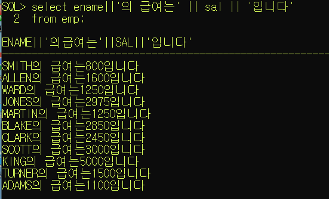

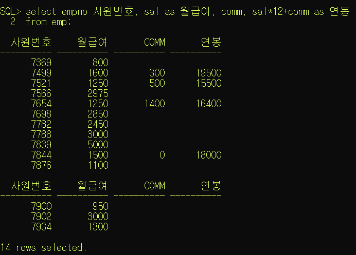


### 2. select절에 조건 추가하기

* select [distinct] 컬럼명, 컬럼명, ...... [alias명]

  from 테이블명

* where 조건

  - 검색결과를 제한(조건에 만족하는 데이터만 조회하겠다는 의미)

  - where절은 from절 다음에 정의

  - where절은 조건식이 true가 되도록 정의

  - where절에 사용할수 있는 비교연산자

    > <,  <=,  >,  >=,  =(같다),  <>(다르다),  !=(다르다)

  - where절에서 조건과 함께 비교하는 값을 추가해야 하는 경우
    문자, 날짜는 작은따옴표로 묶어주어야 한다. 

  - SQL은 대소문자를 구분하지 않는다. But, 값을 비교하는 경우 정확하게 대소문자까지 일치
  
  - 두 개 이상의 조건이 있는 경우 사용할 수 있는 연산자
  
    > and 연산자 : 모든 조건이 일치
    >
    > or 연산자 : 모든 조건 중 한 개만 일치
    > 					(조건이 모두 다른 컬럼인 경우)
    >
    > between A and B : and연산과 동일
    > 								(같은 컬럼에서 조건을 비교하는 경우)
    >
    > in 연산자 : or연산자의 의미와 동일
    > 					컬럼명 in (비교할 값, 값,.......)
    > 					(같은 컬럼에서 값을 여러 개 비교해야 하는 경우)
    >
    > not연산자 : 부정
  
  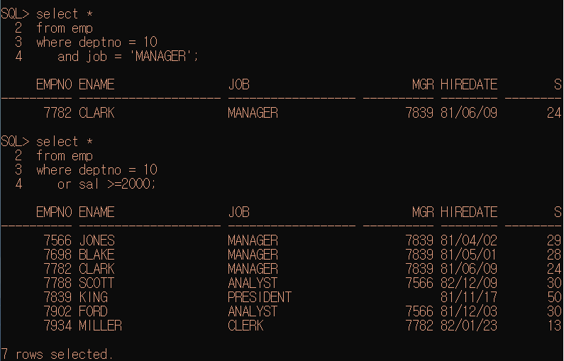
  
  
  
  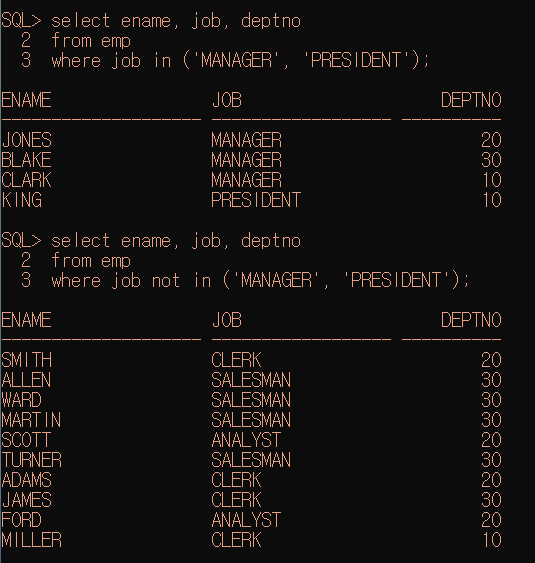
  
  
  
  * null 값에 대한 비교
  
    > is null : null인 데이터를 조회
    >
    > is not null : null이 아닌 데이터를 조회
  
  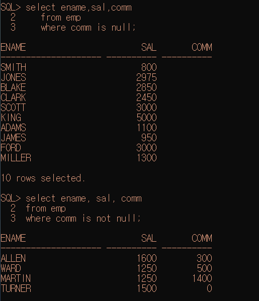
  
  
  
  
  
* like 연산자 : 대표문자와 함께 사용

  * 조건비교를 위해 입력한 값이 문자열에 포함되어 있는 것을 찾는 경우

    > % : 모든 문자열
    >
    > _ : 한 자리 문자를 의미
    >
    > ​	ex. 'A%' : A로 시작하는 모든 것
    > ​	ex. '%A' : A로 끝나는 모든 것
    > ​	ex. '%A%'  : A만 들어가면 다 찾음
    > ​	ex.'_A%' : 두번째 글자가 A가 들어가는 것

    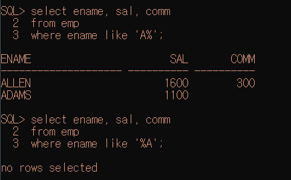

    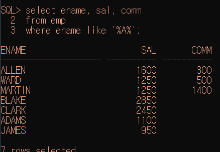

    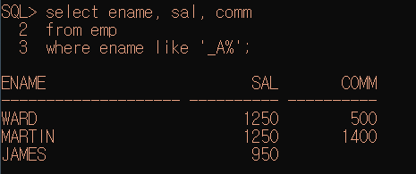

    


### 3. 데이터 정렬

```bash
select [distinct] 컬럼명, 컬럼명 ,....[alias명]
from 테이블명
where 조건
order by 클럼명 정렬기준
				------ > asc,desc
-asc : 오름차순
-desc : 내림차순
-order by 뒤에 정렬기준 안쓰면 기본으로 오름차순
```


  ```bash
cl scr => 도스창 클리어 
  ```


  

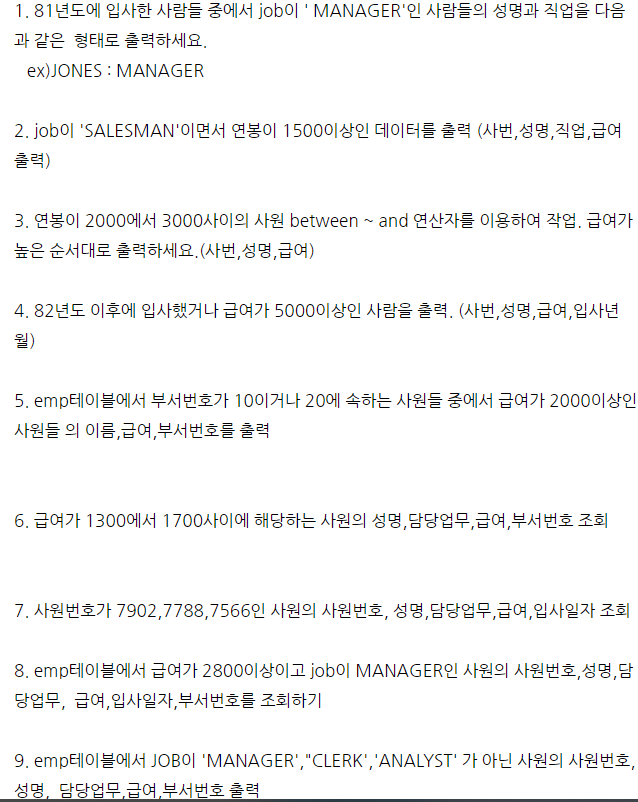


ㅈ