# DDL

### 테이블명 변경

```bash
alter table
기존테이블명 rename to 새로운테이블명; 
```


### 제약조건

사용자가 만든 테이블은아닌데, 오라클에서 기본으로 제공해주는 데이터를 담을 테이블이 존재한다. 그 중 User_constraint가 저장된 것이 제약조건이 담긴 테이블이다. 


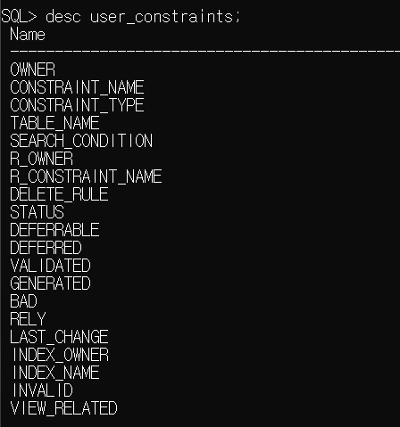

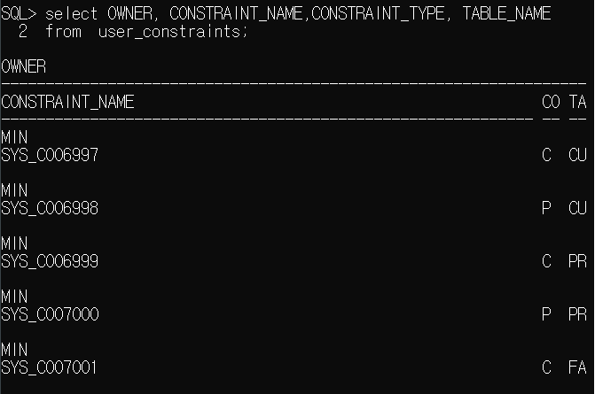


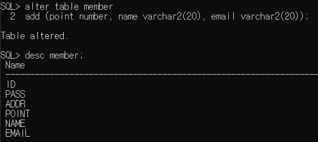

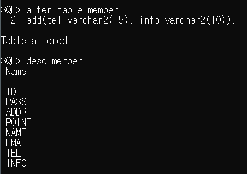


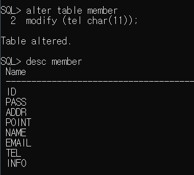


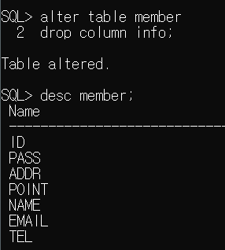


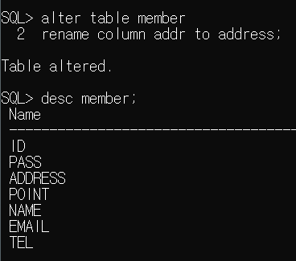

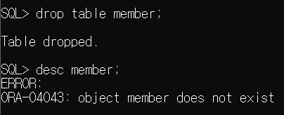


```bash
alter table (테이블명)
add constratint 제약조건명 제약조건(제약조건 설정할 컬럼)
```


### 제약조건 종류

* #### not null : 공백 불가

  * 컬럼에 데이터가 저장될 때 NULL이 포함되지 못하도록 지정

  * 수정하면서 하는거 안된다. 컬럼 레벨로 설정한다. 

    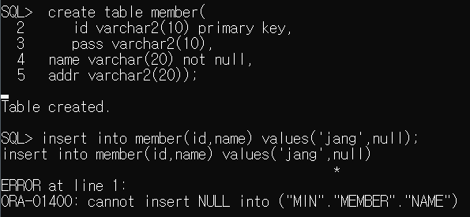

  

  ---

  

* #### unique : 중복 불가

  ```bash
  alter table (테이블명)
  add constratint 제약조건명 unique(제약조건 설정할 컬럼)
  ```

  

  * 중복된 값이 저장될 수 없는 컬럼인 경우, unique제약조건을 정의한다.

    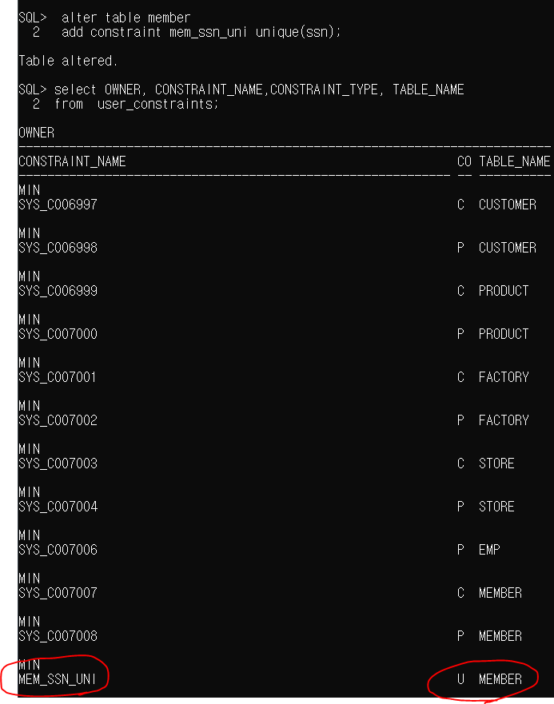

    

    

    

* #### primary key 제약 조건 : not null 과 unique 속성을 갖고 있다.

* #### foreign key 제약 조건 : 데이터를 아무거나 입력할 수 없고, 프라이머리 값과 연관되어야 한다.

  mydept라는 테이블 생성 후 row 2개 넣기

  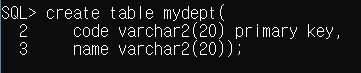

  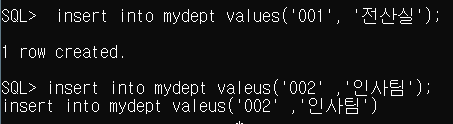

  

  

```bash
alter table 테이블명
add constraint 설정할포린키제약조건이름 foreign key(FK제약조건 적용할 컬럼)
		references 테이블명(FK에서참조할기본키);
```

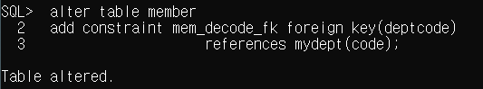

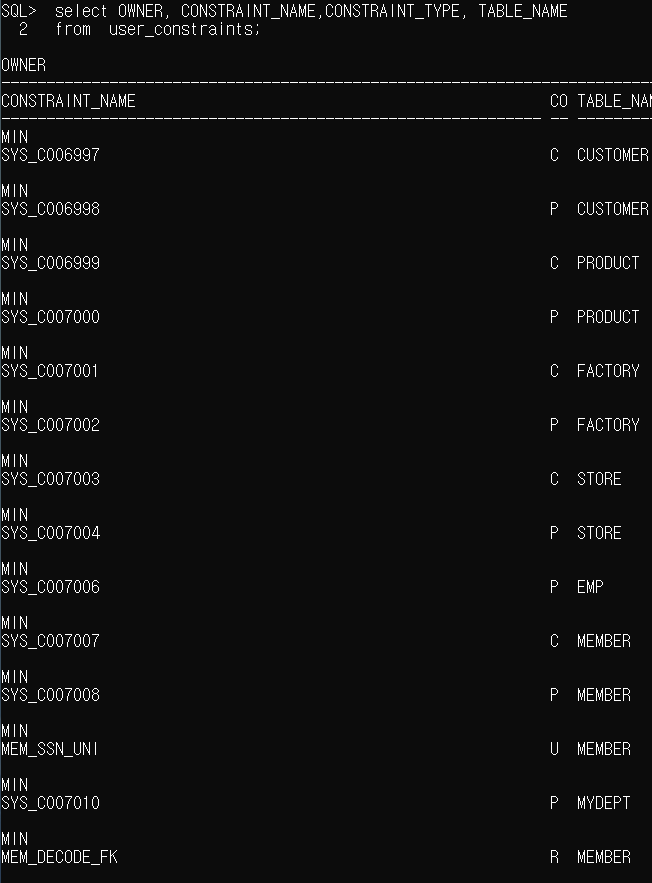


[제약조건에 맞춰서 값을 넣어보자!]

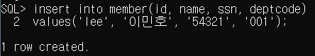

[*내가 parent키에 없는 값을 입력했을 때 나오는 오류 문구* (제약조건 위반) ]

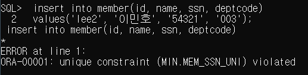


* 기본키-포린키 제약조건 관계가 설정된 테이블에 **기본키 테이블(parent)을 삭제할 수 없다.** 포린키가 붕 떠버린다.

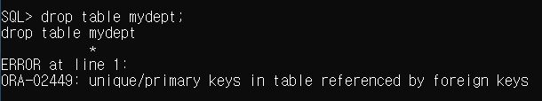

* 따라서 삭제하고 싶으면, **포린키(child)를 먼저 삭제후 (참조하는 테이블이 없는 상태로 만들고)  or 제약조건을 제거 후 기본키를 삭제할 수 있다.** 


기본키에 없는 값을 쓸 수 없다.

기본키 테이블의 값을 포린키에서 참조해서 사용하는 경우, 기본키 테이블을 삭제할 수 없다.
포린키 테이블을 먼저 제거하거나, 제약조건을 삭제하고 기본키를 삭제할 수 있다.


---


* #### check : 컬럼에 입력되는 값에 대해 제한을 둔다. 

  ex. 은행 시스템에서 사용자에게 10만까지만 입력받기가 가능 등

```bash
alter table member
add constraint 만들check제약조건명 check(컬럼명 in (..,..,..))
```

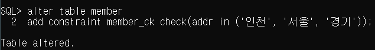

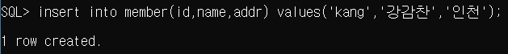

[ 제약조건 위반 ]


[제약조건 제거]

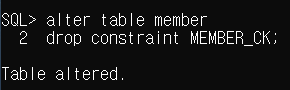


---


# 시퀀스

순차적인 값을 쓸 때 시퀀스 사용

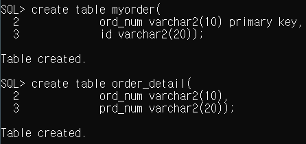


```bash
create sequence 시퀀스명; (시퀀스명:테이블명_seq 보편적)
```

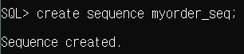


주문 상세내역이 다음 값이 아니라, 저장된 myorder 테이블의 ord_num이어야 하기 때문에 nextval이 아니라 `currentva`l로 해준다. 

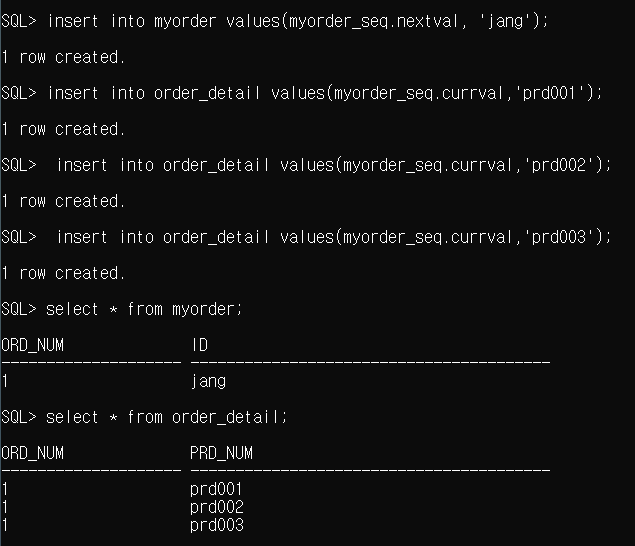

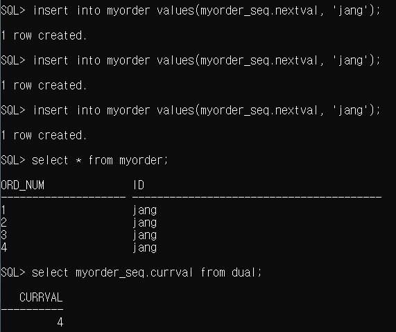


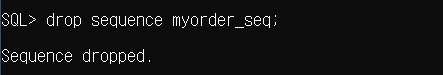


* 테이블

