## 서브쿼리

* SQL문에 삽입된 query
* select문에서 주로 사용하고 select문에 삽입된  select문
  바깥쪽의 query를 main query, 안쪽에 삽입된 query를 sub query라 한다.
* sub query는 괄호로 묶어주어야 한다.
* sub query는 메인쿼리가 실행되기 전에 한 번 실행되며 그 실행결과를 메인쿼리에서 사용한다. 

[실습예제]

1. 10번 부서의 평균 급여보다 급여를 많이 받는 사람들 조회

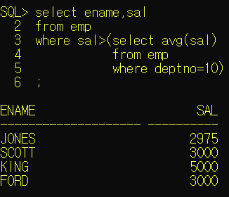


### 서브쿼리의 종류

#### 1) 단일행 서브쿼리 - 서브쿼리의 결과가 1행 1열인 서브쿼리

[실습예제]

2. 전체 평균보다 높은 급여를 받는 사원의 목록(ename,sal)

   ```bash
   select ename, sal from emp
   where sal > (select avg(sal) from emp);
   ```

   

3. smith와 같은 job을 갖고 있는 사원의 목록(ename,job,hiredate)

```bash
select ename, job, hiredate from emp
where job = (select job from emp
				where ename = 'SMITH');
```

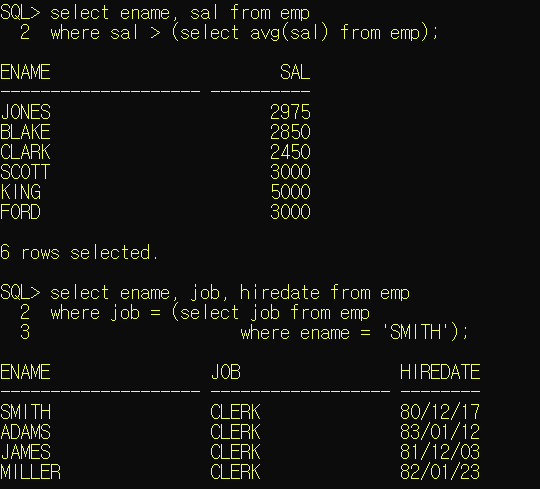


4. 10번부서에 근무하는 사원들의 job과 같은job을 갖고 있는 사원 목록

   *(오류)*

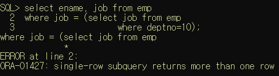

<정답>

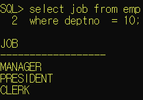


#### 2) 다중행 서브쿼리 - 서브쿼리의 실행결과가 열 하나의 행이 여러개 인 경우

* =연산자와 같은비교연산자를 사용할 수 없다.
* `in`  : 컬럼의 값이 정확하게 일치하는 경우


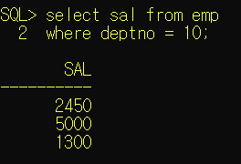

*  `<any ` : 서브쿼리 결과의 최대값보다 작은 값을 구하는 경우

  ```bash
  select ename, sal
  from emp
  where sal <any(select sal
  				from emp
  				where deptno = 10);
  ```

  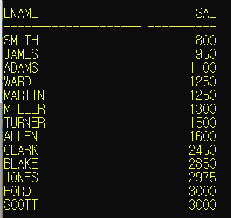

  

* `<any` : 서브쿼리 결과의 최소값보다 큰 값을 구하는 경우

  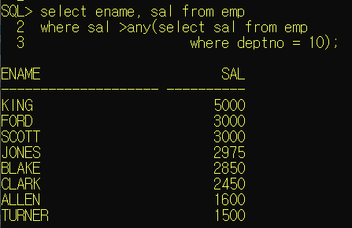

  

* `<all` : 서브쿼리 결과의 최소값보다 작은 값을 구하는 경우

  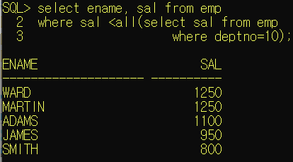


* `>all` : 서브쿼리 결과의 최대값보다 큰 값을 구하는 경우

  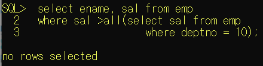


[실습예제]

5. 10번 부서에 근무하는 사원들의 job과 같은 job을 갖고있는 사원의 목록

   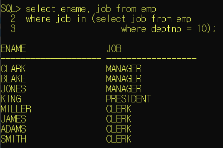


#### 3) 다중컬럼 서브쿼리 - 두 개 이상의 컬럼과 다중행을 반환하는 서브쿼리

* 메인쿼리 비교 컬럼의갯수, 종류가 서브쿼리의 반환 결과와 동일

  ```bash
  ...
  where (컬럼1, 컬럼2) in (select 컬럼1, 컬럼2
  						..... )
  ```

  


6. 각 부서별로 최소급여를 받는 사원의 정보를 출력(사원명, 부서코드, 급여,입사일)

   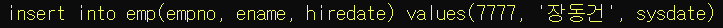

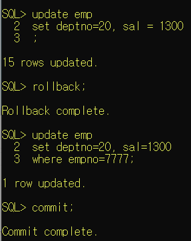

*장동건 정보 추가*

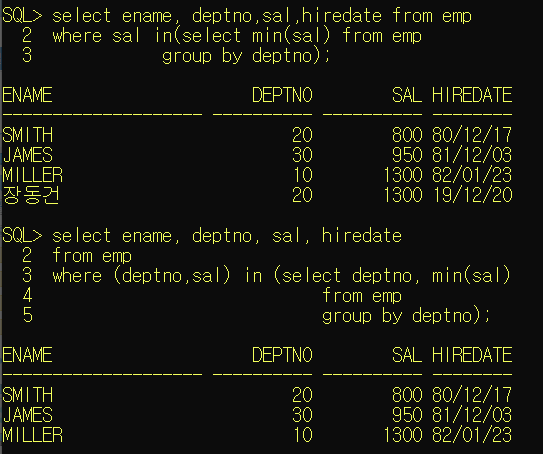

단일행으로 하게 될 경우, 위 케이스와 같이 처리가 안된다. 따라서 아래 케이스처럼 다중행으로 처리해줘야 한다. 


#### 4) 상관형서브쿼리(상호연관서브쿼리) - 메인쿼리의 값이 서브쿼리에서 사용되는 경우

* 메인쿼리 한 row에 대해 서브쿼리가 한 번씩 실행된다.
* 메인쿼리의 값이 어떤 값이냐에 따라 서브쿼리의 결과가 달라진다. (메인쿼리의 값을 받아야 하는 경우)

**[실행]**

1. 메인쿼리에서 비교할 값을 가져온다.
2. 메인쿼리에서 받은 값을 이용해서 서브쿼리가 실행된다.
3. 서브쿼리의 실행결과로 메인쿼리가 실행된다.
4. 메인쿼리의 레코드수만큼 반복된다.


[실습예제]

7. 소속부서의 급여 평균보다 급여가 많은 사원들의 정보를 출력
   (ename, deptno, sal)

```bash
select ename, deptno, sal from emp
where sal > (select avg(sal) from emp
			where deptno = 현재 작업중인 row의 부서코드 )
```

다음과 같이 alias를 사용하여 소스를 작성한다. 

```bash
select ename, deptno, sal from emp outer 
where sal > (select avg(sal) from emp e
				where e.deptno = outer.deptno);
```


#### 5) from절에서 사용하는 서브쿼리(inline view)

* from절에 서브쿼리 추가해서 사용

* 서브쿼리 결과를 가상 테이블로 사용하겠다는 의미

* from절에 추가되는 서브쿼리는 alias를 정의해야 한다.

* from절에 추가되는 서브쿼리 내부의 컬럼은 실제 컬럼처럼 메인쿼리에서 사용해야 하므로, 컬럼도 컬럼명이 존재하거나 alias를 정의해야 한다.

  ```bash
  select 컬럼명1,...
  from( select컬럼.....
  		from 테이블명
  		where....
  		group by ...) alias
  ```

  


[실습예제]

8. 소속부서의 급여 평균보다 급여가 많은 사원들의 정보를 출력
   (ename, deptno, sal)

   => 조인과 from절에 추가하는 서브쿼리를 이용해서 작업

```bash
select deptcode, countdata
from (select deptno as deptcode, count(empno)as countdata //alias설정
		from emp
		group by deptno) mytable; //alias설정
```

```bash
select e.ename, e.deptno, e.sal
from emp e, ( select deptno , avg(sal) as avgsal
from emp 
group by deptno) m
where e.deptno = m.deptno
	and e.sal > m.avgsal ;

```


