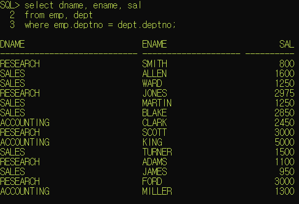
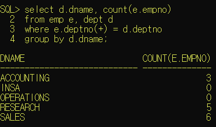
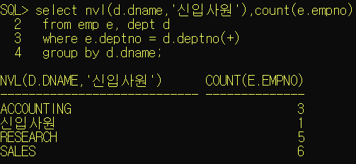
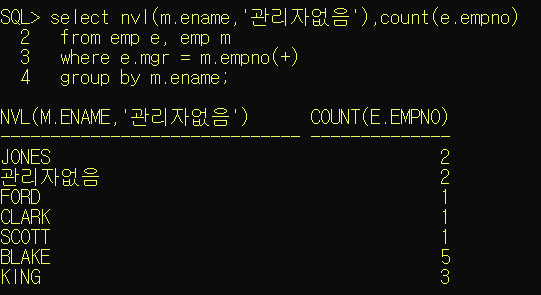
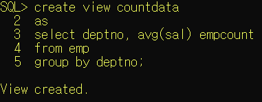

# 1. 조인

- 정규화된 테이블이나 혹은 일반적으로 작성된 여러 테이블의 컬럼을 이용해서 데이터를 조회하는 것
- 조인은 관계형 데이터베이스에서 반드시 알아야 하는 개념
- 기본키와 외래키의 관계를 이용해서 테이블을 조인
  외래키를 가지고 기본키 테이블에서 값을 비교하여 작업이 진행됨
- 조인을 하는 경우, 무조건 where절에 조인조건을 정의해야 한다.
- 테이블을 여러 개 사용하는 경우 모든 테이블들의 조인조건을 정의해야하며
  select절에서 사용하지 않고 조건으로만 사용한다고 하더라도 조인조건은 정의해야 한다.


### [조인 방법]

1. from절에 조회하고 싶은 데이터가 저장된 테이블들을모두 명시

2. 조인을 하는 경우 컬럼이 어떤 테이블의 컬럼인지 명확하게 정의
   `테이블명.컬럼명` 으로 액세스한다.

3. from절에 테이블명을 정의할 때` alias`를 함께 추가하여 `alias`를 통해 액세스하도록 한다.

   ```bash
   select alias.컬럼명, alias.컬럼명...
   from alias1.컬럼명, alias2.컬럼명...
   from 테이블1 alias1, 테이블2 alias2
   where 외래키 = 기본키 
   ```

   

4. where절에는 반드시 조인조건을 추가하며 조인조건에는 두 테이블의 값을 비교하기 위해 정의하는 것이므로, 외래키와 기본키를 정의한다. 
   외래키테이블(child테이블)에 정의된 컬럼값을
   기본키테이블(parent테이블)에서 비교하여 정확하게 일치하는 경우 값을 가져온다. 
   (테이블이 2 개 -> 조인조건1개, 테이블이 3 개 -> 조인조건 2개)

   ---

   ex. 부서별로 인원 수 출력

   

   

조인 : 연결되어있는 여러 테이블에게서 (연관성 있는) 값을 가져다 쓸 수 있다.
두 테이블의 연관성있는 컬럼들이 반드시 존재해야만 쓸 수 있다.

한쪽은 그 연관성있는 컬럼이 기본키(PK)

그것을 다른 테이블에서 참조해서 썼다 -> 외래키(FK)

두 테이블을쓸거다 라고 명시해 줘야 하는데 그 조건을 조인조건 이라고 한다. 


조인을 할 때 == 두 개 이상의 테이블에게서 값을 가져다 쓸 때. (두 테이블 간 연관성을 명시 )

`this` 처럼 `테이블명.컬럼명` 으로 쓴다. 



이너조인 : 정확하게 일치하는 데이터를 가져올때 쓴다.


# 2. 조인 종류

* equi join(inner join) : 두 테이블에서 정확하게 일치하는 컬럼에 대한 데이터만 조인

* outer join : 두 개 이상의 테이블에 조인을 적용했을 때 join조건을 만족하지 않아도 데이터를 조회하고 싶은 경우 사용
  조인 조건에 (+)를 추가한다. 
  //(+) 붙으면 채워지지 않은 정보까지 나온다. 정보를 확장해야 하는 쪽에다가 붙이면 된다. 
  join조건을 만족하지 않아도 한 쪽 테이블의 모든 데이터를 출력하고 싶을 때 사용하는 조인방식으로 정보가 부족한 테이블의 컬럼에 (+)를 추가한다.

  ```bash
  select 테이블 alias.컬럼명...
  from 테이블 alias
  where 테이블alias.컬럼명 = 테이블alias.컬럼명(+)
  
  or
  
  select 테이블 alias.컬럼명...
  from 테이블 alias
  where 테이블alias.컬럼명(+) = 테이블alias.컬럼명
  ```

  > (+)기호는 한쪽에만 사용한다. 데이터가 확장되어야 하는 곳에 추가한다. 


[실습예제] 

1. 부서별 인원수를 출력하기
   단, 부서명을 출력하고 인원이 없는 부서명도 모두 출력한다.

   ```bash
   select d.dname, count(e.empno)
   from emp e, dept d
   where e.deptno(+) = d.deptno
   group by d.dname;
   ```

   
   

2. 부서별 인원수를 출력하기
   단, 부서명을 출력하고 부서가 배치되지 않은 사원은 "신입사원"으로 표시한다.

   ```bash
   select nvl(d.dname,'신입사원'), count(e.empno)
   from emp e, dept d
   where e.deptno = d.deptno(+)
   group by d.dname;
   ```

   


* self조인 : 두 개 이상의 테이블에서 조인하지 않고 같은 테이블의 컬럼을 이용해서 조인(하나를 가상테이블로 만든다.)

[ 연습문제 ]

1. 관리자 별 인원수 구하기

   ```bash
   select nvl(m.ename,'관리자없음'), count(e.empno)
   from emp e, emp m
   where e.mgr = m.empno
   group by m.ename;
   ```

   


테이블 : 하드디스크에 저장되어있음

뷰 : 내가 자주사용하는 테이블을 등록해서 가상테이블로 쓰는 것

뷰를 만들기

1. 시스템 계정으로 접속해서 만들고자 하는 계정에 view create 권한을 준다.
2. 

3. `select * from tab;` 을통해 뷰가 추가됨을 확인한다.
4. `select * from 뷰이름;` 출력해보자.


