# 함수

* 함수의 종류는 단일행 함수, 그룹함수가 있다.

* 단일행함수를 정의하면 테이블의 모든 행에 각각 함수가 적용된다.

* 그룹함수는 그룹으로 묶인 데이터에 적용되므로 where절에 그룹함수를 사용할 수 없다.

  

## 1) 단일행함수

* `select`, `where` , `order by`절에 모두 사용할 수 있다.

​	**① 문자함수**

> ```ba
> lower(문자열 or 컬럼명) : 값을 소문자로 변환 (컬럼명: 문자열이 들어간 컬럼명)
> ```
>
> ```bash
> upper(문자열 or 컬럼명) : 값을 대문자로 변환
> ```
>
> ```bash
> initcap(문자열 or 컬럼명) : 전달된 값의 첫 글자만 대문자로 변환
> ```
>
> 
>
> 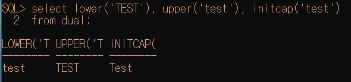
>
> 
>
> `substr(문자열 or 컬럼명,시작위치,문자열의개수)` : 오라클에서 정의하는 인덱스는, 0번부터가 아닌 1번부터이다.
>
> 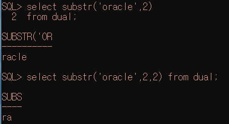
>
> 
>
> `length(문자열 or 컬럼명)` : 문자열의 길이를 반환
>
> 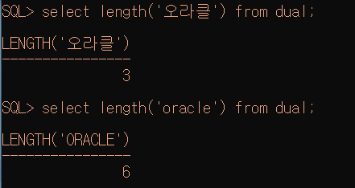
>
> 
>
> `instr(문자열 or 컬럼명, 찾을 문자, 찾을위치, n번째 문자)` : 특정 컬럼이나 문자열에서 문자의 위치를 찾을 때 사용하는 함수. 
> 찾을 위치나 n번째 문자에 대한 매개변수는 생략이 가능.
> 찾을위치를 -1로 정의하면, 문자열의 오른쪽 끝에서 문자를 찾는다. 
>
> ```bash
> select instr('oracle oracle oracle', 'a', 5,2) from dual;
> ==> 해당 문자열의 5번위치 부터 a를 찾아 위치를 반환.
> ==> 단, 2번째 a위치를 반환
> ```
>
> 
>
> 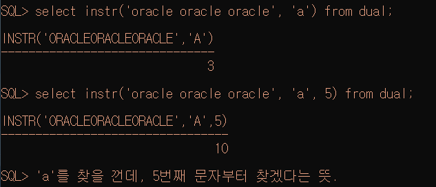
>
> 
>
> 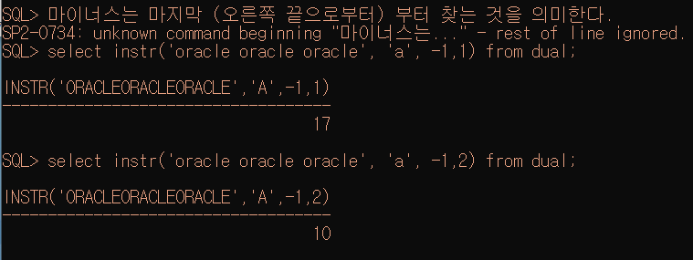
>
> `concat(문자열 or 컬럼명,문자열 or 컬럼명)` : 문자열 연결.  `||` 연산자와 동일.  
>
> 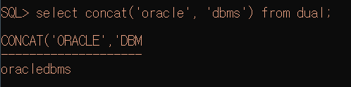
>
> 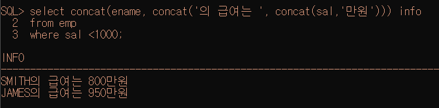
>
> `lpad(문자열 or 컬럼명, 출력할문자열의길이, 출력할문자열)` : 전체 출력할 문자열의 길이에 문자열을 출력한 후 남는 공간에 정의한 문자를 채워 출력해주는 함수(왼쪽)  
>
> `rpad(문자열 or 컬럼명, 출력할문자열의길이, 출력할문자열)` : 전체 출력할 문자열의 길이에 문자열을 출력한 후 남는 공간에 정의한 문자를 채워 출력해주는 함수(오른쪽)  *( 숨겨야 하는 주민번호에 많이 활용 )*
>
> 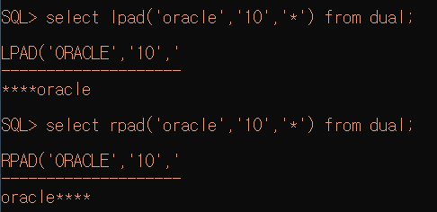
>
> 
>
> `ltrim(문자열 or 컬럼명, 제거할 문자)`: 컬럼에서 매개변수로 정의한 문자를 왼쪽에서 찾아 모두 제거 
>
> `rtrim(문자열 or 컬럼명, 제거할 문자)` : 컬럼에서 매개변수로 정의한 문자를 오른쪽에서 찾아 모두 제거 
> 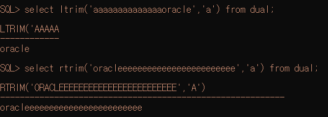
>
> *공백을 제거할 때 활용된다*
>
> 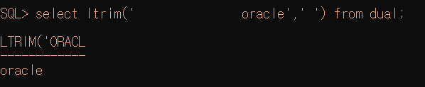
>
> 
>
> 


​	**② 숫자함수**

> ```bash
> round(숫자, 반올림할 위치) : 반올림
> ```
>
> 

​	**③ 변환함수**

> * 데이터의 타입을 변환하기 위한 함수
> * 또 다른 함수의 매개변수로 사용하게 될 경우 타입이 컬럼의 타입과 일치해야 하므로
>   
>
> ```bash
> cast(값 or 컬럼명 as 타입) // 날짜 :date, 숫자 : integer
> ```


> ```bash
> to_char(변환할데이터,표시할format);
> ```
>
> * 숫자를 문자로 변환
>
>   * 숫자의 한 자리를 표시 => 9, 0
>
>   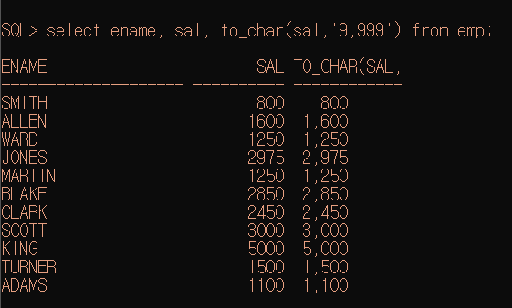
>
>   * 콤마 => ,
>
>   * 소수점 => .
>
>     - 반올림
>
>     ```bas
>     select floor(125.8) from dual;
>     ==> 125
>     ```
>
>     ```bash
>     select trunc(125.8, 0) from dual;
>     ===> 125
>     ```
>
>     ```bas
>     select ceil(125.2) from dual;
>     ===> 126
>     ```
>
>     
>
>   * 통화기호 => ￦,$,L(지역의 통화기호를 출력)
>
>   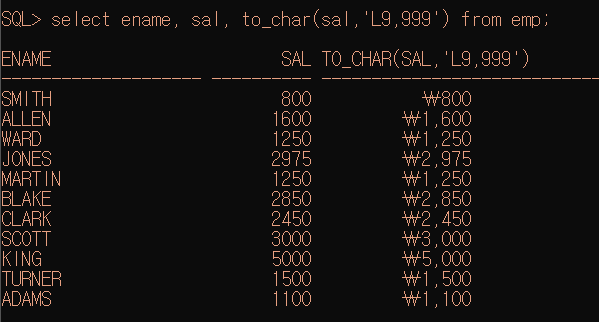
>
>   
>
> * 날짜를 문자열로 변환 : 년 월 일 각각의 데이터를 추출하고 싶은 경우
>
>   * 년도 => YYYY(2019추출됨)
>   * 월 => MM (12추출됨)
>   * 일 => DD (19추출됨)
>
>   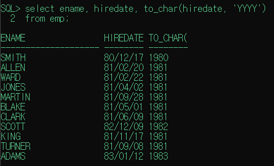
>
>   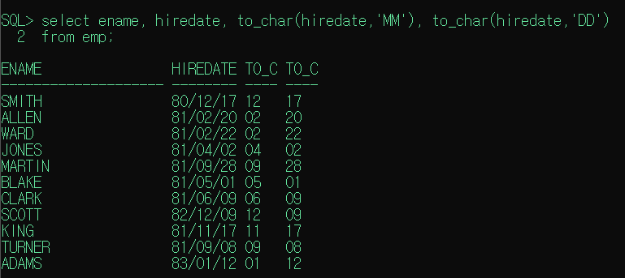
>
>   


​	**④ 날짜함수**

> ```bash
> sysdate //날짜데이터는 연산이 가능하다.
> ```
>
> 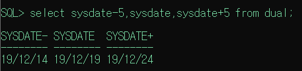
>
> 
>
> 


**⑤ null처리함수**

>```bash
>nvl(컬럼, null인경우 처리할 식이나 값) // null 경우 대신할 식이나 값을 명시
>```
>
>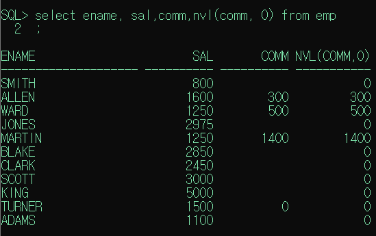
>
>
>```bash
>nvl2(컬럼, 표현값1, 표현값2) //null이 있을 컬럼 적는다.
>//표현값1 : null이 아닌 경우 표현할 값이나 식
>//표현값2 : null일 경우 표현할 값이나 식
>```
>
>comm에 '신입사원'이라고 넣으려고 하는데, comm의타입은 숫자고 '신입사원'은문자열이다. 따라서 넣고 싶으면 두 개의 타입을 일치시켜야 한다. 
>
>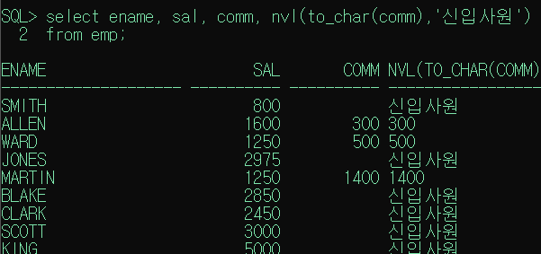
>
>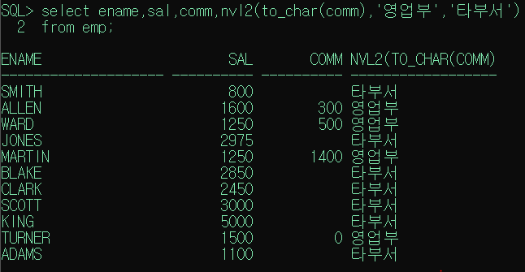
>
>
>
>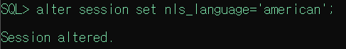
>
>
>
>
>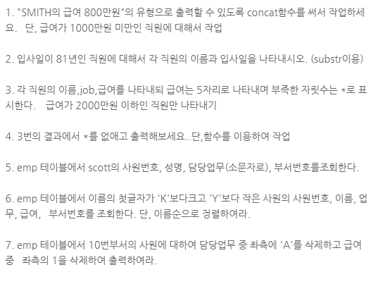


## 2) 그룹행 함수

* 먼저 그룹(group by)으로 적용되어야 하고, 그 그룹에 함수 적용 

  ex. 통계, 집계, average, count, max ....

from emp와 where절부터 실행이 되고 select문이 실행되기 때문에 결과가 나올 수 있다


기본키 = 공백이 없는 컬럼

* **`count`** 를 쓸 때, 공백이 있으면 안 세기 때문에 **꼭 공백이 없는 기본키 컬럼으로 적어준다.**


**[ Q. 부서별 인원 수를 구하는 쿼리문 ]**

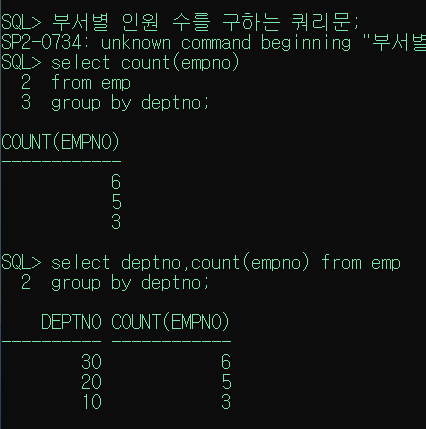


2. **그룹화**

```bash
select 컬럼...
from 테이블..
where 조건
group by 그룹화할 컬럼명(함수를 포함한 식도 가능)
having 그룹화 한 결과에 적용할 조건 
order by 정렬할 컬럼명
```

* 테이블에 저장된 레코드를 구룹화하여 분류하고 싶은 경우 사용
* **`select`** 절에는 **group by절에 명시한 컬럼명**과 그룹함수만 사용할 수 있다. (그롭화 한 컬럼명 말고 다른거쓰지말자)
* 데이터가 복잡한 경우  group by절에 두 개 이상의 컬럼을 명시할 수 있다. 
* `group by`하기 전에 적용해야 하는 조건은 `where`절에 정의
* `group by`한 결과 조건을 적용해야 하는 경우, `having` 절을 이용 (조건에 그룹함수를 써야 하면 having에 추가)


[Q. 직업 별 연봉 평균]

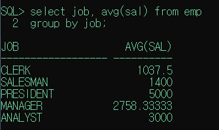


[Q. 부서별, 직업별 인원 수 세기]

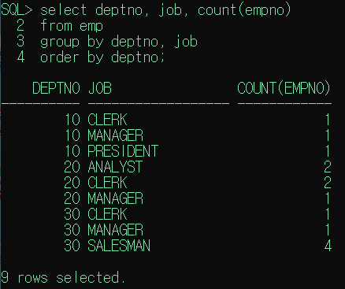


[Q. 직업별, 부서별 인원 수 세고 가장 높은 연봉 찾기]

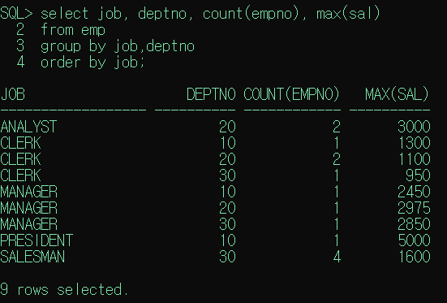


Groupby 하고 나서 써야 하는 조건은, where절에 쓰지 않는다.

Groupby 하고 난 결과에 조건을 적용하려면 `havging` 절을 사용한다. 


**[Q. 직업별 이름에 H가 들어가지 않는 사람들의 연봉 평균 계산 후 2000 이상의 평균만 출력하기 ]**

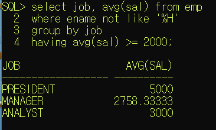


[Q.직업별 인원수를 구하기. 단, 1983년 입사자는 제외하고 최종결과로는 인원수가 3명 이상인 직업만 출력하기]

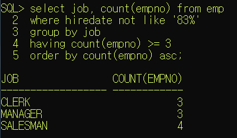


[ alias 로 num으로 해서 order by 가능.이유는? num 보다 order by 가 더 마지막에 실행돼서 그렇다. 하지만, Having절에 num은 못한다. 왜냐하면 having 다음에 alias 가 실행된다. ]

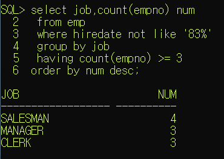


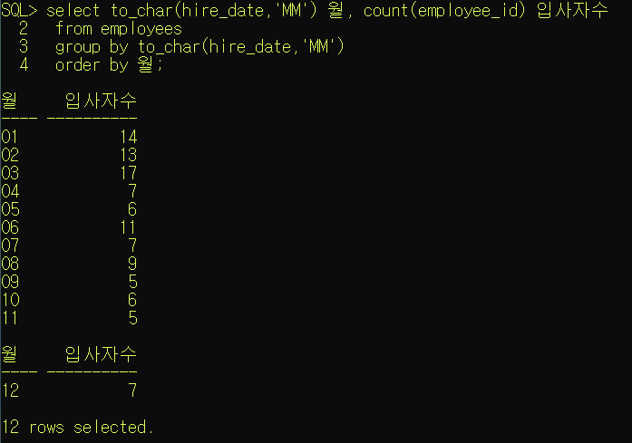

