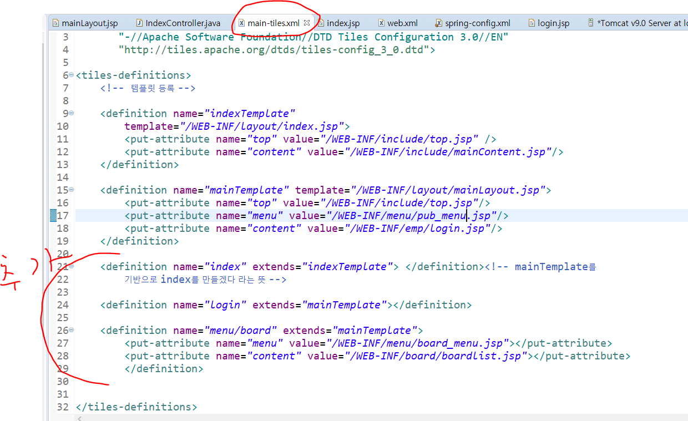
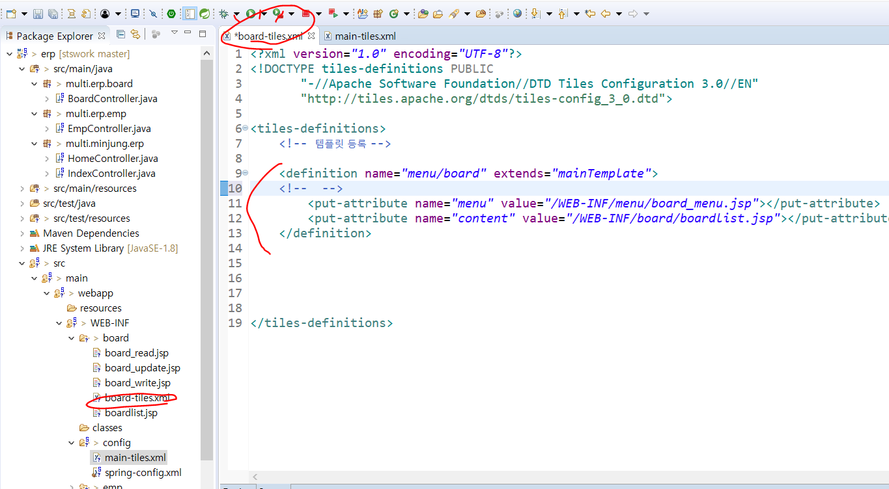
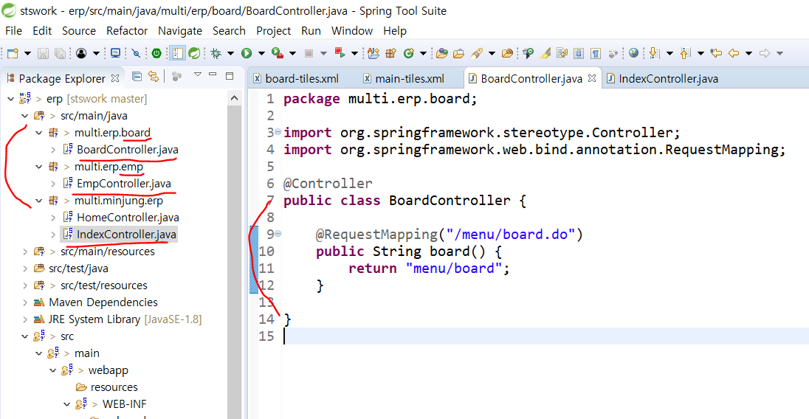
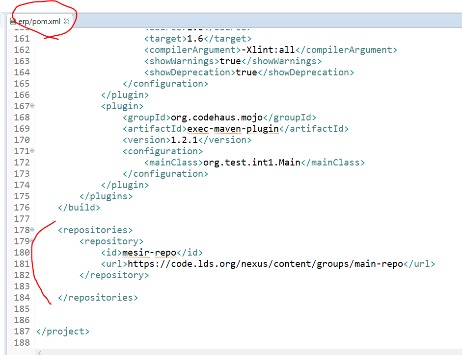
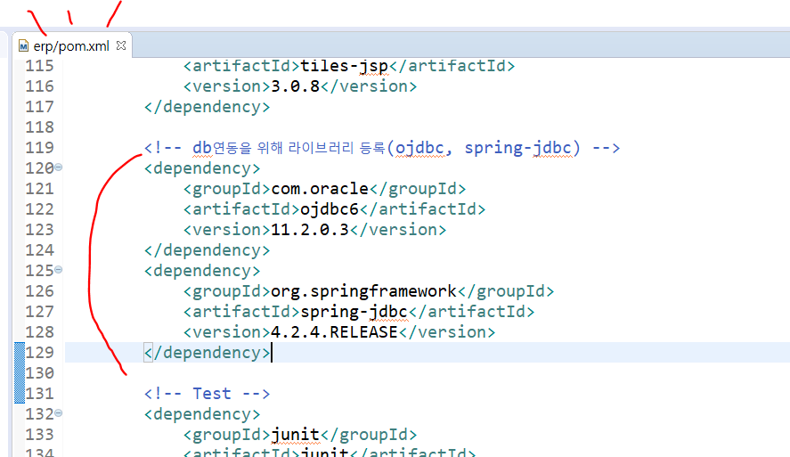

# Tiles 실습 : ERP

### WEB-INF 밑에 config 폴더 만들고, main-tiles.xml과 spring-config.xml파일 만든다.

spring-config.xml는 spring>appServlet > 에 있는 파일을 복사해서 가져온다.

그리고 main-tiles.xml파일은 새로 만들어준다.

###

### web.xml에서 설정파일 기본 인식 위치를 수정해주기


### main-tiles.xml파일을 추가

맨 위에 tiles 써주기

```xml
<!DOCTYPE tiles-definitions PUBLIC
       "-//Apache Software Foundation//DTD Tiles Configuration 3.0//EN"
       "http://tiles.apache.org/dtds/tiles-config_3_0.dtd">
```

 템플릿 등록해준다. 


### 해당 템플릿에 넣은 put-attribute를 템플릿(jsp)파일에 tiles:insertAttribute해주기 (연결작업)

jsp 파일에 위에 라이브러리 추가해줘야한다.

```jsp
<%@ taglib prefix="tiles" uri="http://tiles.apache.org/tags-tiles" %>
```


### 컨트롤러 파일을 만들어 주고, 어노테이션 해준다.


### main-tiles.xml 에서 리턴값에 맞는 동작을 정의해준다.



---

---

---

---

---

--

--

---

----

---

----

----

main-tiles.xml 복사하여 board폴더안에 board-tiles.xml로 생성, definition 안에는

main-tiles.xml의 menu/board 부분만 넣기




Controller를 패키지 별로 만들어서 쪼갠 뒤 클래스(컨트롤러)를 넣고, IndexController.java에서 Board부분만 쪼개서 BoardController 에 넣는다.




### SQL 연동

### pom.xml에 db연동을 위한 라이브러리를 등록한다. 

https://mvnrepository.com/artifact/com.oracle/ojdbc6/11.2.0.4.0-atlassian-hosted > (ctrl을 누른 상태로 주소를 누르면 해당 주소로 이동한다. )

```xml
<dependency>
    <groupId>com.oracle</groupId>
    <artifactId>ojdbc6</artifactId>
    <version>11.2.0.4.0-atlassian-hosted</version>
</dependency>
```

(버전은 나중에 바꿔준다 11.2.0.3으로)

```xml
<repositories>
		<repository>
			<id>mesir-repo</id>
			<url>https://code.lds.org/nexus/content/groups/main-repo</url>
		</repository>
		
	</repositories>
```

중앙저장소가 없어서, 별도로 다른 서버 저장소를 따로 추가해줘야해서 위 코드를 xml 에 적어준다. 




https://mvnrepository.com/artifact/org.springframework/spring-jdbc/4.2.4.RELEASE 라이브러리도 추가해준다.

```xml
<!-- https://mvnrepository.com/artifact/org.springframework/spring-jdbc -->
<dependency>
    <groupId>org.springframework</groupId>
    <artifactId>spring-jdbc</artifactId>
    <version>4.2.4.RELEASE</version>
</dependency>

```



ojdbc, spring jdbc 라이브러리를 https://mvnrepository.com 사이트에서 찾아서  pom.xml에 추가해 주었다. 


(중단)