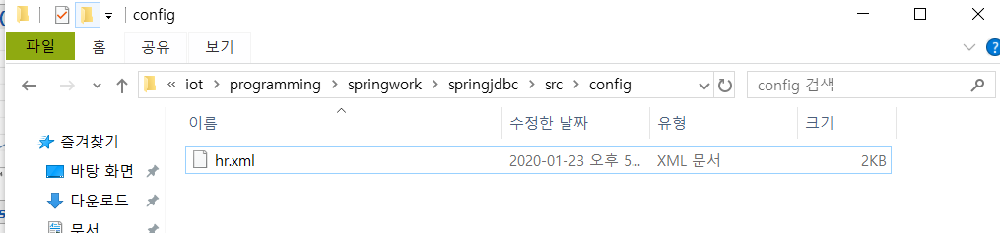
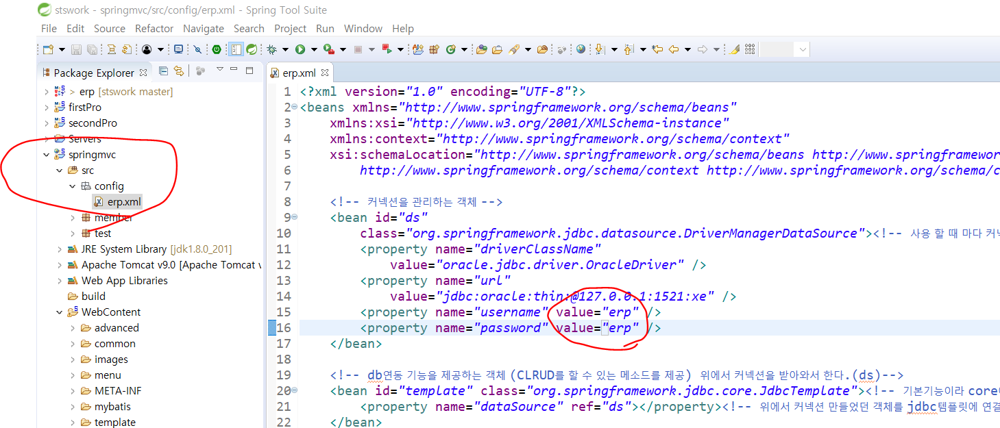

#### src 밑에 config 패키지 만ㄷ르고, erp.xml 추가



복붙해서 가져와서 이름만 erp.xml로 바꾼다.

#### erp.xml에서 property의 name을 erp로 바꾼다.




---

ds넘겨준 것. 

JdbcTemplate은 다음과 같은 동작을 수행한다. 

```java
class JdbcTemplate{
    DataSource dataSource;
    public void setDataSource(매개변수 받고){
        this.dataSource = 객체받기;
    }
    
    public Connection을 리턴하는 메소드 (){
        dataSource.
    }
}
```

데이터소스를 통해 무언가를 전달받았다. 
JdbcTemplate은 예전에 preparedStatement 등등 커넥션을 관리했던 그 동작을 수행한다. 

dataSource 객체를 내부로 di 하고 있는것.

따라서 JdbcTemplate을 활용하는 DAO만 만들어주면 된다. 


```sql
select * from dept;
```

해서 수정된 deptno, deptname살펴보자