# Spring MVC 프로젝트 구성 - maven을 이용하지 않는 경우


1. Dynamic Web Project 생성 (xml파일 추가하기 선택)
2. 라이브러리를 lib폴더에 복사하기


3. `DispatcherServlet`을 web.xml에 등록

   => 모든 요청이 `DispatcherServlet`을 통해 진입하도록 설정해야 스프링이 제공하는 여러가지 기능을 적용할 수 있다. ( frontController 패턴이 적용되어 있다. )

4. spring에서 사용할 설정파일을 작성한다.

   * 따로 등록하지 않으면 web프로젝트에서 사용할 스프링설정 파일은 파일명을 작성할 때 규칙이 있다.
     (DispatcherServlet이 해줄꺼라서 반드시 파일명 규칙을 지켜야함)

     ```xml
     [DispatcherServlet을 등록할 서블릿명]-servlet.xml
     ```

     ex. 서블릿명 : springapp

     /WEB-INF/

     ​        ㄴ> sprintapp-servlet.xml //스프링에서 쓸 설정파일 (web.xml는 웹에서 쓸 설정파일)

   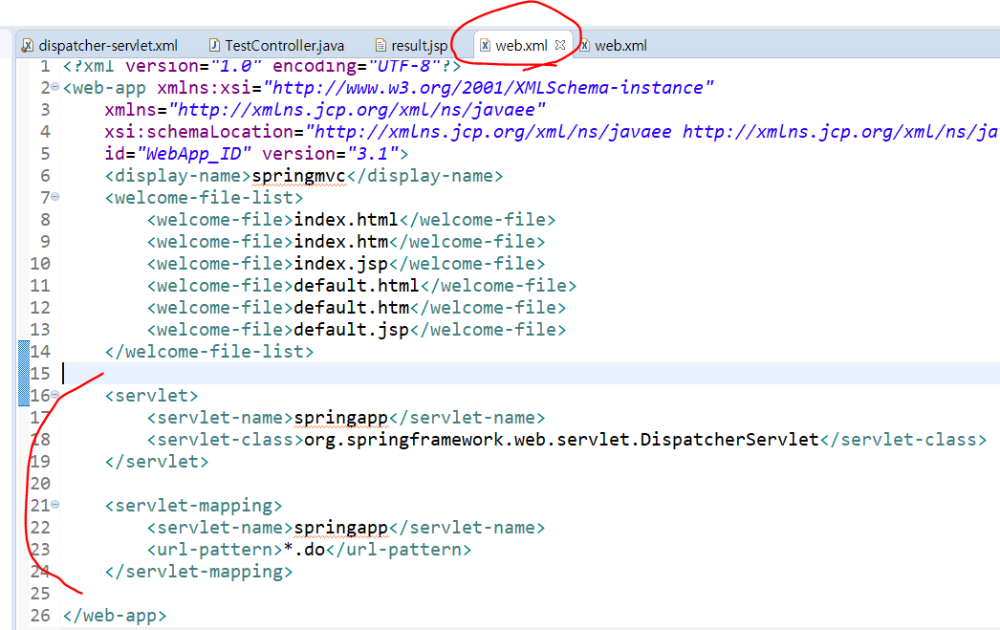

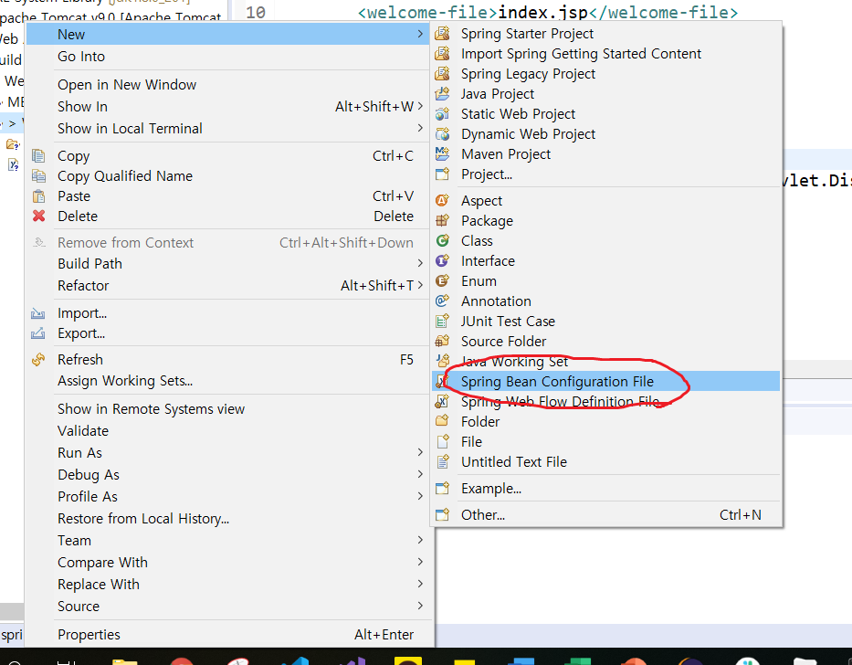


5. Controller작성하기
   * 기본 web에서 서블릿과 같은 역할을 하는 클래스
   * 실제 처리를 담당하는 클래스 (ex. Action을 상속하는 클래스들)
   * controller는 계속 추가 및 수정해서 사용할 수 있다.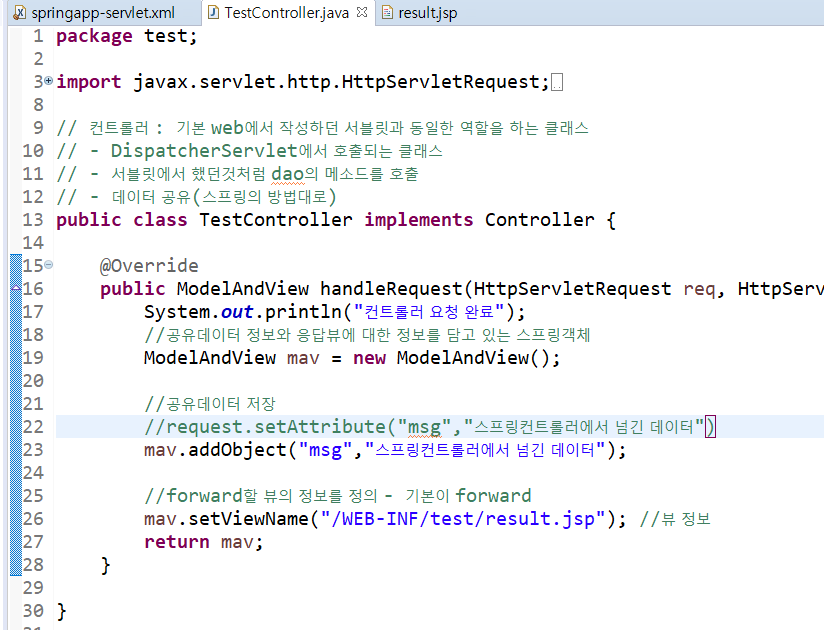

6. 스프링설정파일에 컨트롤러 등록하기

   * `<bean>` 태그를 이용해서 5번에서 생성한 컨트롤러 등록하기

   * 요청path를 기준으로 컨트롤러를 등록할 것이므로, id속성을 쓰지 않고 name속성을 사용한다.

   * DispatcherServlet내부에서 요청path에 맞는 컨트롤러를 `getBean`할 수 있도록 등록

     [형식]

     ```xml
     <bean name = "요청path" class="컨트롤러클래스"/>
     ```

     [예제]
     /test.do로 TestController(실제 처리를 담당하는 클래스)를 요청

     ```xml
     <bean name="/test.do" class="test.TestController"/>
     ```

     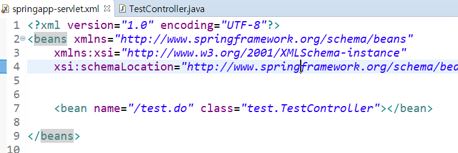

     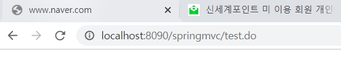

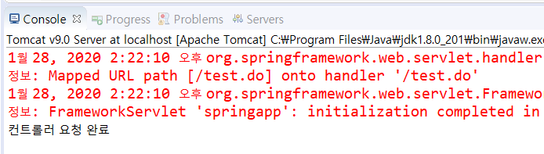


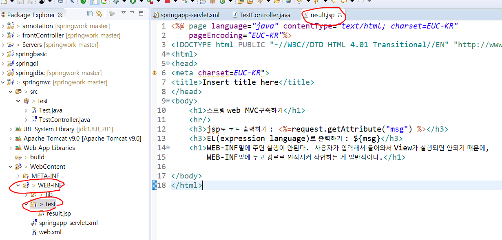

---

---

---

---


## 스프링 설정 파일 변경하기


1. 방금 만든 dispatcher-servlet.xml에서 springmvc1 로 이름변경

2. save as 해서 springmvc2 생성

3. 소스코드 작성 (index.do)

   

4. config 폴더 만들어서 springmvc1, springmvc2 파일 옮기기

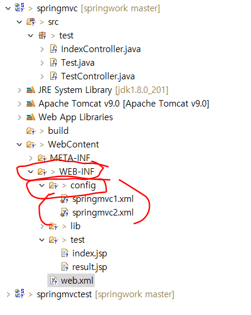

5. 자바 src에서 새로운 IndexController 라는 클래스 생성 - abstract 설정 해주기

Interface아니고 abstract에서 찾기 

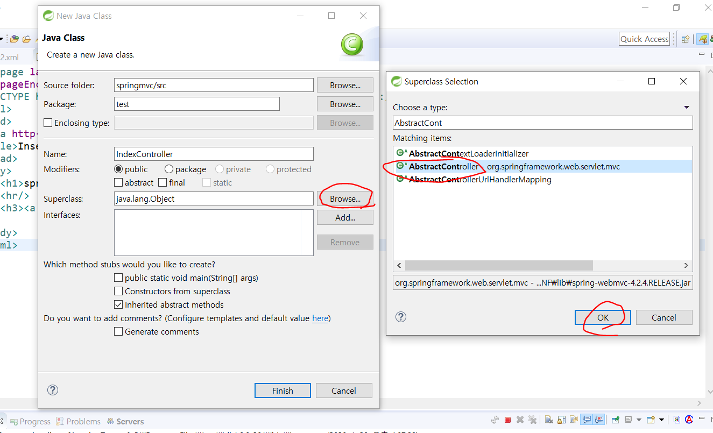

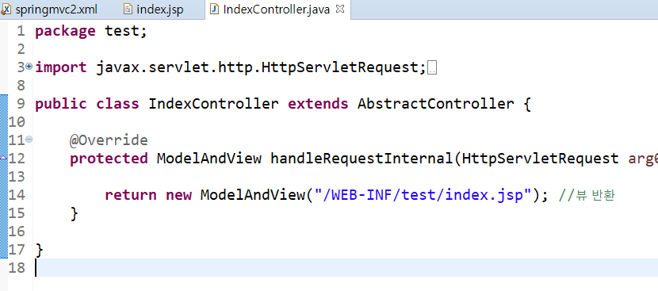

이렇게 작성

6. run on server : 오류남

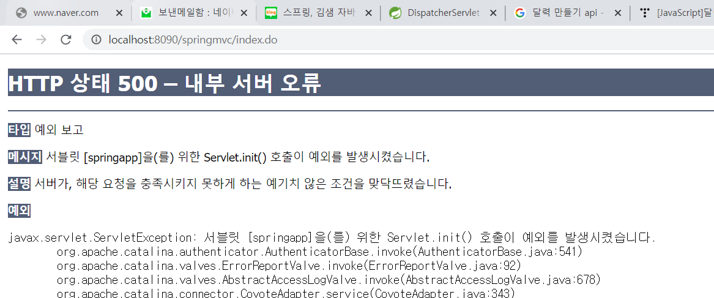


---

설정파일의 이름을 바꾸거나 위치를 변경할 수 있다. 이 때 **서블릿 초기화 파라미터** 를 사용한다.

`<init-param>` 설정을 추가하면 된다.

7. `web.xml` 파일을 열어서 DispatcherServlet클래스를 등록한 곳에 `<init-param>` 설정을 추가한다. 그리고 name과 value를 적어주면 된다. 이 때, `<param-name>` 엘리먼트로 지정한 `contextConfigLocation`을 써주는데, 임의로 변경하지말고 그대로 써야 한다. 대소문자를 구분하므로 정확하게 등록해야 한다.  

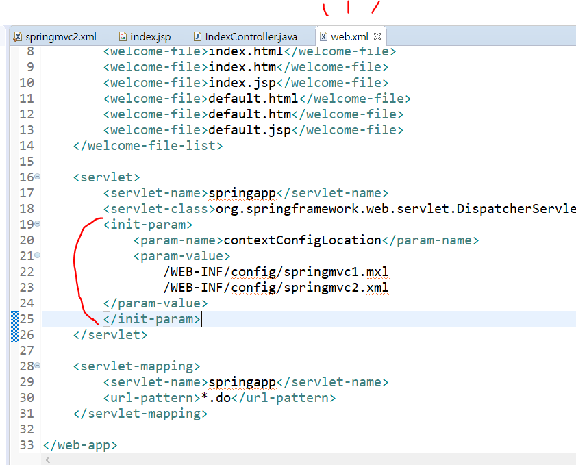

---

### form 검색 버튼


web.xml에 springmvc2.xml 등록된 상태


1. form 태그 추가. 

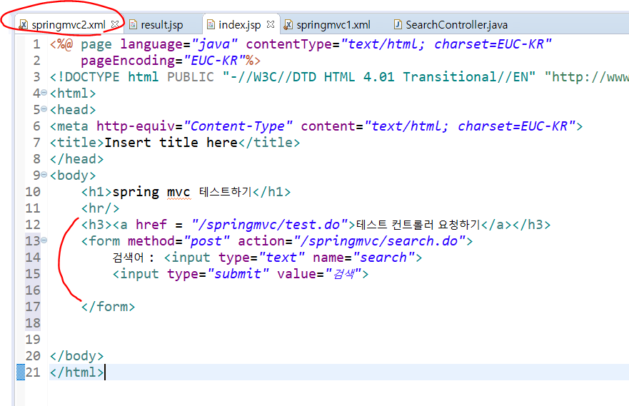


2. config 폴더의 springmvc2.xml 에서 bean추가

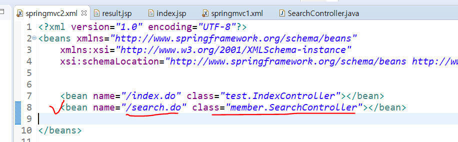


3. 위 bean에서 추가했던 member.SerachController에 따라 member패키지 만들고 SerachController 클래스 추가

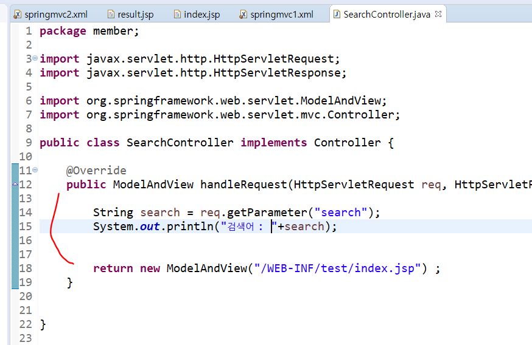

위와 같이 getParameter로 search 값 받아주고 콘솔창에 출력해주는 코드 작성.
결과는 요청했던 화면과 같은 index.jsp 화면 


4. http://localhost:8090/springmvc/search.do 접속

5. 검색어 입력 후 검색 버튼 눌러서 or 엔터키로 submit

   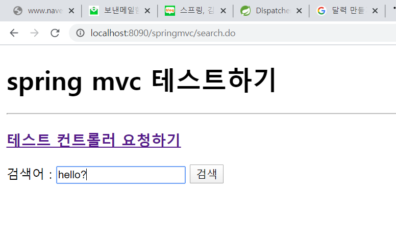


6. 응답 화면은 그대로 index.jsp 가 나오고, 스프링 콘솔창에 내가 적었던 텍스트가 보임을 확인

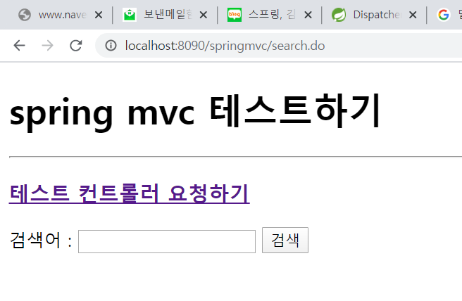

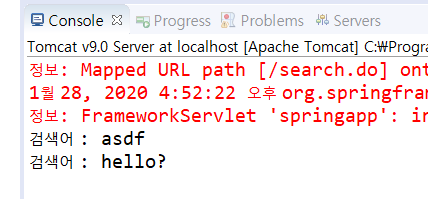


7. web.xml 파일에 한글이 깨지지 않는 한글 인코딩 설정을 추가할 수 있다.


```xml
<filter>
		<filter-name>encodingFilter</filter-name>
		<filter-class>org.springframework.web.filter.CharacterEncodingFilter</filter-class>
		<init-param>
			<param-name>encoding</param-name>
			<param-value>EUC-KR</param-value>
		</init-param>
	</filter>
	<filter-mapping>
		<filter-name>encodingFilter</filter-name>
		<url-pattern>/*</url-pattern>
	</filter-mapping>
```

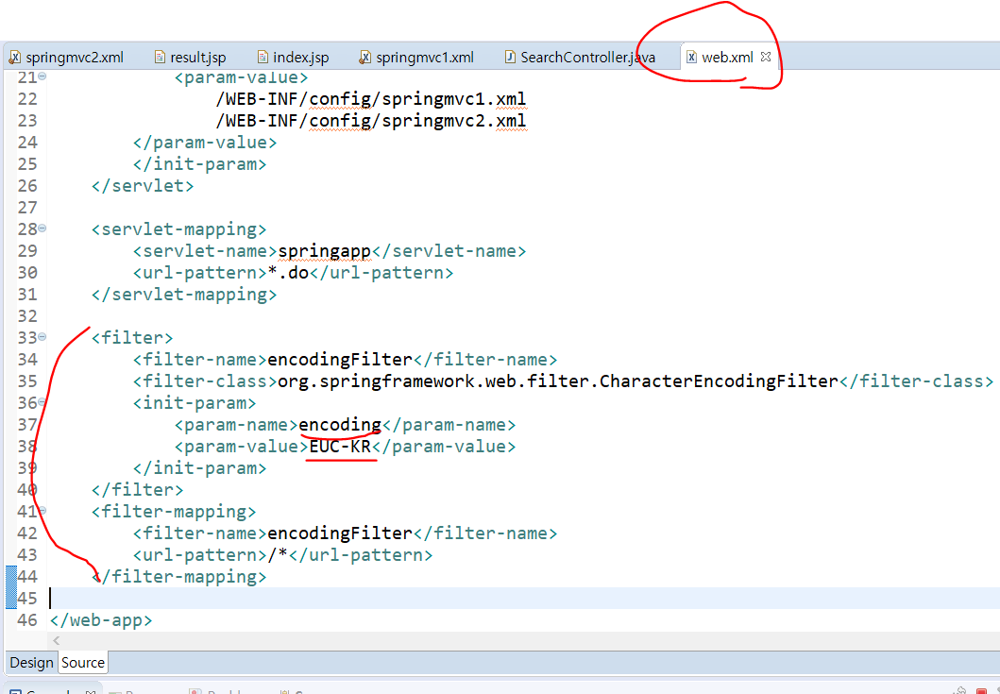

필터는 웹에서 제공하는 또다른 컴포넌트다.  이렇게 써주면, controller마다 `req.setCharacterEncoding("euc-kr");` 쓸 필요 없이 모든 controller에 적용되어 편하다.


그런데 경로를 적을 때 여기저기에 "/WEB-INF/" 와 ".jsp"가 많이 중복된다. 따라서 "/WEB-INF/"와 ".jsp"를 접두사, 접미사로 xml파일에 정의할 수 있다.

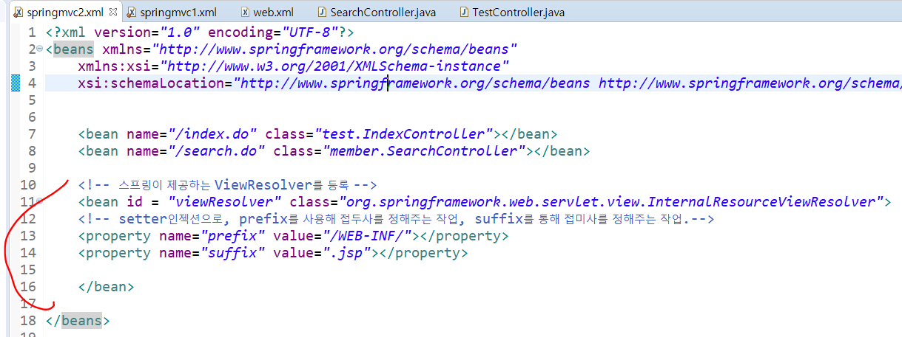

해당 작업을 해준 뒤, 경로에서  "/WEB-INF/" 와 ".jsp"를 빼주어야 한다. 

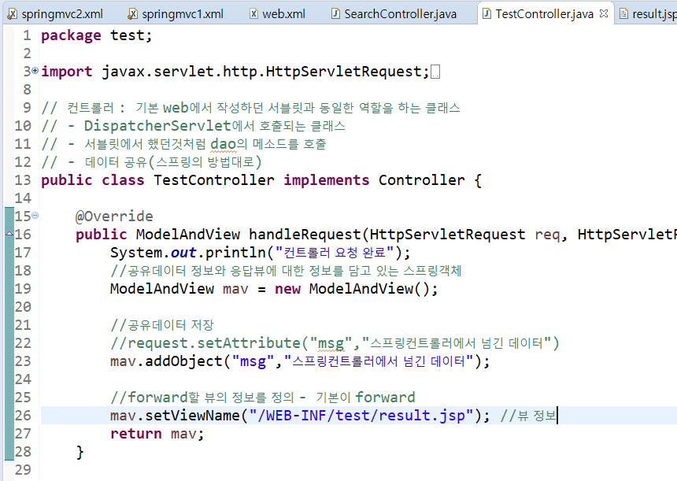

였던 것을 

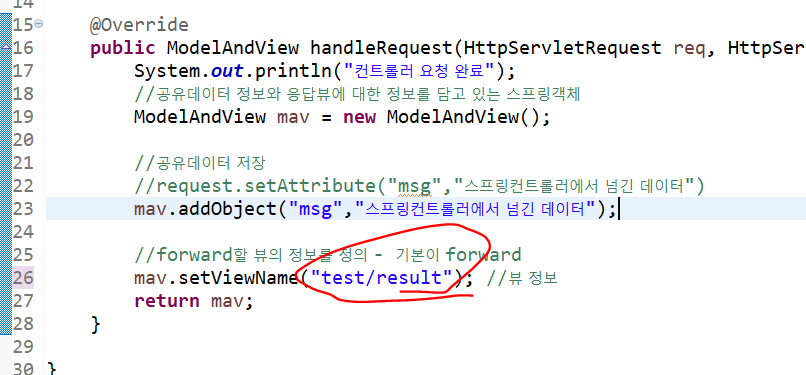

처럼 수정해준다.


-----

-----

----

-----

----


# Spring MVC 구성요소

스프링 MVC를 구축하고 웹을 실행

스프링이 제공하는 모든 편리한 기능을 잘 활용하기 위해서, 스프링이 내가 작성한 자바빈을 관리할 수 있도록 작업해야 한다. (스프링 내부의 컨테이너가 내가 작성한 빈을 생성하고 관리할 수 있도록 작업)

이를 위해 모든 요청을 `DispatcherServlet`이라는 서블릿을 통해 들어올 수 있도록 관리한다.


| /    | MVC 구성 요소       | 설명                                                         |
| ---- | ------------------- | ------------------------------------------------------------ |
| 1    | `DispatcherServlet` | 클라이언트의 모든 요청을 처리하기 위해 첫 번째로 실행되는 서블릿 |
| 2    | `HandlerMapping`    | 클라이언트가 요청한 path를 분석해서 어떤 컨트롤러를 실행해야 하는지 찾아서 `DispatcherServlet` 으로 넘겨주는 클래스 |
| 3    | `Controller`        | 클라이언트의 요청을 처리하는 클래스<br />DAO의 메소드를 호출하는 기능을 정의 |
| 4    | `ModelAndView`      | `Controller` 에서 DAO의 메소드 실행결과로 만들어진 데이터에 대한 정보나 응답할 view에 대한 정보를 갖고 있는 객체 |
| 5    | `ViewResolver`      | `ModelAndView` 에 저장된 `view`의 정보를 이용해서 `DispatcherServlet` d에게 실제 어떤 `view`를 실행해야 하는지 정보를 넘겨주는 객체 |

* 스프링 MVC를 구축하면 위의 클래스들이 자동으로 실행되며 일처리를 한다. 
  따라서 필요에 따라 스프링에서 지원하는 `ViewResolver`나 `HandlerMapping` 객체를 다양하게 등록하고 사용할 수 있다.
* 기본 설정을 이용ㅎ는 경우 개발자는 `Controller`만 작성하고, 설정파일이나 어노테이션으로 등록하면 된다. 
* WEB-INF는 웹상에서 요청할 수 없는 경로다. 