# Front Controller

모든 요청의 하나의 통로로만 들어올 수 있도록 관리하는 것 : front controller
모든 요청을 한 곳에서 처리할 수 있도록 함

웹 관련 라이브러리가 없기 때문에 오류가 뜨고, 따로 라이브러리 추가해줘야 한다. 

### [서버 라이브러리 추가하기]

에러 사라졌다. 이제 FrontServlet을 본격적으로 만들어보자. 

## FrontServlet 만들기

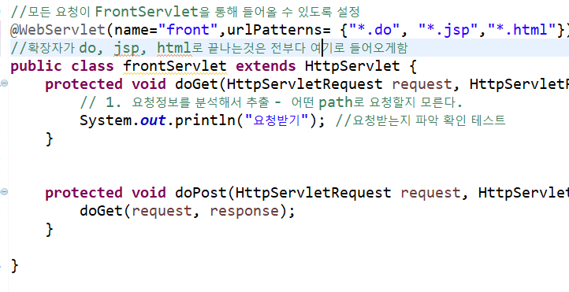

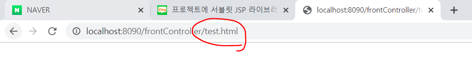

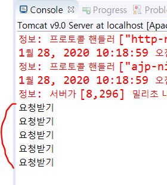

파일 명 뒤가 do, html, jsp로 끝나는 것을 실행할 때마다 요청받기가 실행된다.

다음은 path를 추출하는 메소드이다.

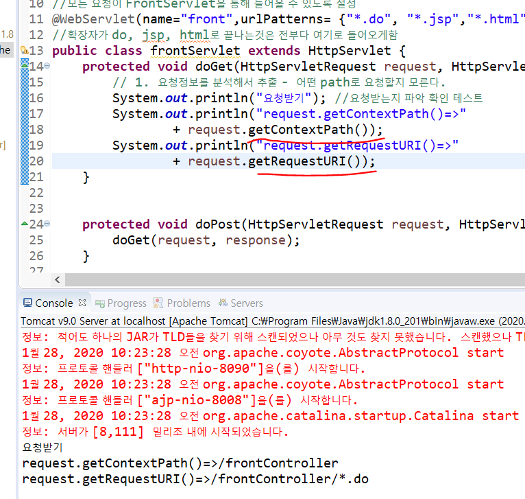

그런데 앞에 /frontController가 붙어서 나온다.

내가 원하는 path명을 자동으로 뽑아내려면 다음과 같이 `subString` 메소드를 적어서 앞에 부분을 자르면 된다.

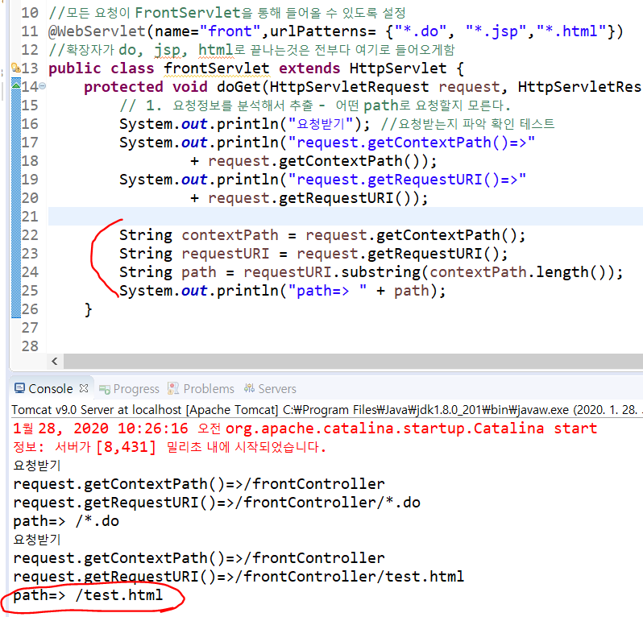

new > file 만들기

요청 패스가 들어오면,  = 의 오른쪽에 있는 패키지속의 클래스명을 실행하라는 뜻의 파일을 만든다.
(미리 요청패스에 대해 해당 작업을 작성한 파일)

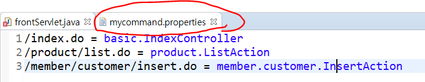

이렇게 매핑해 주는 RequestMapping 클래스를 만들자. 
(일단 frontServlet.java에 작성해준다. )

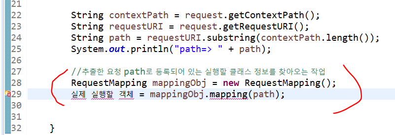

RequestMapping 클래스를 생성한다.

그 다음, 실제 실행할 클래스의 상위타입 클래스를 만들어준다.
RequestMapping클래스가 실행할 클래스를 찾아서 리턴할 때 공통의 타입이 있어야 하기 떄문이다.

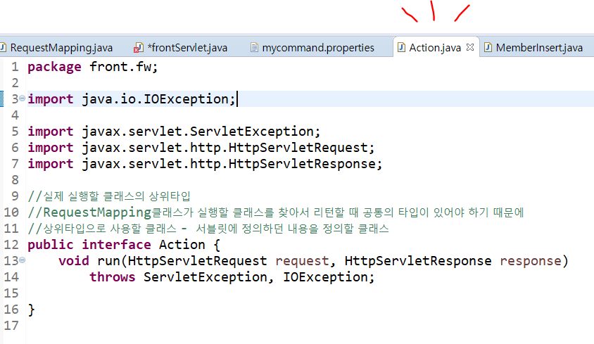

앞으로 역할을 실행하는 클래스들은 앞서 만든 Action을 상속한다.

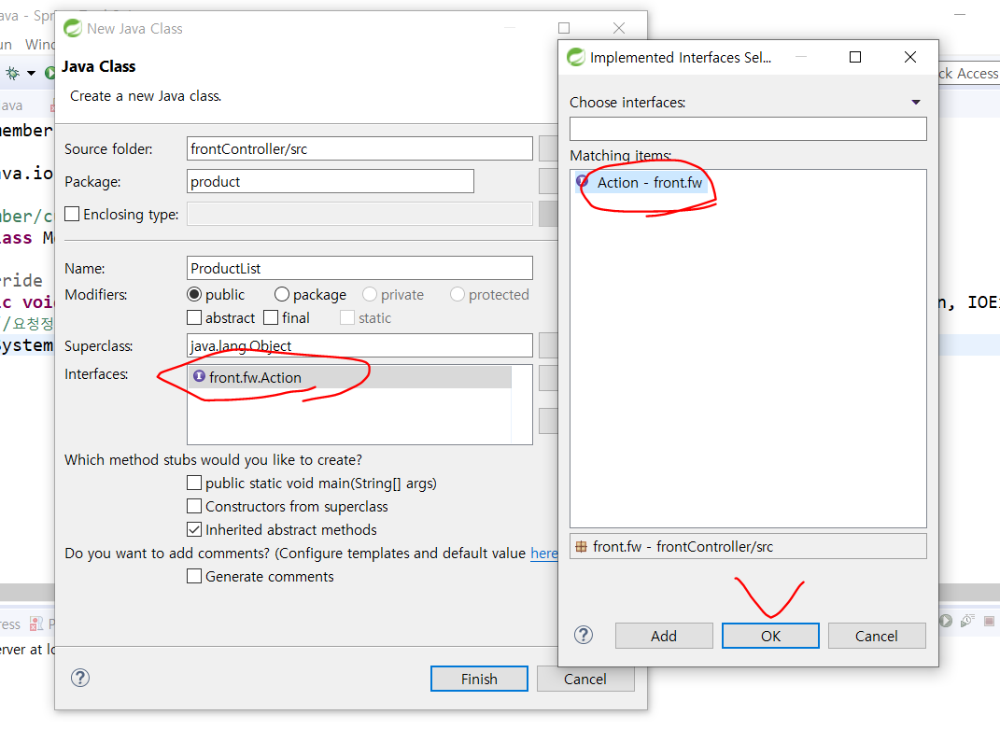

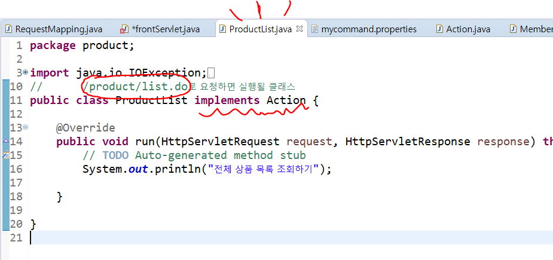

RequestMapping 클래스에 `HashMap` 을 이용해서  path(key), 실제실행할객체(value) 를 묶어준다.

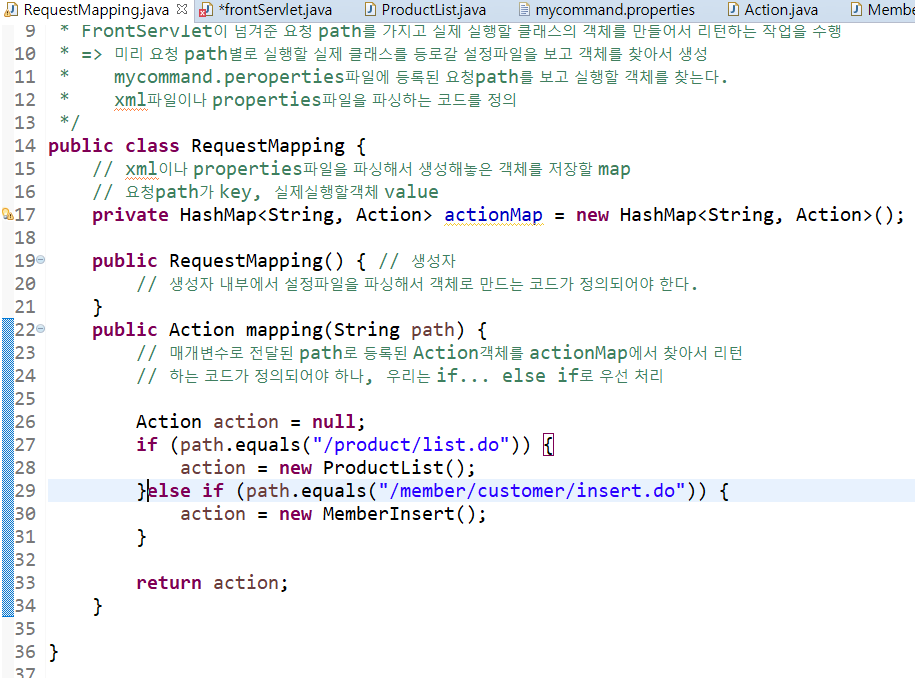

또한 Action 타입을 반환하는 mapping메소드를 정의한다. path(key)에 따라서 반환하는 action(value)값이 달라진다. 

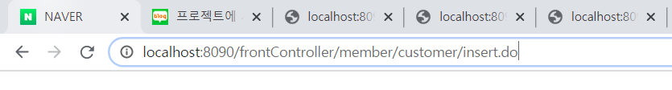

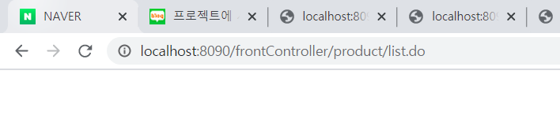

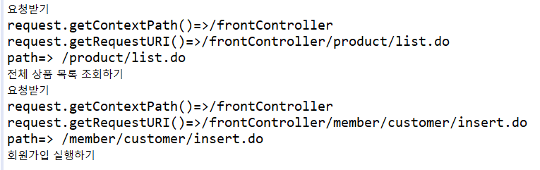

주소줄에 있는 path를 변경하면, 그에 맞게 실행되어 위와 같은 결과가 콘솔창에 나타난다. 

