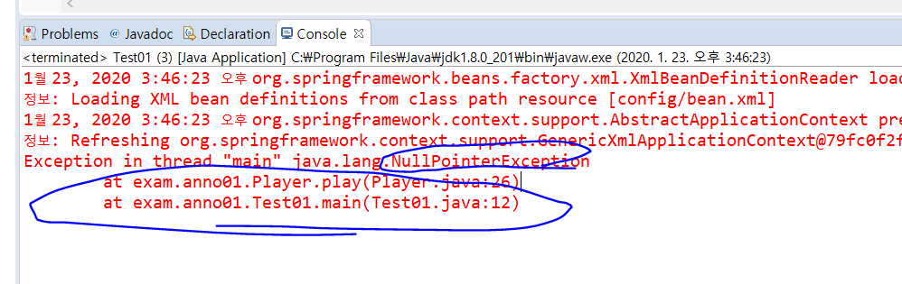
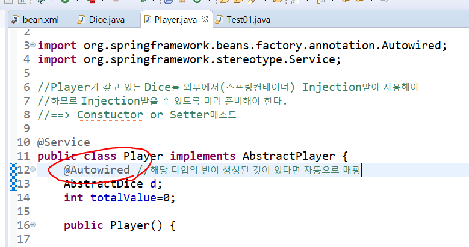
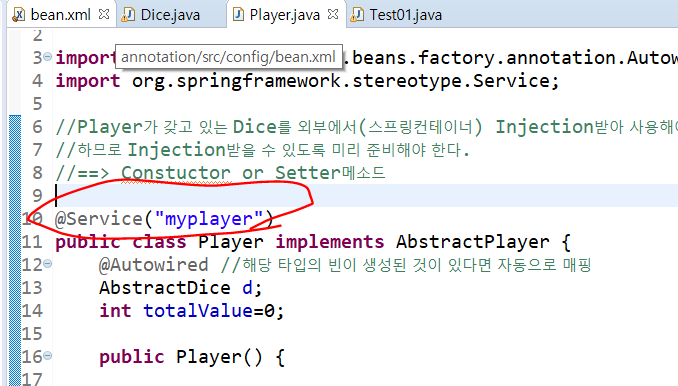
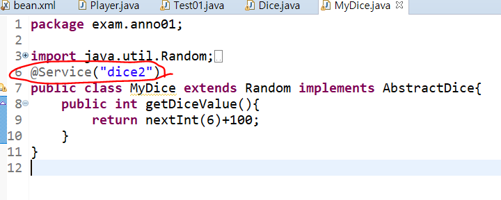
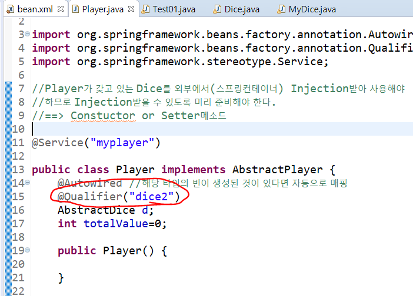
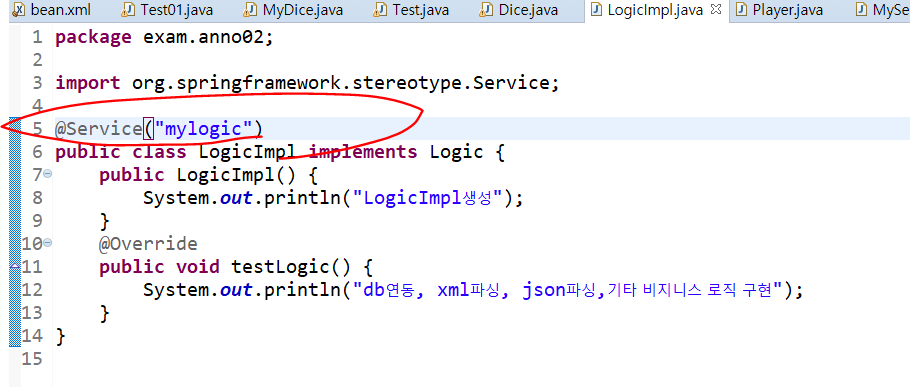
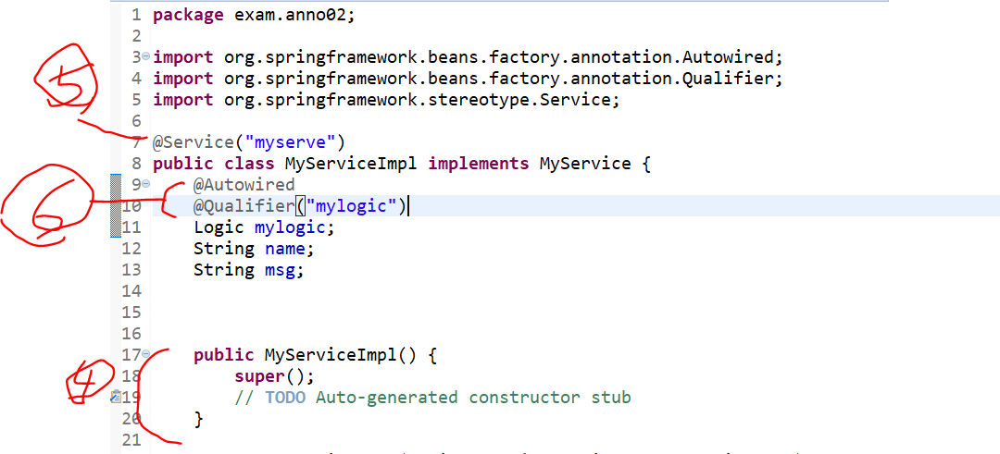

# 어노테이션

### 자꾸 xml파일을 추가해야 해서 불편한 상황 => 어노테이션으로 해결

ctrl + space 하면 context관련 태그가 생긴 것을 확인할 수 있다. 

* bean을 만들기위해 어노테이션 기호 쓰면 자동으로 bean을 만들어준다. (어노테이션 쓰면 기본생성자를 써줘야 한다.)

* `@componet` 를 사용하면 일반적인 bean을 만들 수 있다. 

@Service, @Repository, @Controller

### 오류 예제

이게 없다고해서 추가해줘야한다. 

추가해 주자

추가해준 뒤에 또 오류가 뜬다

이것은 xml에서 경로가 잘못된 것이므로 맞게 수정해준다.

player에 `@Autowired` 어노테이션 선언해주자.

## 어노테이션을 활용하기

* 설정파일에 빈을 등록하지 않고 사용한다. 
* 간단하게 기호를 이용하여 빈을 사용할 수 있도록 설정

### [어노테이션 규칙]

* 설정파일에 `<context:component-scan>` 엘리먼트를 이용해서 컨테이너가 빈을 찾을 수 있도록 패키지를 등록

* 기본생성자를 반드시 추가해야 한다.

* 빈 생성을 위해 사용할 수 있는 어노테이션 기호

  * `@Component` : 일반적인 빈 등록시 사용

  * `@Service` : 비지니스로직(DAO제외)이 정의되어 있는 빈을 등록하는 경우 사용

    ​					클래스의 첫 글자를 소문자로 변경한 이름을 빈의 name에 등록한다. 
    ​					ex. Dice의 경우 -> dice로 등록되어있다.
    ​					ex.Player => player

  * `@Repository` : DAO를 등록하는 경우 사용 

* 빈의 이름을 명시하고 싶으면  `@Service("원하는이름")`  로 정의한다. 

  

  위의 경우에서는 @Service("myplayer") 로 설정.
  												------------- > 등록한 빈의 이름은 lookup 하거나 의존성 주입할때 사용된다.

이렇게 dice 여러개 만들어서 `@Qualifier("")` 를 통해 지정할 수 있다.

### [ 순서 정리 ]

1. bean.xml에 가서 어떤 패키지에서 빈을 찾아야 하는지 명시해준다.

2. LogicImpl에 가서 빈 등록한다.

3. 기본생성자 있는지 확인한다.
4. MyServiceImpl 가서 기본생성자 있는지 확인한다.
5. 서비스를 등록한다.
6. Autowired, Qualifer("logicImpl에서 등록한 이름") 적어준다.

