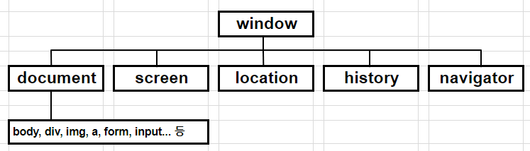
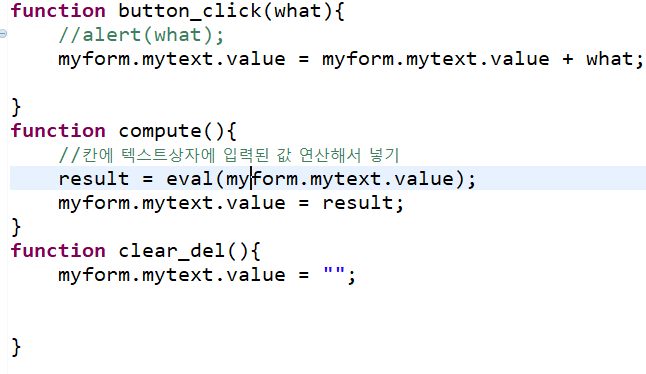
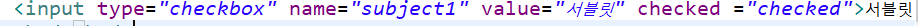

### BOM : 브라우저 객체 모델

브라우저에 출력되는 모든 구성요소를 객체로 정의하고 접근


* window 가 최상위
* history : 접속기록을 관리
* location : 주소표시줄
* document 
* form (양식태그)
* image



1. 접근 방법

   * 모든 객체는 계층 구조를 갖고 있다.

     window.document....

   * form 태그와 form태그 하위 태그를 객체로 접근하기 위해 name속성을 정의하고 접근


     ```html
     <form>
     	아이디 : <input type = "text">
     	패스워드 : <input type = "password" name ="pass"> 
     </form>
     ```
    
     window.document.폼객체.텍스트객체
    
     window.document.myform.id.속성(메소드)


     주로 window.document는 생략 

   * id를 정의하는 경우

     ```html
     <div id = "mydiv">
         
     </div>
     ```

     객체 = document.getElementById("mydiv")


2. **window**

   1) 대화상자

   	- alert
   	- prompt (input 대화상자, 잘 안씀)
   	- confirm (상호작용. 보통 alert과 confim 사용)

   2) popup

   * open
   * close

   3) 자동실행

   * setTimeout
   * setInterval
   * clearInterval

   4) 데이터처리

   * parseInt (윈도우가 갖고있는 메소드) : 숫자모양을 한 문자열을 숫자로 변환
   * isNaN : 입력받은 값이 숫자인지 문자인지 확인
     (타입을 비교하지 않고 실제 값을 비교 - 문자가 입력되면 true)
   * eval : 매개변수로 전달된 데이터(식,연산)를 실제로 실행(보안에 취약)
   * trim : 공백을제거 


---


값을넣을  때

```html
form네임.네임.value = .... //value가 왼쪽이라서 setter
```

[계산기 예제]




체크박스는 넘어오는 값이 많기 때문에 for문과 배열을 이용한다. 


checked



checked에 checked하면 체크된다. 

innterHTML : 덮어쓴다.


document, window 적는 것 생략 가능


----


3. event
   - onclick
   - onkeyup
   - onmouseover, onmouseout
   - onchange
   - onload
   - 