# CSS

1. CSS 사용방법
2. 텍스트 관련 테이블
3. Box모델
4. 포지셔닝
5. float
6. layout


## 1. CSS 사용 방법

### 내부 스타일 시트 적용

헤더태그 안에 넣어준다.

```html
<head>
<meta charset="EUC-KR">
<title>CSS_Basic_Test01</title>

    <style type="text/css">
    /*텍스트로 작성된 css형식이다. */
	</style>
    
    </head>
```

내부로 스타일 시트를 적용했기 때문에, 해당 문서 안에서만 유효하다.

---

### 선택자

태그(=요소)를 주고 중괄호 열고 닫고가 스타일을 정의하는 기본.

```html
	p{ 	/* 1.html태그를 선택자로 사용할 수 있다. */
		color : #84af7e;
		background-color: yellow;
	}
```


* 선택자

  * `태그{ }` :기본형태

  * `태그 태그 { } ` : 태그 내에 정의된 하위 태그를 선택자로 정의할 수 있다.

    ```html
    <style type="text/css">
    	div a {
    	color: red;
    	text-decoration: none;
    	}
    </style>
    ..
    .
    .
    <div class="myclass">
    		<a href="#">HTML 5</a>는 별도 프로그램을 깔지 않아도 인터넷 브라우저상에서 화려한 그래픽 효과를 구현하며,
    		음악ㆍ동영상을 자유롭게 감상할 수 있는 마크업 언어(markup language)이다.
    	</div>
    ```

    

  * `태그, 태그{ }` : 태그와 태그를 복수개 선택하여 선택자로 정의할 수 있다.

    ```ht
    h1, h2{
    	color:blue;
    	}
    ```

    

  * `.클래스명{ }` : 몇 개의 요소를 하나의 클래스로 묶어서 동일한 스타일을 지정할 수 있다.

    ```html
    .myclass{ /* 2.태그내부에 class속성을 정의하고 선택자로 사용할 수 있다. 
    				=> 중복해서 정의하는 것이 가능 */
    		color : blue;
    		 }
    ```

    

  * `태그.클래스명{ }` : myclass가 정의된 div만 적용 

    ```html
    div.myclass{ /*div중에서 myclass클래스들만
    	(아이디일 경우 태그#id명 */
    	color:aqua;
    	}
    ```

    

  * `#아이디명{ }` :단, id는 식별하기 위해 사용하는 것이므로 한 문서에서 동일한 id를 하나만 정의할 수 있다. 

    ```html
    #mydiv{ /*3. 태그 내부에 id속석ㅇ을 정의하고 선택자로 사용할 수 있다.
    				=> id속성은 식별하기 위해 사용하는 것이므로
    					한 문서에서 동일한 이름의 id는 하나만 정의할 수 있다. */
    			border: solid blue 1px;
    	}
    ```

  

  * `<태그 style=>` : [인라인]body 안에 있는 태그에 직접 스타일 추가할 수 있다.

    * css속성을 태그에 추가해서 바로 정의할 수 있다.
    * 가장 가까운 곳에 있는 것이 우선순위가 높기 때문에 head에 있는 css보다 먼저 적용된다. 

    ```html
    <h1 style="border:solid red 1px; color = yellow;">
    ```

    

---


### 외부 스타일 시트 적용

css 파일을 만들기에 앞서, 공통적으로 쓸 수 있는 폴더를 만든다. 

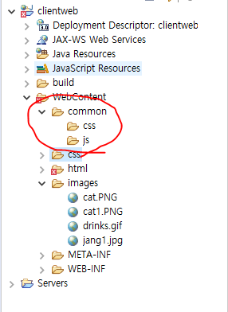


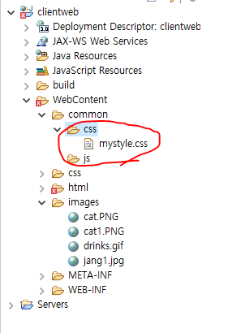


css를 적용할html 파일 head 태그 안에 link 태그를 적고 속성을 적용해준다.

> * href : css파일의 경로
>
> * rel : rel은 경로에 쓰여진 파일과 현재 작성된 파일이 어떤 관계인지 명시해주는 것 

```html
<head>
<link type = "text/css" rel="stylesheet"
		href="../common/css/mystyle.css">
	<style type="text/css">
    </style>
```

---


### 배경 삽입하기

저장된 이미지 경로 작성

* `background-image` : 배경에 이미지 삽입

* `background-repeat` : 반복 여부 작성

```html
body{
	/* css내부에서 이미지나 파일이나 여러 경로를 정의해야 하는 경우
		상대경로, 절대경로 속성을 동일하게 적용한다. */
		background-image: url("../images/background.gif");
		background-repeat: repeat-x; /* x축 방향으로만 중복 */
	}
```

```html
background-repeat: repeat-y; /* y축 방향으로만 중복 */
```

```html
background-repeat: no-repeat; /* 반복없음, 하나만. */
```


---


### 그림자 효과 주기

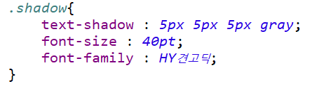


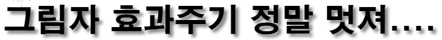


---


### 투명도 적용

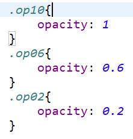


---


### 마우스 커서

마우스를 갖다대면, 커서 상태가 변경된다. 

```html
<p style="cursor: pointer">pointer</p>
```


---

### 링크 스타일 

`a:OOO` : `:` 뒤에 명시한 것은 실체가 없는 것으로 상황 및 상태에 대해 정의한다. 

* `a:link` : 방문되지 않은 링크의 스타일
* `a:visited` : 방문된 링크의 스타일

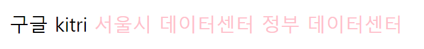

* `a:hober` : 마우스가 위에 있을 때의 스타일 (a태그가 아니라도 모두 적용 가능)

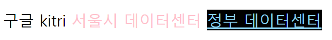

* `a:active` : 마우스가 클릭되는 때의 스타일

  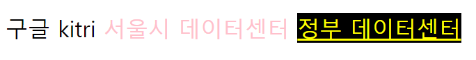

  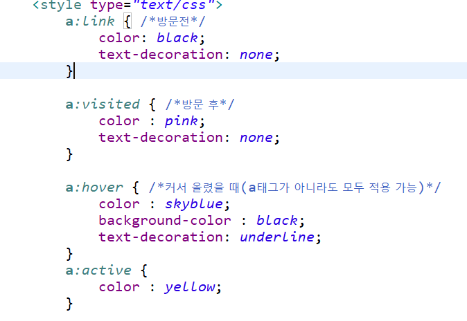

---


### 리스트 스타일 (List Style)

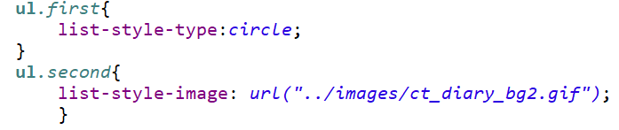

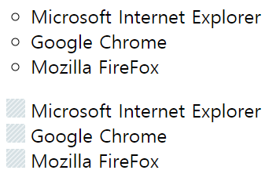


---


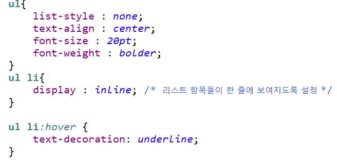

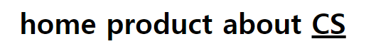

---


### Box model

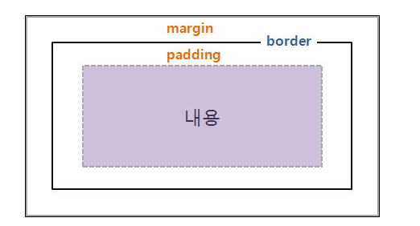

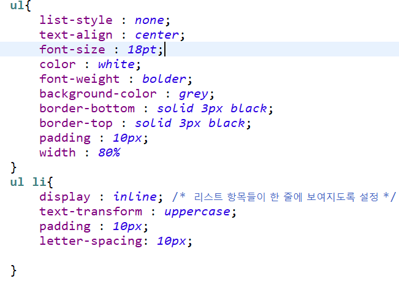


----


### position


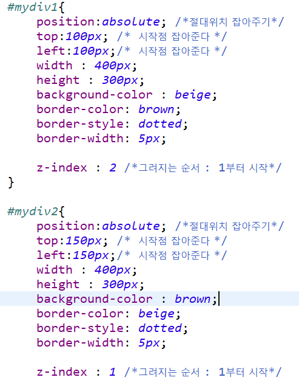


```html
border-radius : 20px; /*둥근 가장자리*/
```

---

### overflow


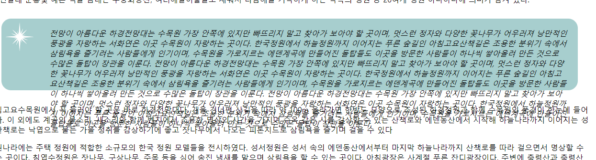


이렇게 글자가 너무 많아서 넘쳐 흐를 경우 다음과 같이 해결한다.

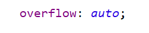

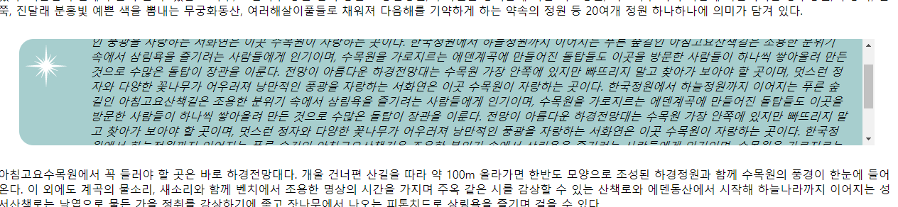

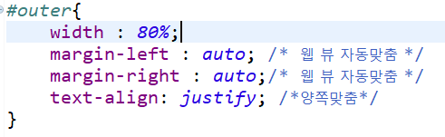

---


### Position

* `relative` :  원래 있어야하는 위치에서부터 상대적 위치로 이동 (평행이동)
* `static` :  원래 기본 흐름대로 보여진다. 원래 있어야 하는 위치에 있다.
  * 위에서 아래로, 왼쪽에서 오른쪽으로 부모의 위치에 영향을 받는다. 
* `absolute` : 부모의 위치로부터 절대적 위치로이동
  * absolute 는 다큐먼트 기준이라. 따라서 해상도와 상관없이 무조건 보인다. 
    현재 화면에서 안보이면, 스크롤 움직여서 볼 수 있다. 
* `fixed` : 부모의 포지션과 상관없이 지정한 위치로 이동. 윈도우 기준으로 이동
  * fixed은 내가 화면을 내려도 계속 보인다. 윈도우 기준으로 무조건 지정된 위치에서 보여진다. 내가화면을 계속 내려도 위에 둥둥 떠서 보인다. 
  * 하지만 만약 윈도우 해상도를 벗어나는 fixed 개체라면, 윈도우 기준이므로 스크롤을 아무리 움직여도 볼 수 없다. 
  * 윈도우 해상도를 벗어나지 않으면 스크롤 해도 화면에서 지정한 위치에 계속 고정된다. 


---


