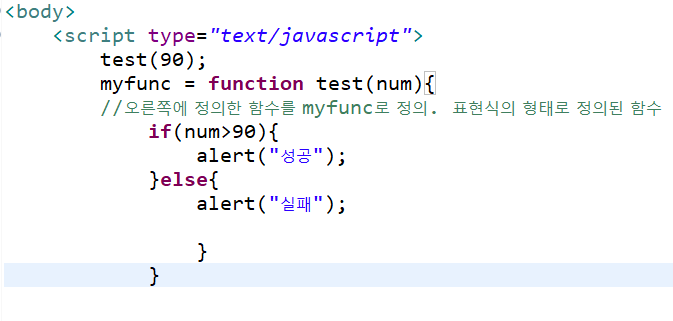
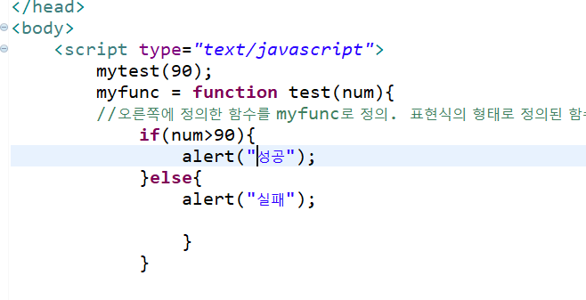
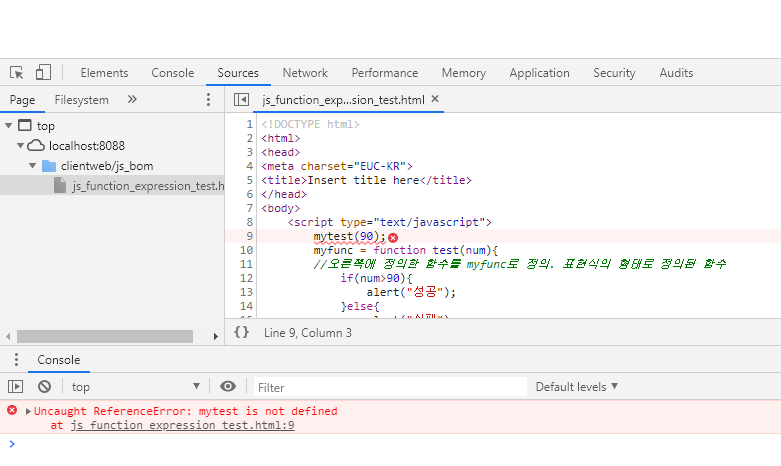
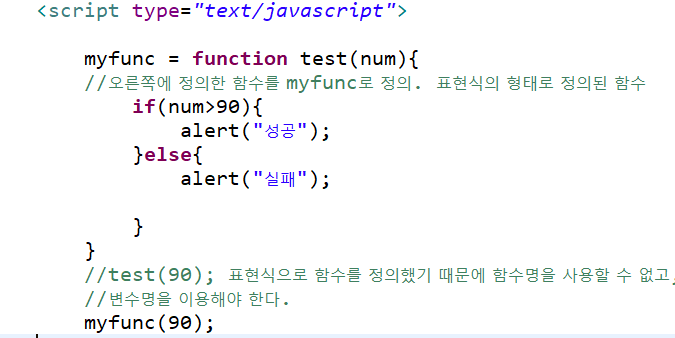

## DOM


DOM : 자바스크립트 뿐만아니라 xml에서도 쓰인다.


웹의 파서 2가지 : 돔, 삭스


HTML의 요소들을 모두 객체로 만든다. (안드로이드의 xml도 마찬가지)

페이지를 읽어와서 문서의 모든 내용을 라이브러리 형식대로 객체화시킨다.

객체화 시켜서 메모리에 올려놓고 화면에 하나하나 뿌려주는 작업


이미 만들어진 태그 = 정적 요소

서버들어갔다가 나와서 생긴 요소들을 페이지에 뿌려얗야 하는 상황이라면,
이렇게 만들어진 요소들은 동적 요소.

이런 동적 요소에 이벤트를 붙일 수 있어야 한다. 


---


## 함수의 표현식, 호이스팅

호이스팅 : 함수를 선언하는 명령문 전에 함수를 호출하는 명령문을 적지만, 실행되는 것.

자바스크립트가 실행 될 때 가장 먼저 함수를 읽기 때문에 함수가 선언되기 전에 함수를 호출하는 이상한?방식을 써도 정상적으로 실행이 된다. => 호이스팅.

그러나, 메모리 효율적으로 좋지 않다. 그래서 꼭 필요한 경우에만 사용한다. 





> > > 이번엔 myfunc으로



그래도 실패



-> 이렇게 함수를 표현식으로 하면, 호이스팅이 일어나지 않는다.

따라서 접근할 수 없다.




```javascript
변수 = function 함수명(){
	//실행할 명령문
}
```

위처럼 함수를 표현식으로 정의하고 사용하면, 함수의 호이스팅이 발생하지 않는다. 

또한	' `=` ' 연산자를 이용해서 함수를 변수에 할당. 
이런 경우 정의한 함수명을 사용하지 않고 변수명을 함수명처럼 이용한다. 

이때 `함수명()`; 이런식으로 함수를 호출할 수 없다. 표현식으로 함수를 정의했기 때문에 함수명을 사용할 수 없고, 변수명을 이용해야 한다. 


---


# callback

매개변수로 전달이 되거나, 이벤트핸들러로 연결이 되는 함수는 당장 실행하는 게 아니라, 어떠한 상황이 될 때 실행하도록 한다.

