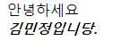
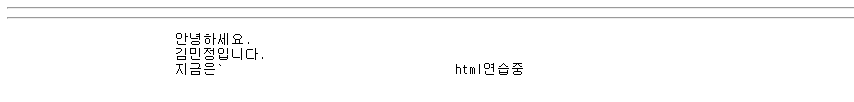
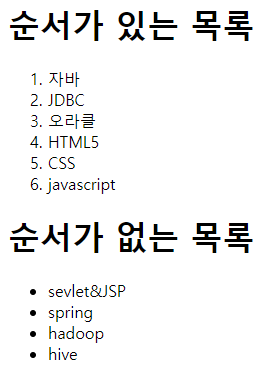
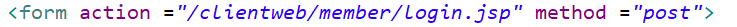
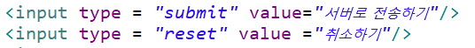
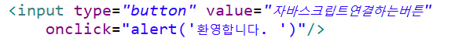
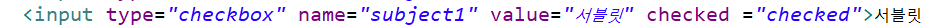
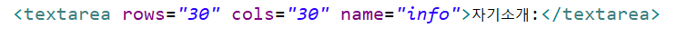

### 헤딩

* h1~h6까지 존재

```html
		<h1>HTML연습중....</h1>
		<h2>HTML연습중....</h2>
		<h3>HTML연습중....</h3>
		<h4>HTML연습중....</h4>
		<h5>HTML연습중....</h5>
		<h6>HTML연습중....</h6>
```


### 단락

```html
<p>
    이것이 하나의 단락입니다.
</p>
```


### 주석

```html
<!-- -->
```


### 줄바꿈

```html
<br/>
```


---

### img

```html

```


* 내부 파일

```html

```


* 상대 경로

`.` 은 현재폴더, `..`은 상위폴더

```htm

```


* 절대 경로

슬래쉬`/`가 맨앞에 있으면 root를 의미한다. http://127.0.0.1:8088이라는 뜻

```html


<!-- 두 문장 같은 말 -->
```


---

### 여러 가지 태그


* `<br/>` : 줄바꿈
* `<i>` : 기울임(이탤릭체)
* `<b>` : 볼드체

```html
안녕하세요 <br/>
		<b><i>김민정입니당.</i></b>
```




* `hr/` : 수평선

* `<pre>` : 쓴 대로 보여지게 만든다.

```html
<hr/>
<hr/>
		<pre>
			안녕하세요.
			김민정입니다.
			지금은					html연습중
		</pre>
```




* `&lt;` : <
* `&nbsp` : 띄어쓰기 공백

```html
안녕하세요&lt; <br/>
		<b><i>김민정</i></b>&nbsp;&nbsp;&nbsp;입니다.
```


F12키 누르고 화살표 누른 뒤, 알고 싶은 부분에 커서를 갖다 대면 해당 코드를 알 수 있다.


---

### 리스트

* `<ol>` : 순서가 있는 리스트
* `<ul>` : 순서가 없는 리스트
* `<li>` : 리스트 목록 작성

```html
<h1>순서가 있는 목록</h1>
	<ol>
		<li>자바</li>
		<li>JDBC</li>
		<li>오라클</li>
		<li>HTML5</li>
		<li>CSS</li>
		<li>javascript</li>
	</ol>
	
	<h1>순서가 없는 목록</h1>
	<ul>
		<li>sevlet&JSP</li>
		<li>spring</li>
		<li>hadoop</li>
		<li>hive</li>
</ul>
```




* `<dl>` : 정의리스트
* `<dt>` : 타이틀
* `<dd>` : 타이틀에 대한 설명

```html
<h1>정의리스트</h1>
	<dl>
		<dt>클라이언트웹</dt> <!-- 타이틀 -->
		<dd>클라이언트에게 보여지는 페이지를 만드는 기술을 살펴본다.</dd> <!-- 타이틀에 대한 설명 -->
		<dt>서버웹</dt>
		<dd>DB연동이나 파일작업을 할 수 있는 웹의 기술을 살펴본다.</dd>
		
	</dl>
```


---


### 하이퍼링크

* `<a>` 
* `target` 
  * "_self" : 현재페이지에서 해당페이지를 열기
  * "_blank" : 새 창에서 해당페이지를 열기

```html
<a href="https://www.naver.com" target="_self">네이버</a>
	<a href="https://www.naver.com" target="_blank">네이버</a>
```


### 테이블

* `<tr>` : 행과 행 사이는 tr로 구분하여 tr을 써준다.
* `<td>` : 행에 대한 열 구분은 td로 작성한다.
* `<th>` : 컬럼값은 th로 작성해도 된다.
* `border = "사이즈"` : 테이블 선의 두께 지정
* `<td colspan = "3">` : 3개의 열 병합. 
* `<td rowspan = "2">` : 2개의 행 병합. 이때 하나의 값이 공통으로 들어갈 수 있도록 1개를 제외한 나머지 요소는 삭제해준다.
* `<tr align="center">` : 요소의 값을 가운데 정렬 할 수 있다.

```html
<table border="1" width="400" height="400">

		<tr align="center">
			<td>1</td>
			<td colspan="2">2</td>
			<td rowspan="2" colspan="2">3</td>
		</tr>

		<tr align="center">
			<td>4</td>
			<td rowspan="2">5</td>
			<td>6</td>
		</tr>

		<tr align="center">

			<td>7</td>
			<td colspan="3">8</td>
		</tr>

		<tr align="center">
			<td colspan="3">9</td>
			<td colspan="2">10</td>
		</tr>
```

---


## form


### input

* `method`
  * get : 헤더에 입력한 데이터들이 넘어가는것이라 입력한 내용이 주소표시줄에 노출된다. 
  * post : 요청메세지 바디에 숨겨져서 나가기 때문에 주소표시줄에 노출되지 않는다. 

* `action` 절대경로로 작성해준다. 서버로 요청 전송 시 해당 액션을 수행한다.

* `<input type = "속성값">` 

  * `text` : 텍스트를 쓸 수 있는 기능
  * `password` : 비밀번호 텍스트 

  ```html
  아이디: <input type = "text" name="id" size="100"maxlength="20"/><br/>
  		패스워드: <input type = "password" name="pass"/></br>
  ```

  

  * `summit`: 서버로 데이터를 전송하는 역할.(**무조건 form과 form/ 사이에 있는 정보들 모두 서버로 요청**)
    서버로 (get, post방식으로) 요청을 보내면서 action에 명시한 어플리케이션 호출. 아무것도 쓰지 않으면 현재 페이지가 호출됨.
    따라서 정보를 서버로 전송하고 싶으면, 무조건 form 을 써줘야 한다. 

  ```html
  
  ```

  

  

  * `reset` : 지우는 역할

  * `button` : 버튼 타입

    

  * `checkbox` : 중복 선택 가능

  * `radio` : 중복 선택 불가, 1개만 선택 가능 기능

  ```html
  		<h2>3. 선택관련태그</h2>
  		<h3> 좋아하는 과목 </h3>
  		<input type="checkbox" name="subject1" value="자바">자바
  		<input type="checkbox" name="subject1" value="JDBC">JDBC
  		<input type="checkbox" name="subject1" value="HTML5">HTML5
  		<input type="checkbox" name="subject1" value="서블릿" checked ="checked">서블릿
  		<br/><br/>
  		
  		<h3> 좋아하는 과목 </h3>
  		<input type="radio" name="subject2" value="자바">자바
  		<input type="radio" name="subject2" value="JDBC" checked ="checked">JDBC
  		<input type="radio" name="subject2" value="HTML5">HTML5
  		<input type="radio" name="subject2" value="서블릿">서블릿
  		<br/><br/>
  ```

  

  

  * `select` : 선택하는리스트.

  ```html
  <select name = "subject3">
  			<option value="hadoop">hadoop</option>
  			<option value="hive">hive</option>
  			<option value="mongodb">mongodb</option>
  			<option value="sqoop">sqoop</option>
  		</select>
  ```

  

  * `file` : 파일을 찾는 탐색기가 나온다.
  * `date` : (양식태그) 달력과 함께 날짜를 입력할 수 있다.
  * `number` : (양식태그) 수량 조절할 수 있는 버튼이 나온다.
  * `email` : (양식태그) 이메일 주소 형식에 맞게 쓰지 않으면, 서버로 넘어가지 않음. 

  ```html
  <input type="file" name="photo" value ="파일선택">
  	<input type="date" name="regdate">
  	<input type ="number" name= "count">
  	<input type ="email" name= "mymail">
  ```

  

  

* `onclick` : 자바스크립트연결하는 역할. 버튼을 누를 때 어떻게 할지 값을 써준다. 

  

* `checked` : `radio`나 `checkbox`에서선택하기 전에 미리 디폴트로 체크되게 한다. 

  

  

* `multiple` : select타입에서 여러 개 선택 가능

* `disabled` : 입력 못하게 한다. 

```html
	닉네임 : <input type = "text" name="nickname"
			value="별칭을 입력하세요. "  disabled="disabled"/><br/>
```


* `textarea` : 한 줄이 아니라 여러 줄 쓸 수 있는 텍스트 입력 칸이 나온다. 




### Fieldset

```html
<fieldset>
	<legend> 좋아하는 과목 </legend>
		<input type="checkbox" name="subject1" value="자바">자바
		<input type="checkbox" name="subject1" value="JDBC">JDBC
		<input type="checkbox" name="subject1" value="HTML5">HTML5
		<input type="checkbox" name="subject1" value="서블릿" checked ="checked">서블릿
		<br/><br/>
	</fieldset>
```


---


* `<div>` : 줄바꿈이 있는 그룹 묶기
  * div안에 여러 div 중첩 사용 가능.
  * div로 묶고 나서, 다음 문장은 줄바꿈 되어 다음 줄에 텍스트가 써진다.
* `<span>` : 줄바꿈이 없는 그룹 묶기
* `<p>` : 단락 그룹 묶기(시작 전과 후에 여백을 준다. )