# JSP

* Java Server Page

* 클라이언트의 요청에 대해 동적 컨텐츠를 생성해서 응답결과(html태그)를 만들어 줄 때 사용하는 기술.
  Html문서에 화면을 구성하는 방법과 동일하게 작성하면 된다.

* 실행이 될 때 WAS내부에있는 JSP컨테이너에 의해 서블릿으로 변환되어 실행되므로, 자바코드를 사용할 수 있다.

* JSP는 서블릿에서 발생한 데이터를 화면에 출력하기 위해서 사용하는 기술이므로 자바코드를 다양하게 많이 정의하지 않도록 구현해야 한다.

* Lifecycle이 서블릿과 유사

  

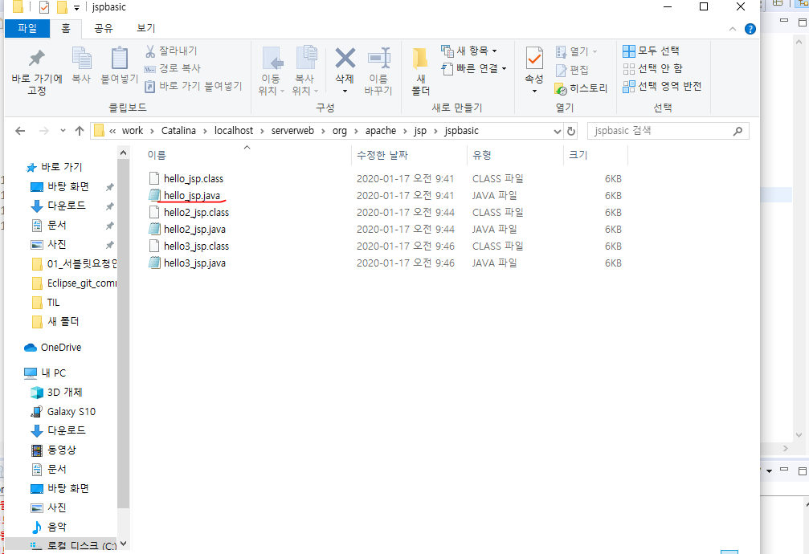

.java파일 : 서블릿으로 변환된 파일들 

---


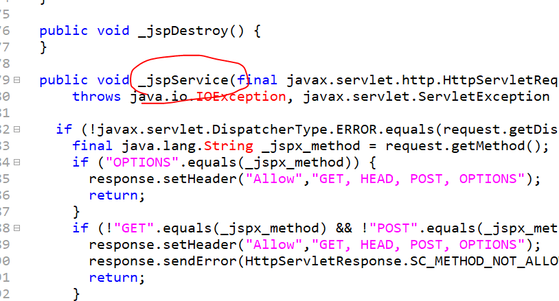

_jspService 는 서블릿의 Service() 와 같다. 


#### 1. JSP스크립트요소

1) 스크립트릿

```java
<%  %>
```

* 자바 코드를 작성할 수 있는스크립트 요소
* 문장의 끝에 반드시 ;을추가해야 한다.
* 스크립트릿 요소는 여러 번 반복해서 정의할 수 있다.
* 지양한다.
* 서블릿이 공유하는 데이터를 꺼내서 출력하는 작업만 구현한다. 
* .java파일에서 할 수 있는 모든 작업을 할 수 있다. (메소드선언, 클래스선언은 X)
* java.lang 패키지 빼고 모두 import
* 스크립트릿 내부에서 정의하는 변수는 모두 _jspService()메소드의 지역변수로 추가

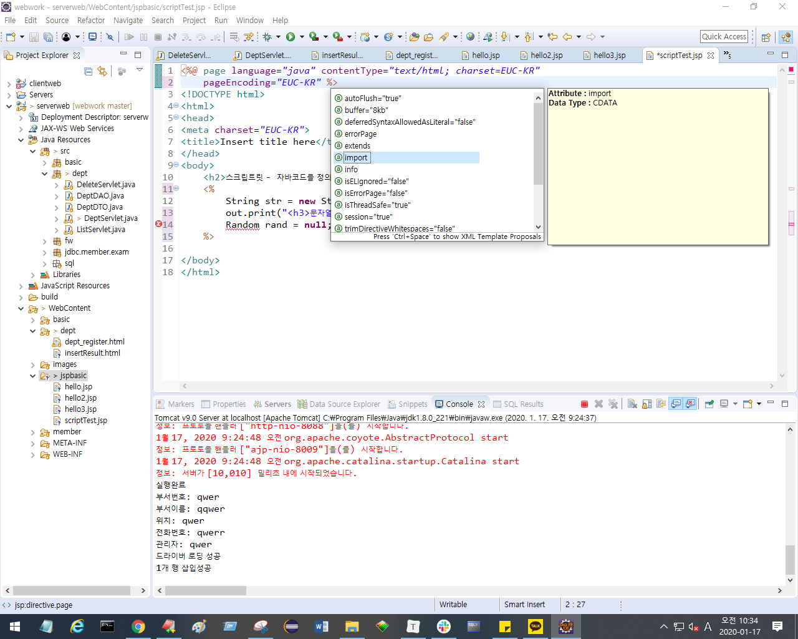

import 할 수 있다.

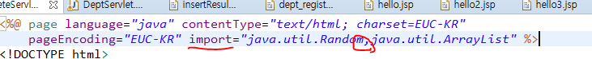

컴마로 구분하여 여러 개 임포트 할 수 있다.

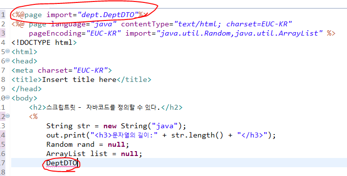

ctrl+space바를 통해 자동완성으로 import를 자동으로 추가할 수 있다.


[ 주석문 ]

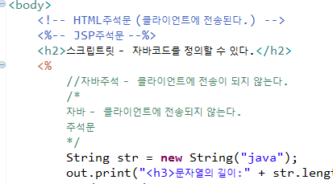


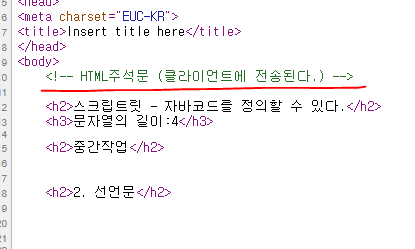

html 주석문으로 중요한 내용들을 정리하면, 페이지소스검사 했을 때 나오기 때문에 쓰면 안된다.

자바주석문이나 jsp주석문을 사용할 것.


2) 선언문

```java
<%! %>
```

* jsp파일이 서블릿으로 변환될 때 서블릿클래스의 멤버로 작성될 메소드나 변수를 정의

  

3) 표현식

```java
<%= %>
```

* 동적으로 만들어진 컨텐츠를 구성하는 값을 출력하기 위해 사용하는 스크립트 요소

* 서블릿으로 변환될 때 out.print()의 내부에 매개변수로 추가가 되므로 ;을 추가하지 않는다. 

  * [오류상황]

    ```java
    <%= "test" ; %>   ======> out.print("test;") : error
    ```

  

* 표현식은 값을 출력하기 위해서 사용하므로 사용가능한 타입이 제한적

  * 기본형,  String, 앞에 나열한 타입을 반환하는 메소드 호출문, 연산


#### 2. 지시자

#### 3.  JSP내장객체

* JSP가 서블릿으로 변환될 때 jsp 컨테이너에 의해서 _jspService()메소드 내부에 추가된 지역변수
  ( jsp 문서 내부에서 변수 선언하지 않고 사용할 수 있다. )

* 객체명은 컨테이너가 자동생성해 준 이름이므로 반드시 정해진 이름으로 사용해야 한다.

  > request : `HttpServletRequest`
  >
  > response : `HttpServletResponse`
  >
  > session : `HttpSession`
  >
  > application : `ServletContext`

  

  **1) request 객체 ( `HttpServletRequest` )**

  * 클라이언트의 요청정보를 담고 있는 객체.

  * 서블릿으로부터 전달받아 사용한다.

    => 서블릿에서 사용하는 모든 것을 사용할 수 있다.

---


## 요청재지정

>  ex. 내가만약 메일함에 있는 특정 메일을 즐겨찾기 하고, 다른 사이트갔다가 로그아웃한 상태에서 그 즐겨찾기 한 것을 다시 가면 로그인하라고 뜬다. => 요청재지정

* 클라이언트로부터 들어온 최초 요청을 servlet에서 원하는 다른 자원(jsp)으로 요청을 넘기는 것

* 요청재지정을 하는 목적은 서블릿에서 화면단을 분리시키고, 분리시킨 화면이 응답하도록 하기 위해 필요하다.

* 웹을 개발하기 위해 사용하는 최적화된 패턴인 MVC패턴을 적용하기 위해 반드시 필요한 개념

  

#### 1. 데이터 공유

**1) scope**

* page, request, session, application에 각각 map구조의 저장소를 갖고 있고
  																			======== > name과 value를 같이 저장

* 그 저장소에 추가하고 저장소에서 꺼내온다.

  * page -> javax.servlet.jsp.PageContext
    			jsp문서 내에서만 사용할 수 있다.
  * request -> javax.servlet.ServletRequest
          한 번에 request에 대해서 처리하고 response하기 전까지 사용되는 모든 객체에 공유
  * session -> javax.servlet.http.HtppSession
        세션이 생성되고 사용되는 모든 것들이 공유할 수 있도록 세션이 생성되는 시점 로그인
        세션이 해제되는 시점 로그아웃(or 정해진 시간 동안 사이트를 사용하지 않는 경우)
  * application -> javax.servlet.ServletContext
         모두 공개 : 톰캣메모리에 공유
          => 로그인 유무와 상관없이 사용하는 모든 곳에서 공유

  

**2) 데이터 공유하는 메소드**

* 공유되는 데이터를 attribute라 한다.

* 모든 객체(scope에 해당하는)의 setAttribute("공유할attribute이름",공유할객체)

  > 공유할객체 : 자바에서 사용할 수 있는 모든 것. java.lang.Object 클래스


**3) 공유된 데이터 가져오기**

* 모든 객체(scope에 해당하는)의 

  ```jav
  java.lang.Object = getAttribute("공유된 attribute의 이름")
  ```

  

#### 2. 요청재지정 방법

**1) 리다이렉트(sendRedirect)**
① 문법

* HttpServletResponse의 sendRedirect메소드를 이용해 구현

```java
response.sendRedirect("요청재지정될 web application의 경로")
    					-------------------------------
    					html, jsp, 서블릿 모두 가능
    					↓
    	/contextpath/폴더명..../요청application의 path
    ex) /serverseb/dept/list.do
```


② 실행흐름

* 클라이언트에서 요청한다.
* 서블릿이 실행된다.
* 서블릿의 실행이 모두 완료되면 클라이언트로 응답한다.
* 클라이언트가 서블릿에서 요청재지정한(sendRedirect에서 설정한) jsp파일을 다시 요청한다.
* jsp페이지가 클라이언트에 응답된다.

http의 특징은 상태정보를 유지하지 않는 것.(stateless) 따라서, 상태정보를 유지시키고 싶을 때 만들어 진 것이 세션, 쿠키이다.

③ 특징

* 두 번 이상의 요청으로 처리되므로 데이터를 공유할수 없다.
* 주소표시줄이 마지막 요청 path로 변경된다.

클라이언트가 요청하면, 서블릿이 요청객체를 만든다. setattribute가지고

센드리다이렉트 만나면 다시 리스폰스한다. 클라이언트에.

끝났다. 그러면 요청객체가 사라진다.


다시 클라이언트가 요청하면, 새로운 요청객체 만든다. 서버쪽에는 늘 새롭게 요청객체 만들어짐

근데 센드리다이렉트는 한번 요청하고 응답했다가 다시 요청들어오면 jsp쪽으로 간다. 또 새로운 요청객체가 만들어짐. null이 나오는 이유(데이터가 공유가 안되는 이유): 서로 요청객체가 다름.


**2) forward**

sendRedirect와 다르게 한 번의 요청으로 모든 web application이 실행된다. 
서블릿이 요청재지정된 application으로 모든 제어를 넘기기 때문에
요청재지정된 jsp파일이 응답된다. `RequestDispatcher`가 이런 일을 처리하는 객체

① 문법

```java
RequestDispatcher rd = request.getReqeustDispatcher("요청재지정할application경로");
rd.forward(request,response);						-------------------------
           ----------------- 	  							   ㅣ
            └> forward하면서 request와 response객체가 			   ㅣ
          전달되므로 같은request를 공유해 사용할 수 있다.			 ↓
    												/폴더.../appplication의 path.
    												context의 path를 생략.
    												jsp,html,서블릿 모두 가능
```

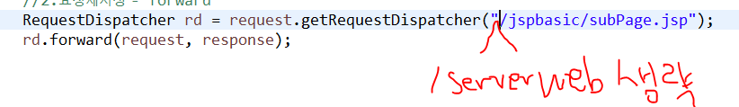

> context의 path를 생략하는 이유? 
>
> /serverweb써주면 404에러 뜬다. /serverweb/serverweb으로 인식되기 때문!
>
> sendredirect는 시작점이 클라이언트 시작 페이지다. but, forward의 시작은 이미 서버웹에 들어와있는 상태기 때문에 context의 path는 쓰지 않는다.


② 실행흐름

* 클라이언트가 서블릿을 요청한다.
* 서블릿이 실행된다.
* 서블릿이 클라이언트로 응답되지 않은 상태에서, jsp를 요청재지정(호출)
* jsp가 실행되고 실행된 결과를 클라이언트로 응답한다. 

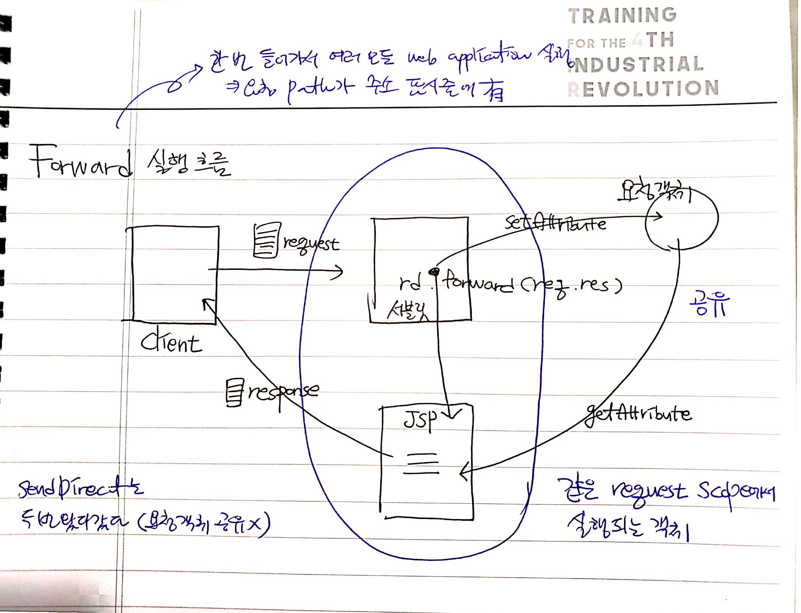


③ 특징

* 한 번의 요청으로 모든 application이 실행되므로 데이터 공유가 가능

* 주소표시줄이 최초 요청된 서블릿 path에서 변경되지 않는다. 

* 서블릿에서는 forward를 많이 쓴다. 

  

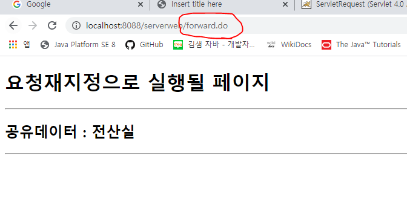

주소표시줄에 요청path가 적혀있다.


**3) include**

forward와 동일하게 RequestDispatcher의 메소드를 이용하여 실행하며
요청재지정될 때 모든 제어를 jsp로 넘기지 않고 다시 서블릿으로 돌아와 서블릿에서 응답된다.

① 문법

forward와 동일

```java
RequestDispatcher rd =
    	request.getRequestDispatcher("요청재지정할application의 path");
rd.include(request, response);
```


② 실행흐름

* 클라이언트가 서블릿을 요청한다.
* 서블릿이 실행된다.
* 서블릿이 클라이언트로 응답되지 않은 상태에서 jsp를 요청재지정(호출)
* jsp실행이 완료되면 jsp실행결과를 갖고 서블릿으로 되돌아온다.
* 서블릿에서 최종 응답된다.

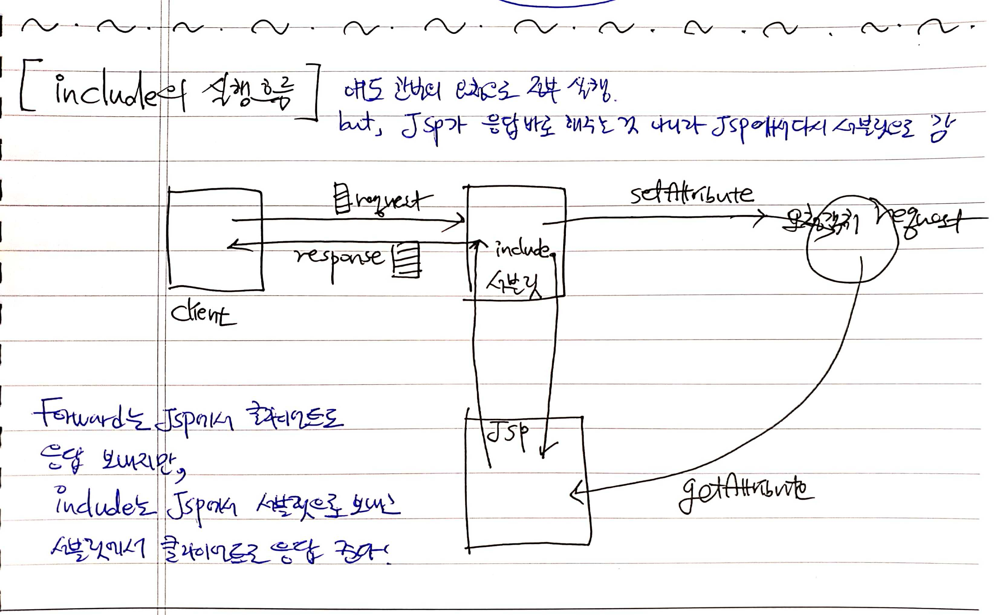


③ 특징

* forward와 동일
* jsp에서 주로 사용하는 요청재지정 방식


---


#### 4. JSP액션태그

#### 5. EL & JSTL

