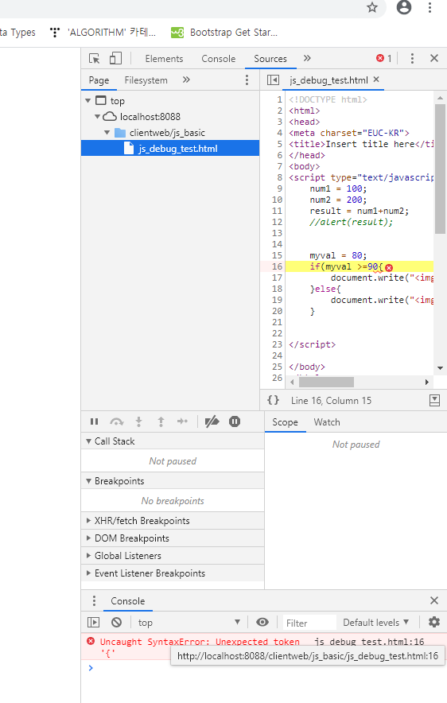

# Javascript 문법

파일만들기


한글설정 방법


1. body태그 안에 직접 정의

   ```javascript
   <script type="text/javascript">
   	//한 줄 주석
   	/* 자바와 동일한 
   	여러 줄 주석 */
   		document.write("<h1>브라우저에 데이터 출력하기 - 연습</h1>");
   		//사실 document.write는 잘 안쓴다. 그냥 연습용
   		test();
   </script>
   ```


2. head 태그 안에 function 정의

```html
<script type="text/javascript">
	// 2. head태그 안에 function을 정의하고 사용하는 방법
	function test() {
		alert("테스트 중 - 자바스크립트 사용방법");
	}
</script>
```


3. 태그내부에서 inline으로 사용하기 : 이벤트핸들러에 연결

```html
<!-- 3. 태그내부에서 inline으로 사용하는 방법 : 이벤트핸들러에 연결  -->
	<!-- 이벤트 : 마우스나 키보드의움직임 -->
	<input type = "button" value = "자바스크립트 실행하기"
	onclick="alert('안녕')"><!-- 클릭이 발생하면, 메세지를 띄운다.  -->
```


4. 외부문서로 작성하고(.js파일) 호출해서 사용하기

```html
<!-- 4. 외부문서로 작성하고 호출해서 사용하기(.js)  -->
<script type="text/javascript"
		src = "/clientweb/common/js/test.js"></script>
		
<body>
    <!-- 4. 외부문서로 작성하고 호출하기 -->
	<input type = "button" value = "자바스크립트 외부문서의 함수 호출"
		onclick="test2()">
</body>
```

---

### 디버그

오류가 있을 경우, F12눌러서 확인할 수 있다.

