1. 프레임워크 

* 완성된 소프트웨어가 아니라 어떤 문제를 해결하기 위해서 잘 설계된 미완의 모듈로 spring같은 경우 자바 개발자들이 공통으로 사용할만한 기능을 미리 정의해 놓은 모듈이다.

  > 모듈 : 코드를 모아놓은 라이브러리

(해결해야 하는 문제 : 내가 개발하고 싶은 모든 시스템 - 쇼핑몰, 예약관리시스템, 인터넷뱅킹.... )
재사용이 가능한 모듈이며 일반적으로 프레임워크를 통해서 개발하는 시스템의 공통모듈은 프레임워크에서 제공

- 개발자가 처리해야하는 대부분의 작업을 프레임워크 내부에서 처리해 주므로, 개발(프론트엔드와 백엔드의 교환 작업)을 위한 시간과 노력을 절약할 수 있다.
-  신뢰있는 프로그램을 개발할 수 있다.
- 개발자 간의 의사소통 원활해진다.
- 주어진 매뉴얼대로 개발하면 된다. 즉, 프레임워크 내부에서 제공하는 정해진 모듈을 사용해서 개발하면 된다. 

2. 스프링의 특징

* 경량 시스템 (포함된 라이브러리가 거의 1MB가 넘지 않기 때문에 가볍다.)

* POJO (Plain Old Java Object)로 개발하기 때문에 작성하는 OOP의 특징을 적용하여 개발하면 된다. 

* spring프레임워크 내부에 IoC컨테이너를 포함하고 있다.

  1) 의존성을 주입

  * 시스템내부(내가만든 프로그램)에서 사용하는 객체를 직접 생성해서 사용하지 않고
    스프링 내부에 존재하는 컨테이너를 통해 필요한 곳에서 사용할 수 있도록 전달받아 사용한다.
    										======== > 스프링 내부에서 라이브라리로 존재
    																spring-beans-4.2.4.RELEASE.jar
                                                                    spring-context-4.2.4.RELEASE.jar

  2) 스프링 내부의 IoC컨테이너를 통해 객체를 관리하면서 커플링을 낮출 수 있다.

  3) 스프링 내부에는 발생할 수 있는 다양한 모든 경우에 반응할 수 있도록 많은 컨테이너 클래스를 제공한다. 

3. 스프링 컨테이너의 종류

* BeanFactory (가장 상위) : 개발자가 객체를 요청하는 시점에 객체를 생성한다.
  		      ↑
* ApplicationContext : 컨테이너 객체가 생성될 때 전달된 xml안에 정의된 모든 빈을 생성하고
            ↑                              의존성주입을 처리한다. 당장 쓰지 않는 것도 다 만들고 시작한다.
* WebApplicationContext

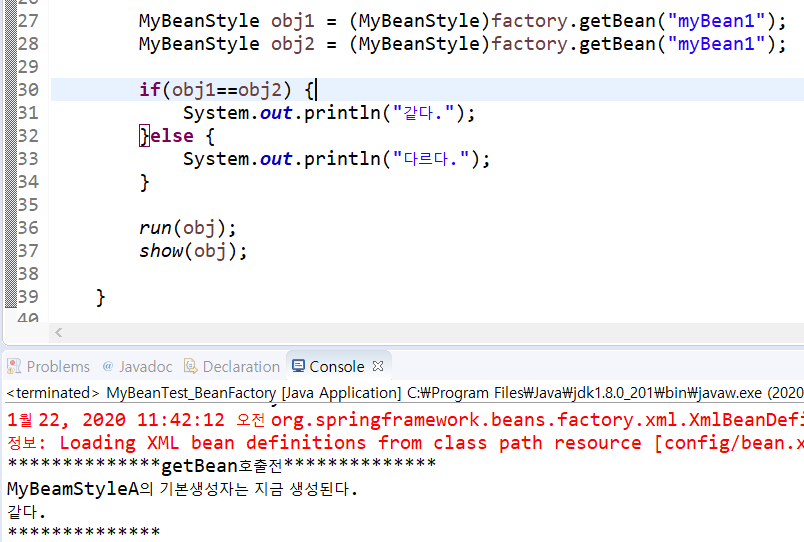

BeanFactory, ApplicationContext 둘 다 객체 생성 시점은 다르지만,
이미 만들어진 객체는 새로 만들지 않는다는 점이 같다. 똑같은 객체는 하나만 만든다.

같은 경로인데 다른 객체로 만들고 싶다면? `scope="prototype"` 해주면 된다.

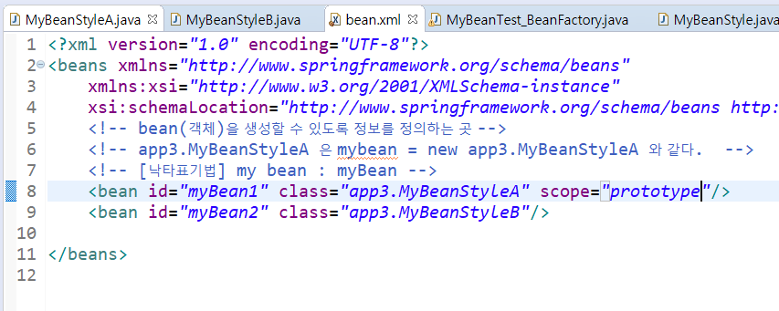

4. 의존성 주입

   1) DL (Dependency Lookup)

   => 컨테이너가 만든 객체를 getBean메소드를 통해 가져와서 사용하는 것

   

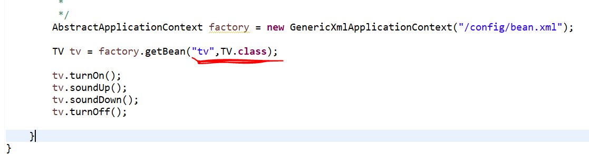

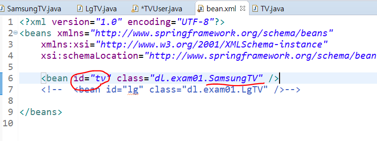

실행결과 : 

2) DI (Dependency Injection)

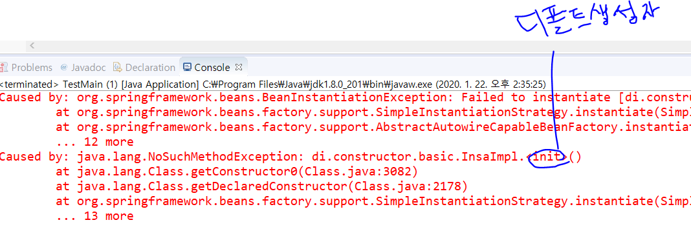

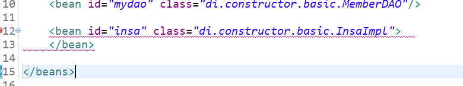

오류가 뜨기 때문에 xml 파일에 다음과 같이 추가해줘야 한다. 현재 InsaImpl파일에 기본 생성자가 없는 것이다.

InsaImpl에서 받는 매개변수 [MemberDAO dao]는 reference 속성이기 때문에 ref 로 선택해준다. (value속성일 경우는 value)

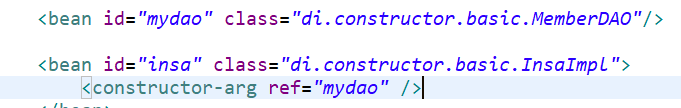

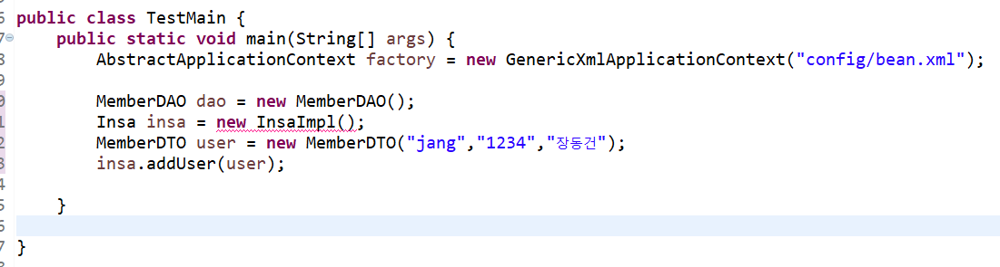

이랬던 코드가

이렇게 변했다. 더 이상 객체를 new해서 직접 생성하지 않는다.

 [ 자동으로 interface 만드는 방법 ]

alt + shift + t > Extract Interface > 

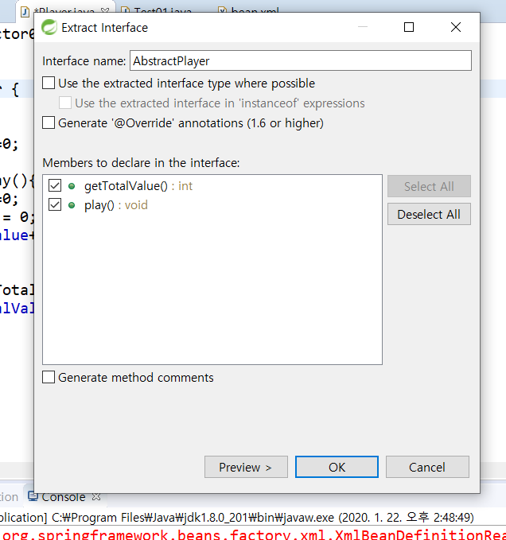

[ Dice 문제 상속 괸계 ]

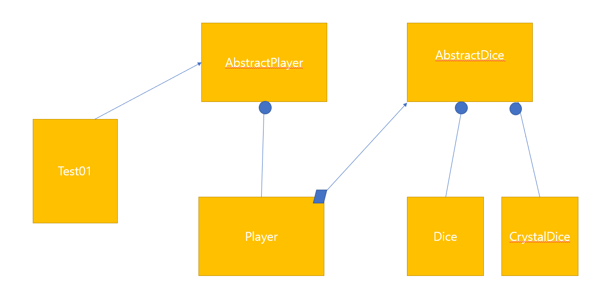

스프링 예제 - Service가 Logic을 사용하는 상황

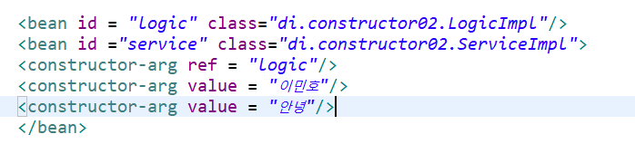

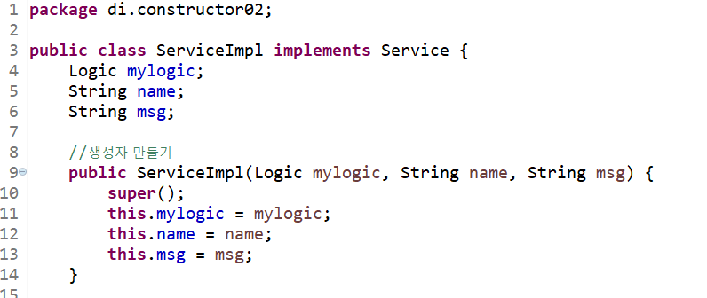

매개변수 개수와 constructor-arg의 개수가 같다.
String name과 String msg는 value형이므로 value로 적어준다. 

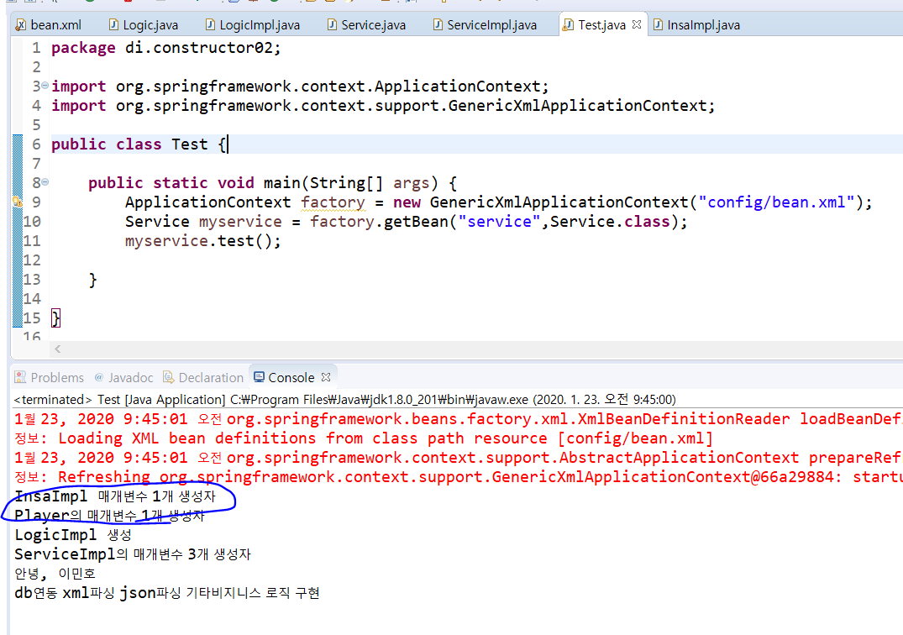

나는 분명 Test 를 실행시켰는데 (관련 파일은 Logic과 service) bean.xml에 있는 InsaImpl 과 Player 까지 다 생성이 되었다. 이처럼 (사용하지 않더라도)  xml에 있는 생성자를 모두 만들어 놓고 시작한다는 것을 알 수 있다. 

---

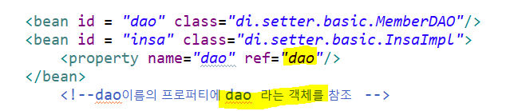

### setter 인젝션

* property로 적용한다 
* 기본생성자와 setter를 생성해야 한다.
* <bean>을 생성할 때 <constructor-args>엘리먼트가 없으면 기본 생성자를 호출해서 객체를 생성한다. <property>에서 name속성에 정의한 dao???? <property>에서 name속성에 정의한 dao의 첫 글자를 대문자로 변경하고 set을 접두사로 추가한 메소드를 찾아서 호출
  ex) name 속성이 dao면 set + Dao

* 

* 인젝션을 섞어서 사용할 수 있다. 단, 사용할 때 개수에 해당하는 생성자를 만들어야 한다. 

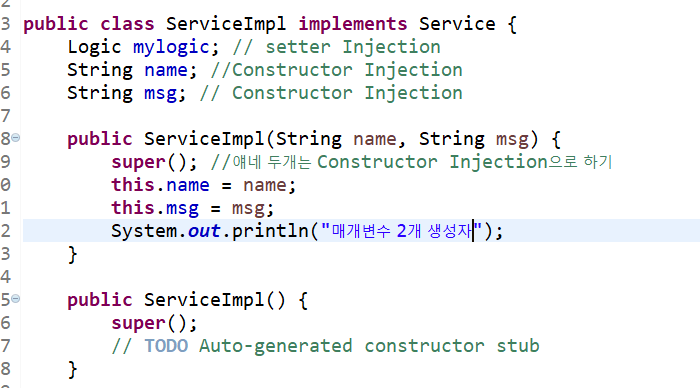

* 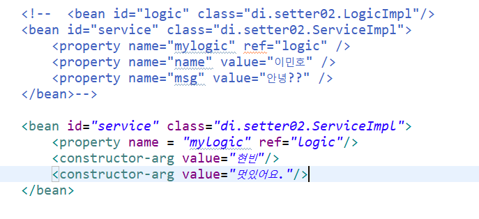

* xml 작성 시 리스트의 하위는 모두 list로 작성한다.
  값들은 모두 value로 적는다. 

* 하나의 entry는 key와 value 표시 

  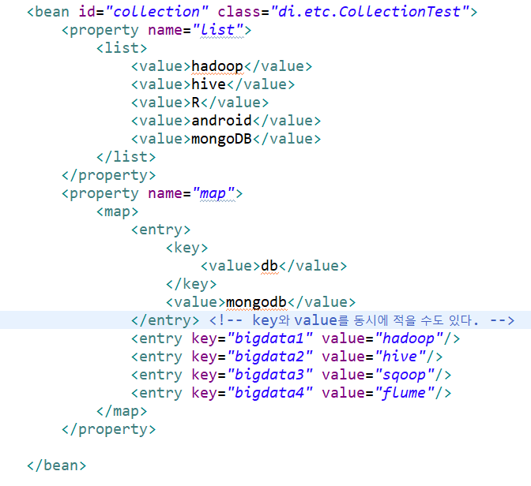

  #### 실행 결과

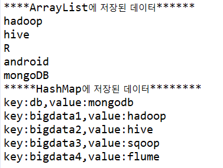

----

