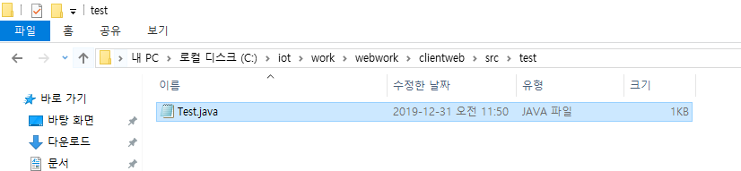
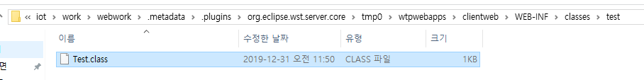
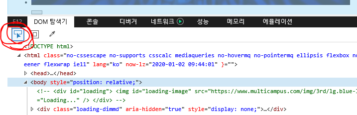

내가 만든 폴더와 파일들이 알아서 context 표준에 맞게 서버가 인식하는 위치 경로로 저장이 된다. 

이클립스가 자동으로 해주는 게 아니라, 

Ant (자동빌드툴)툴이 자동으로 서버가인식하는 위치로 복사해주고 컴파일 해주는 작업을 한다. 

자동 툴이 하는 거라서 어쩌다보면 파일들이 자동으로 서버가 인식하는 위치로 안넘어 갈 때가 있다. 

따라서 문제가 있을 경우, 확인해 봐야 한다. 

인터넷익스플로러에서 구조 확인하는 방법

F12 눌러서 개발자도구 팝업 생성

