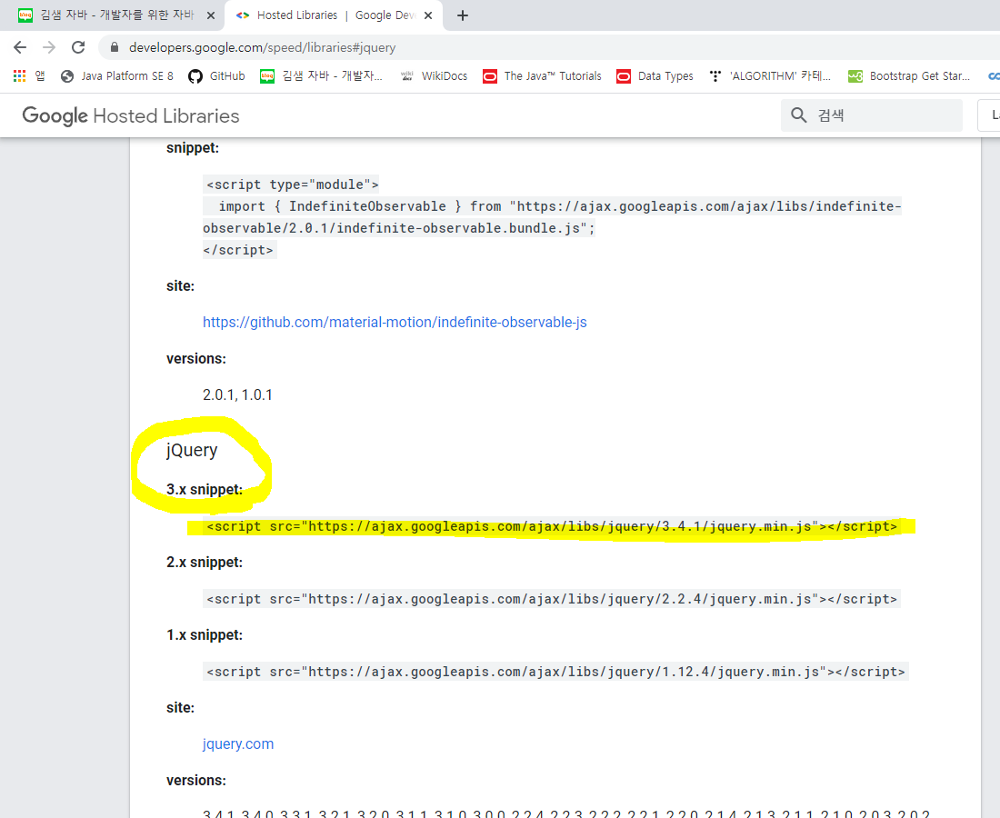
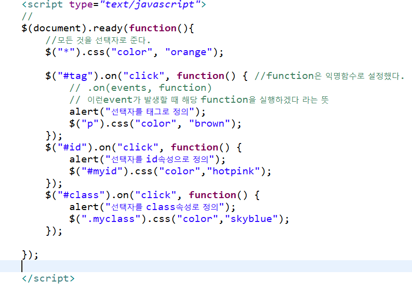
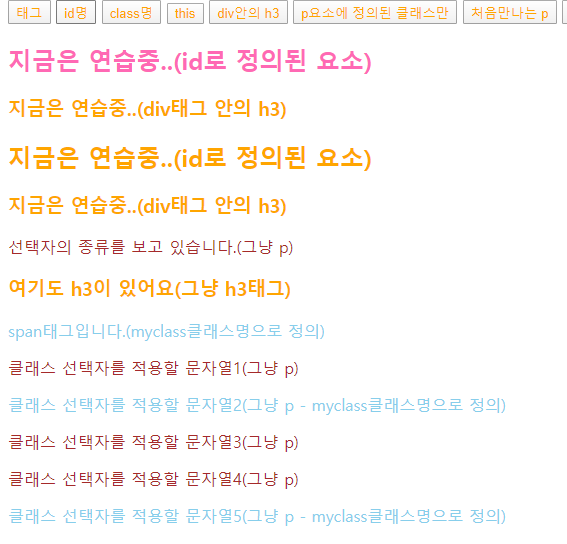

# jQuery

제이쿼리 : 자바스크립트 라이브러리

자주 사용하는 기능들을 효율적으로 쓰기 위해 만들어짐. 긴코드를 짧게

- DOM 제어
- Ajax
- effect ( 애니메이션 효과 )

버전을 꼭 맞출 것!!!!




위 서버사이트를 그대로 긁어서 사용할 예정.
 (아래 코드 복붙해서 head 태그 사이에 집어넣을 것. 

```html
<script src="https://ajax.googleapis.com/ajax/libs/jquery/3.4.1/jquery.min.js"></script>
```

------

## jQuery 문장의 구조


```javascript
$(선택자).선택된요소의함수호출( );
```

`$( ).`  안에 선택자를 사용할 때 문법은, CSS에서의 선택자 사용 문법과 같다. 

* $("#id명") 
* $(".class명")
* $("태그명")


제이쿼리에서 function나 객체, 선택자 사용 시 문법은 다음과 같다. 항상 $로 시작.

```javascript
$(document).ready(function() {
		//이 코드는 window.onload 와 같은 기능을 한다.
    // 한 문서에 하나만 있어야 한다. (굳이써줄필요없긴 함)
    
    $("#clickMe").click(function(){ //click이라는 이벤트를 연결 
			//클릭미가 실행되면 익명의 함수를 사용하겠다는 뜻 
			//click의 매개변수 안에 익명의 함수를 정의한다. 
			//alert("div눌려짐");
			
			//아이디가 picframe으로 정의된 객체를 화면에 보여지도록
			//다시 클릭하면 화면에서 사라지도록
			$("#picframe").slideToggle();
			
		});
	})
```

(=페이지가 로딩되고 dom객체가 형성이 되면, 익명의 함수를 실행하겠습니다. )


```javascript
$("*").css("color","pink"));
//---- => "*" 모든 요소 
```

---


**예제**




**결과**



---


### 선택자 형식 사용법 

| 형식           | 설명                                                         |
| -------------- | ------------------------------------------------------------ |
| $("*")         | 모든 요소 선택                                               |
| $(this)        | this는 객체명이라서 큰따옴표 안쓴다.                         |
| $("p.myclass") | `<p>` 요소 중에 class="myclass"인 요소                       |
| $("p:first")   | 첫 번째 `<p>` 요소                                           |
| $("div h3")    | `<div>` 안에 포함된 `<h3>` 인 요소                           |
| $(":button")   | 버튼과 버튼 타입 요소를 모두 선택.<br />`<button></button>` 혹은 `<input type="button"/>` 모두 선택됨 |

