# sevlet 

웹 플랫폼에서만 사용되는 기술

WAS에는 웹 서버가 요청을 당겨서 파악한 다음, 자신의 위치에서 실행해 서비스 할 수 있는 기능이 있다.

서블릿을 요청하는 시점은 

웹페이지 내에서로그인버튼 누르거나 버튼 누르거나 이런 시점에 서블릿 요청하게 하니까

태그에서 자바코드를 실행해야 함

자바코드를 실행하려면 new 해서 메모리 올리고 call햇는데 이제는그렇게 할수 없다. 왜냐하면 태그에서는자바코드를 쓸 수 없으니까.  javscript, css 등 html문서에서 모두 쓸 수 없다

하지만 요청은 해야한다. 따라서 자바를 요청하는 방법이 있다. 


* 서블릿은 클라이언트 페이지에서 발생하는 클라이언트에 요청을 처리하기 위한 기술

* 클라이언트로부터 요청이 전달되면 서버에서 실행되며,
  DB연동이나 서버의 자원을 액세스해 만들어진 결과를 클라이언트로 응답한다.

* 클라이언트의 요청을 인식하고 실행되도록 하기 위해서는
  서블릿은 정해진 규칙대로 작성되어야 하고,
  서버가 서블릿을 찾아서 실행할 수 있도록 `정해진 위치`에 작성되어야 한다. 

> 여기서 정해진 위치란? 표준화된 폴더 구조안에 있는 classes폴더 (서블릿디렉토리)


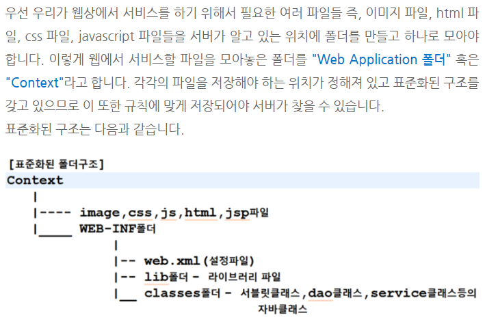


---


### 1. 서블릿 작성 규칙

1) 표준화된 폴더 구조 안에서 서블릿 디렉토리에 저장되어야 한다.

* C:\iot\work\webwork\.metadata\.plugins\org.eclipse.wst.server.core\tmp0\wtpwebapps\serverweb\WEB-INF\classes 에 작성되어야 한다.
  => 이 위치에 서블릿 클래스가 없으면 못찾는다. 무조건 이 위치에 있어야 한다.

2) public 클래스로 작성해야 한다.

* 서버가 찾아서 실행해야 하므로

3) 서블릿클래스를 상속해야 한다.

* 서버가 우리가 작성한 서블릿 클래스를 찾아서 생성하고 호출하기 위해서는 서버가 인식할 수 있는(서버가 사용할 수 있는) 타입이어야 하므로 서버에 등록된 타입으로 서블릿 클래스를 작성한다.

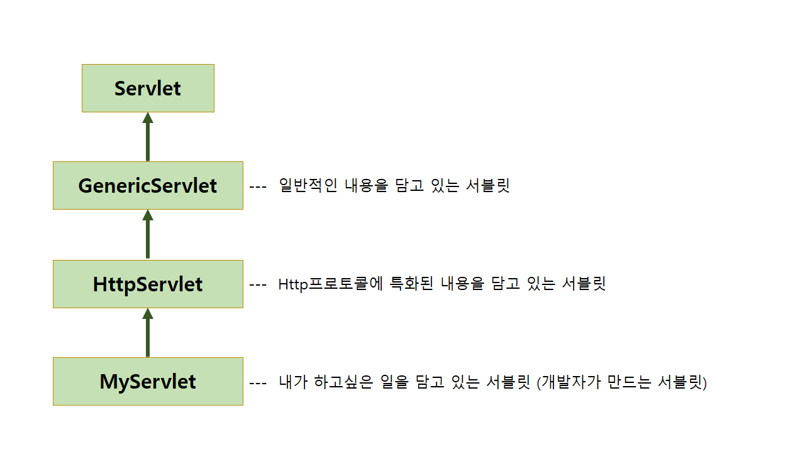


> sevlet API 보는 방법

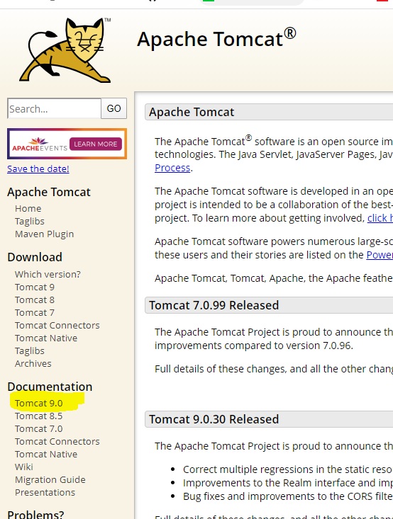


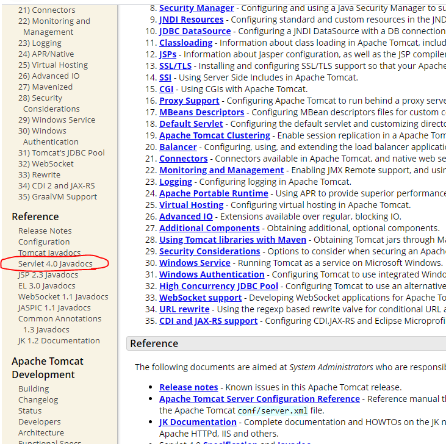


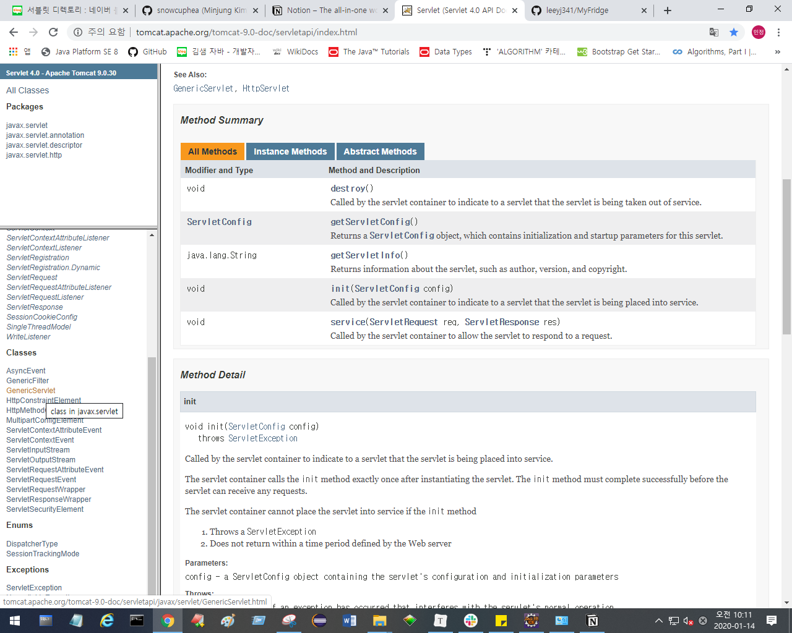


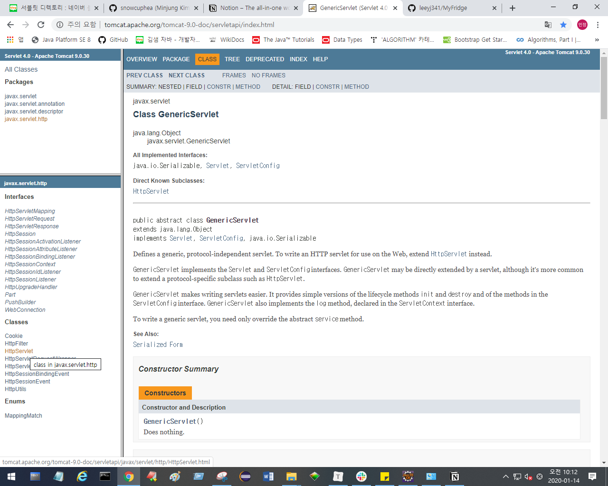


> 라이브러리에 추가하기

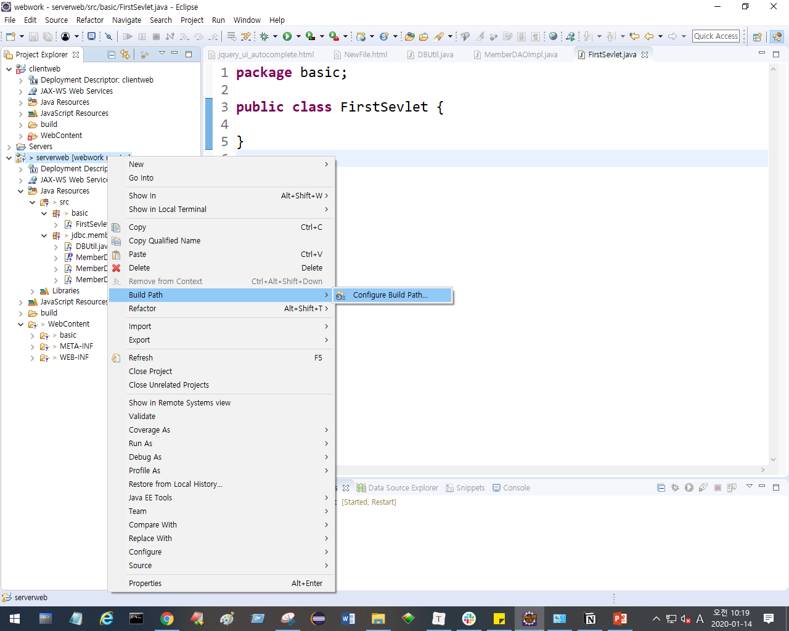

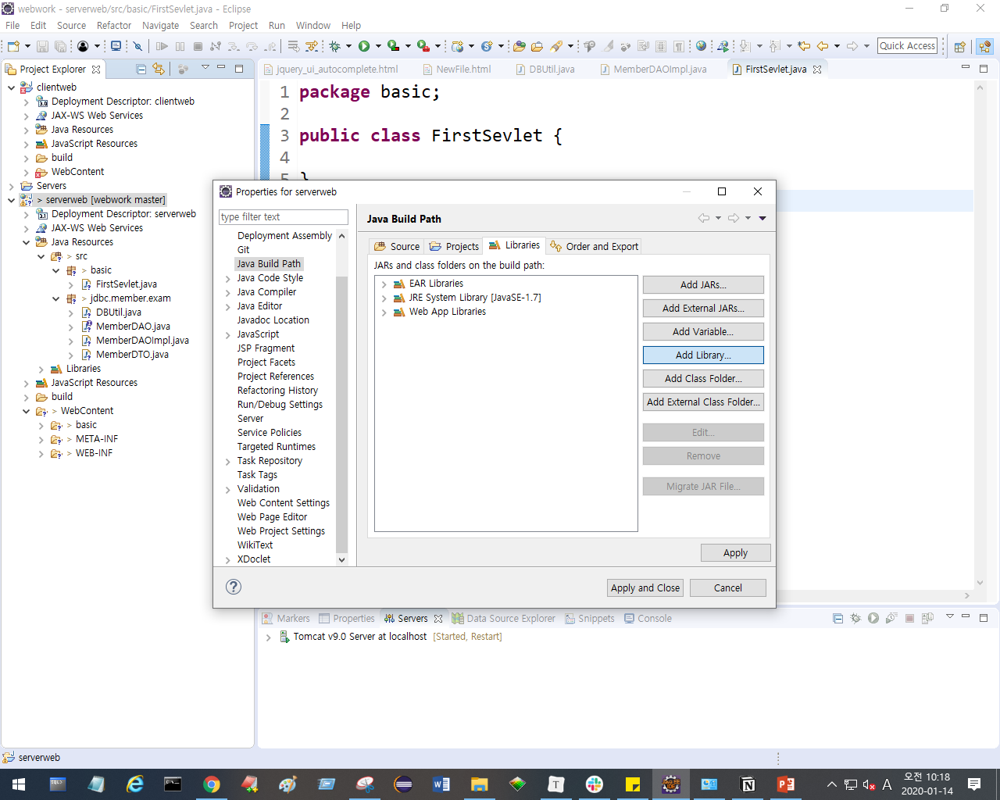

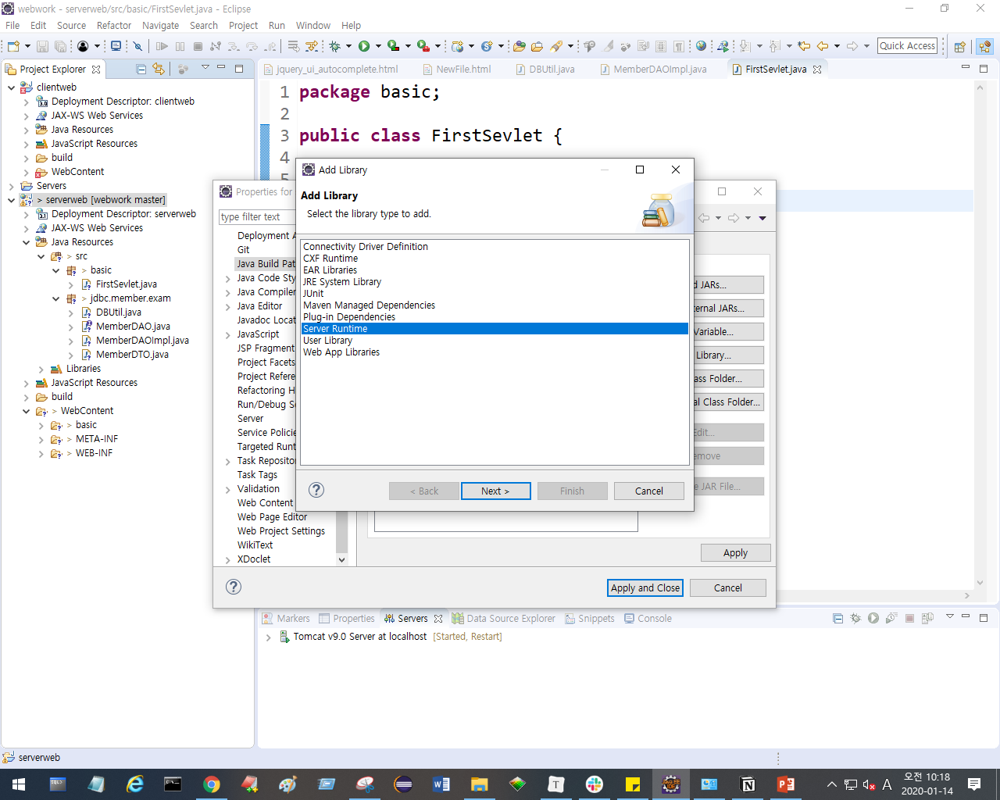

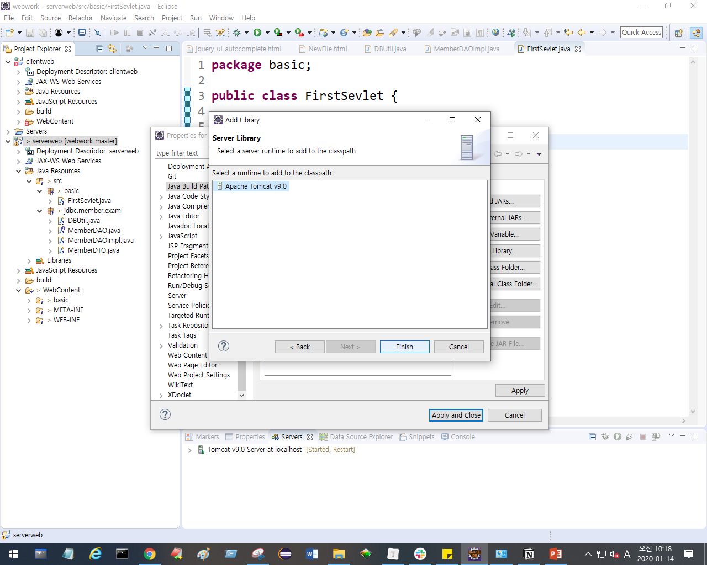

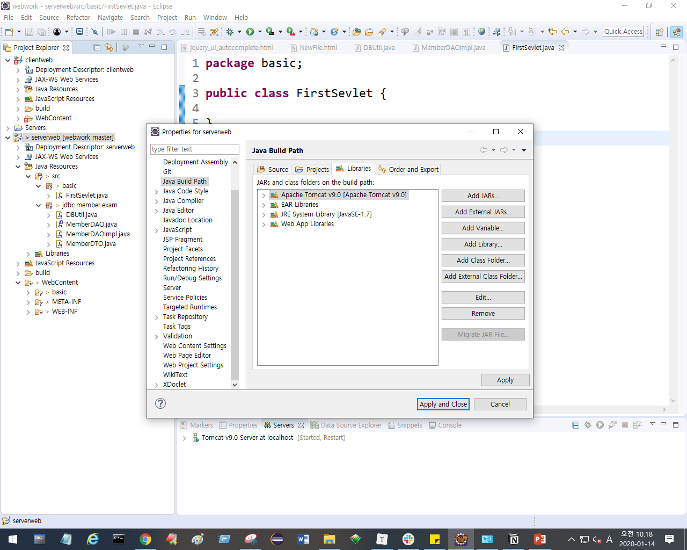

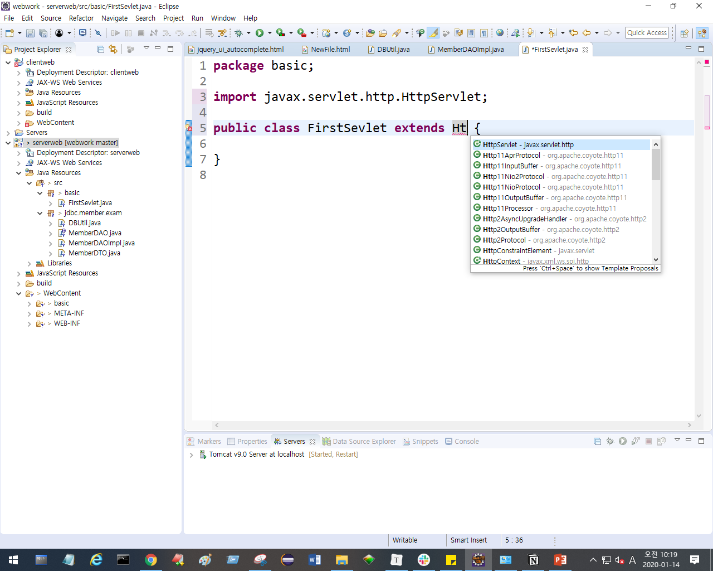


4) 서버가 호출하는 메소드를 오버라이딩 해야 한다.

* 서블릿 클래스는 일반 클래스를 사용하는 방법 처럼 객체생성해서 사용하는 클래스가 아니다.

* 서블릿이 호출되면 서버가 서블릿 객체를 생성하고 적절한 시점에 따라 메소드를 자동으로 호출한다. 즉, 서블릿의 LifeCycle을 서버가 관리한다. (lifecycle : 객체를 생성하고 소멸하는 것)

* 서버가 적절한 시점에 따라 자동으로 메소드를 호출할때 원하는 작업을 처리하기 위해서는 
  **서버가 호출하는 메소드를 오버라이딩해서 내가 원하는 내용을 기술해야 한다. **

  * [오버라이딩할 메소드]

    * `init `: 서블릿이 초기화될 때 호출

    * `service` : 클라이언트가 요청을 하면 호출되는 메소드
                     => 클라이언트의 요청을 처리할 수 있는 내용을 기술
                           ex.로그인, 게시판목록보기, 회원가입..

      ​              => 요청방식의 구분없이 모두 호출

    * `doGet` : service와 동일하게 동작하며 클라이언트가 get방식으로 요청하는 경우에만 호출

    * `doPost` : service와 동일하게 동작하며 클라이언트가 post방식으로 요청하는 경우에만 호출

    * `destroy` : 서블릿 객체가 소멸될 때 (메모리에서 해제될 때) 호출

      

5) 서블릿을 등록

* 서버가 서블릿을 찾아서 실행할 수 있도록 서블릿을 web.xml에 등록
  (`web.xml` : 서블릿에 대한 내용을 등록하는 설정 파일)

  xml은 다른 기종간에 데이터를 교환하기 위해서 나온 것. 설정파일용으로 많이 사용된다.

  xml이 무거워서 나온 것 : JSON

  

  ① 서블릿 등록 : 사용할 서블릿이 어떤 클래스인지 정의

  ```xml
  <servlet>
    	<servlet-name>서블릿의 이름(alias)</servlet-name>
    	<servlet-class>실제사용할 서블릿클래스(패키지포함)</servlet-class>
    </servlet>
  ```

  ​		ex. basic패키지에 작성한 FirstServlet을 first라는 이름으로 등록

  ```xml
  <servlet>
    	<servlet-name>first</servlet-name>
    	<servlet-class>basic.FirstServlet</servlet-class>
    </servlet>
  ```

  ==> first는 베이직 패키지에 잇는 firstservlet입니다. 라는 뜻 

  

  ② 서블릿 매핑 

  * 서블릿을 어떤 url로 요청할지 등록

  ```xml
   <servlet-mapping>
    	<servlet-name>미리등록한 서블릿의 이름</servlet-name>
    	<url-pattern>요청url(반드시 /나 .으로 시작</url-pattern>
    </servlet-mapping>
  ```

  ex. 위에서 등록한 first서블릿을/first.multi 로 요청

  ```xml
   <servlet-mapping>
    	<servlet-name>first</servlet-name>
    	<url-pattern>/first.multi</url-pattern>
    </servlet-mapping>
  ```

  

  

  

  

  

  

  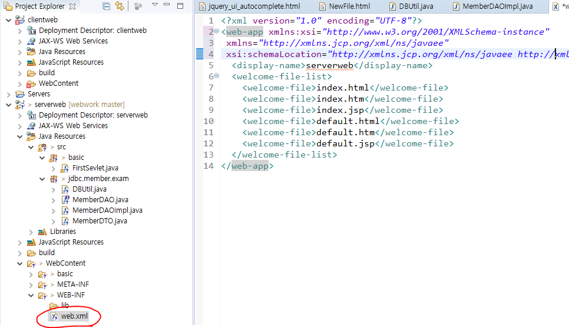

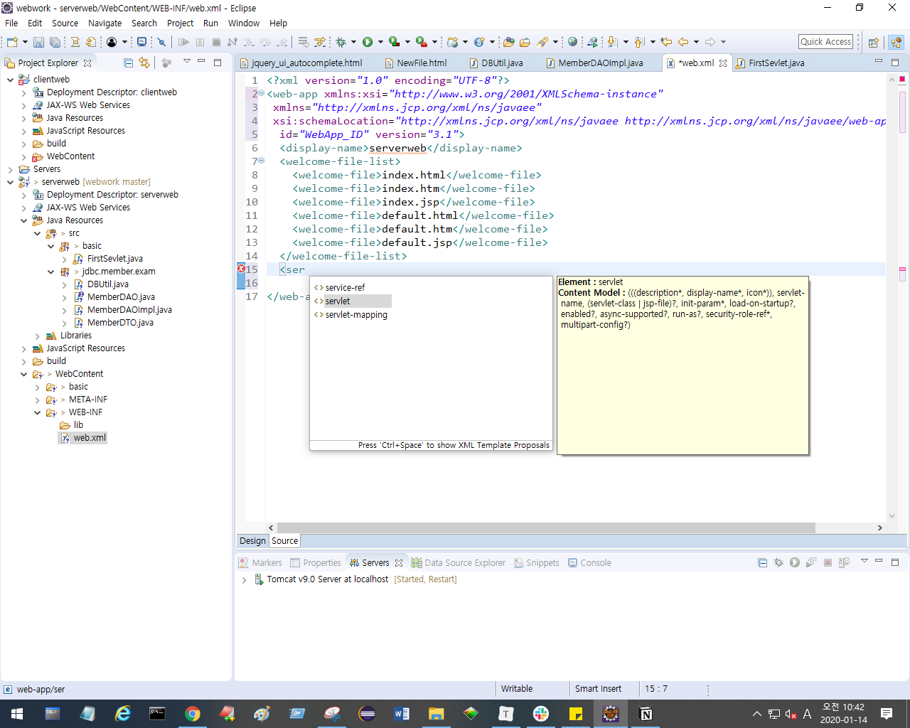

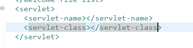

---


### 2. 서블릿 요청 방법


#### 1) get방식으로 요청

① 주소표시줄에 입력하고 요청

  - 테스트용으로 사용

  - http://70.12.155.50:8088/serverweb/first.multi

    여기서 `serverweb` : server.xml 에 등록한 path. 보통은 context명

    여기서 `first.multi` : web.xml 에 등록한 요청 path .  ` <url-pattern>`에 등록


② 하이퍼링크를 클릭

```html
<a href ="http://서버ip:port/contextpath/서블릿요청url">하이퍼링크</a>
<a href ="/contextpath/서블릿요청url">하이퍼링크</a>
```


③` <form>`태그에서 method 속성을 "get" 으로 설정하고 submit버튼 선택

* action속성에 설정한다.

* form태그를 정의하면서 method속성을 생략하면 get방식으로 요청

* submit버튼을 눌러서 요청하면` <form>`태그의 action속성에 정의한 서블릿이 요청(서블릿이 호출되어 실행되도록 한다.)되며`<form></form>` 내부에 정의한 모든 양식 태그들의 name과 value가 서블릿으로 전달된다. 

  ```html
  <form method="get" action="/contextpath/서블릿요청url">
     <input type="submit" value="전송"/>
  </form>
  ```


#### 2) post방식으로 요청

①` <form>`태그에서 method 속성을 "post" 으로 설정하고 submit버튼 선택

* action속성에 설정한다.

* submit버튼을 눌러서 요청하면` <form>`태그의 action속성에 정의한 서블릿이 요청(서블릿이 호출되어 실행되도록 한다.)되며`<form></form>` 내부에 정의한 모든 양식 태그들의 name과 value가 서블릿으로 전달된다. 

  ```html
  <form method="post" action="/contextpath/서블릿요청url">
     <input type="submit" value="전송"/>
  </form>
  ```


#### 3) 요청 방식

* `get` : 요청할 때 입력하는 내용이 url뒤에 추가되어 전송되는 방식(요청메시지 헤더에 추가)
  * 클라이언트가 입력하는 내용이 그대로 노출된다.
  * 전송할 수 있는데이터의 크기에 제한이 있다. 
  * ex) 게시판 목록 확인하기, 상품정보 가져오기, 검색하기...
* `post` : 요청메시지 body에 추가되어 전송되므로 클라이언트에 노출되지 않지만
              둘을 이용하면 확인할 수 있으므로 암호화해서 전송해야 한다.
  * 보낼 수 있는데이터 크기에 제한이 없다.
  * 서버의 값을 클라이언트가 원하는 값으로 update(변경)하는 경우
  * ex) 회원등록(insert문 실행), 회원정보 수정하기(update문 실행), 파일업로드, 메일쓰기 .. 


get방식으로 하고 요청하면 주소표시줄에 id값 나오고, post방식으로 하면 주소표시줄에 노출안된다.

---

#### Lifecycle

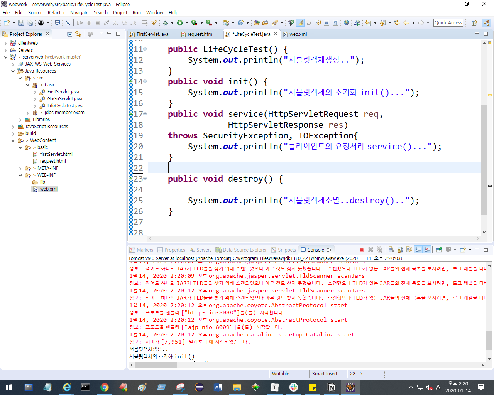


서블릿객체는 1개만 생성된다. 그 이후에 요청을 했을 때, 이미 서블릿 객체가 만들어져 있다면 더 이상 객체를 만들지 않고 init을 호출한다.

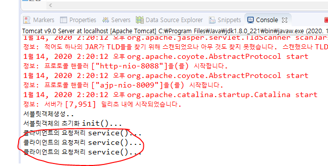

저장하면 다시 컴파일 되므로, destroy()가 실행되어 호출됩니다.

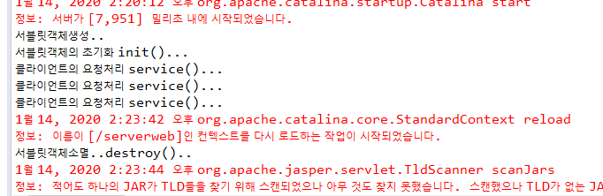


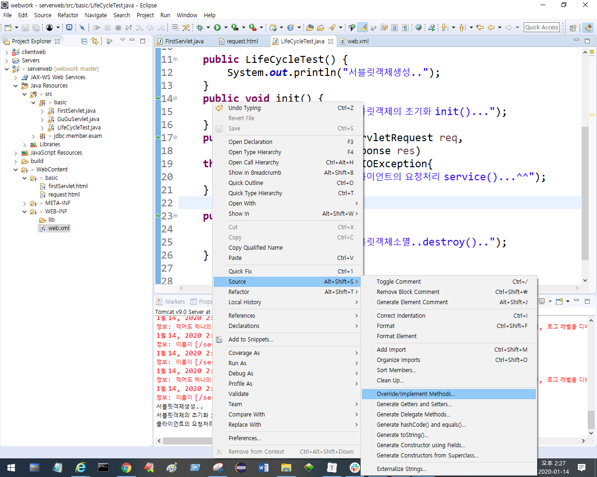


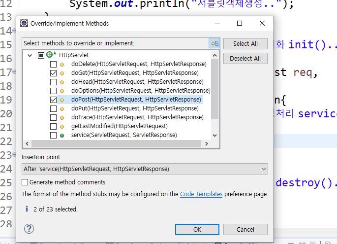


**service 함수 주석처리했을 때 새로고침하여 요청처리하면 doGet() 으로 나온다.** 


**service 주석 해제 하고 실행했더니, doGet()이 호출되지 않는다.**

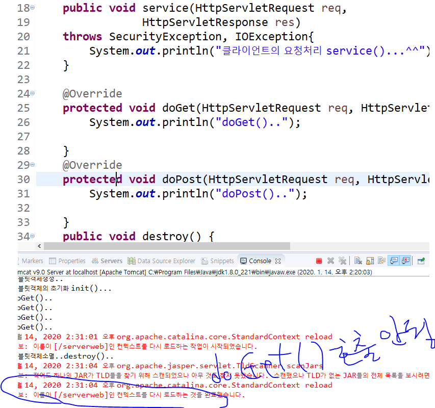


열 개의 리퀘스트 객체 안에는각각 사용자마다 입력한 내용이 다르게 들어가있다. 
각각 다른 정보를 뽑아보려면, req 객체안에 저장되어있으니까 req안에서 뽑아보면 된다.

(HttpServletRequest 에는 정보를 뽑아볼 수 잇는 다양한 get 함수가 있따.)
method 정보를 가져오는 getMethod()를 사용해본다.

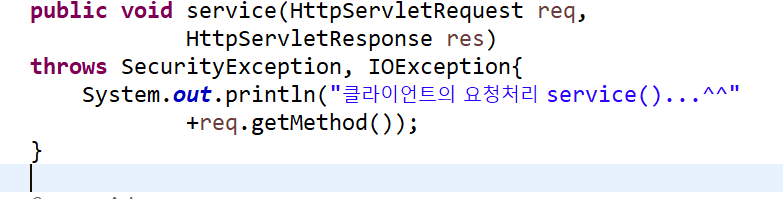


자바 파일에서 doget, dopost 에 대한 if조건을 걸어주고, 

방식에 따라 html파일의 form에서  method를 get, post 설정해 주면 된다.

(메소드 생략하면 자동으로 GET이다.)


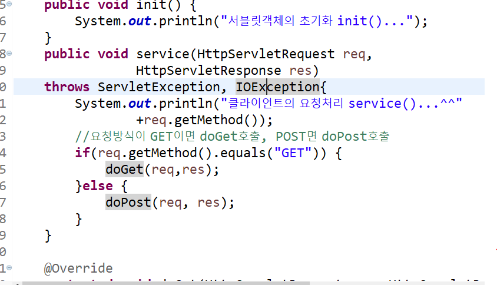

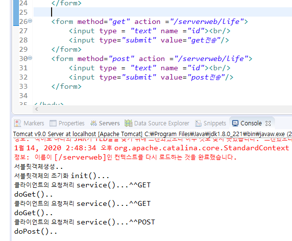


* Get방식에서 내가 값을 입력하고 전송버튼을 눌렀을 때 주소표시줄에

`=` **왼쪽에 있는 것은 `name`값이고 `= ` 오른쪽에 있는 것은 `사용자의 요청메세지`이다.**

`http://~~~url?name값=사용자가요청한값`

----


### 3. 클라이언트가전달하는 요청 메시지에서 클라이언트의 입력 정보를 추출하기

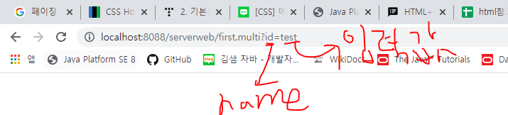


#### 1) 요청

​	[ 요청객체 ]

ServeletRequest
			↑
HttpServletRequest


* 클라이언트가 요청 메시지를 서버로 전달하면 여러가지 클라이언트의 정보가
  (클라이언트가 입력한 데이터, 쿠키, 세션정보, ip, port...) 서버로 전달된다.
* 서버는 이 데이터를 가지고 요청객체(요청객체를 만들면서 전달받은 데이터를 
  요청객체에 셋팅하는 작업을 수행) 를 생성한다.
* http 프로토콜에 특화된 내용은 => HttpServletRequest에서 찾는다.
  일반적인 내용은 => ServletRequest에서 찾는다. 


#### 2) 요청정보 추출

사용자가 입력한 값을 추출해야 한다. 

`~~~~/serverweb.login.do?id=lee&pass=1234`
													~~   ~~~
								  파라미터명<┘    └>파라미터 value

**① getParameter**

* ServletRequest의 메소드로 메소드를 호출하며 전달한 name에 대한 value를 리턴

  * 리턴값 : String으로 파라미터의 값

    > 파라미터의 값 : 주소 표시줄에 직접 넘긴 value로 = 의 오른쪽에 있는 문자열.
    > form태그를이용해서 사용자가 직접 입력한 값

  * 매개변수 : String으로 파라미터 이름

    > 파라미터이름: 주소표시줄에 직접 넘긴 name으로 =의 왼쪽에 있는 문자열.
    > 양식태그를 정의할 때 name속성에 정의한 값 
    >
    > <imput type="text" name = "id">
    > 																~~
    > 											파라미터명<┘ 		


**② getParameterValues**

* ServletRequest의 메소드로 파라미터명이 같은 모든 value를 모아서 String[]로 리턴
  * CheckBox, List에서 복수 개 선택, 임의로 동일한 이름을 정의해서 넘긴 데이터 등 
  * 리턴타입 : String[ ]로 파라미터의 값들
  * 매개변수 : String으로 파라미터명을 정의


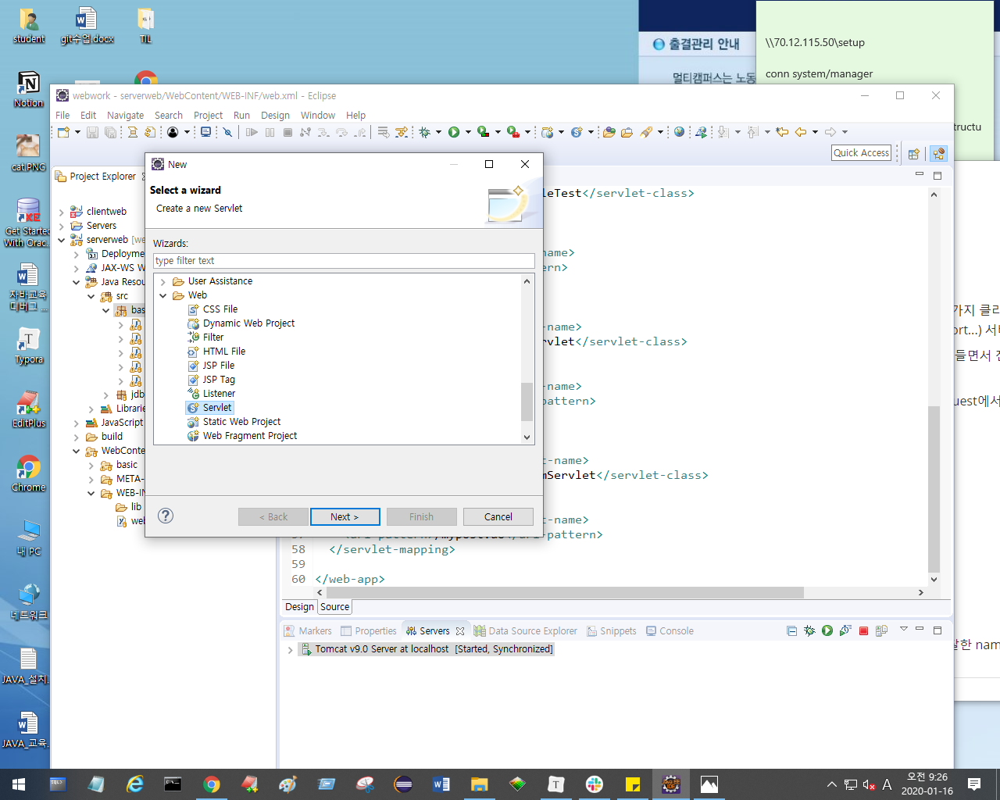

**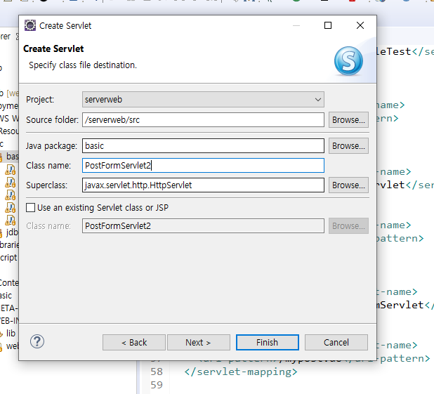**


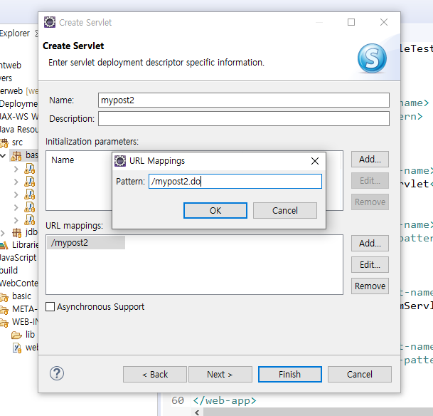

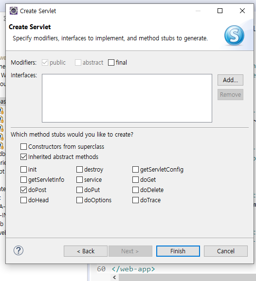


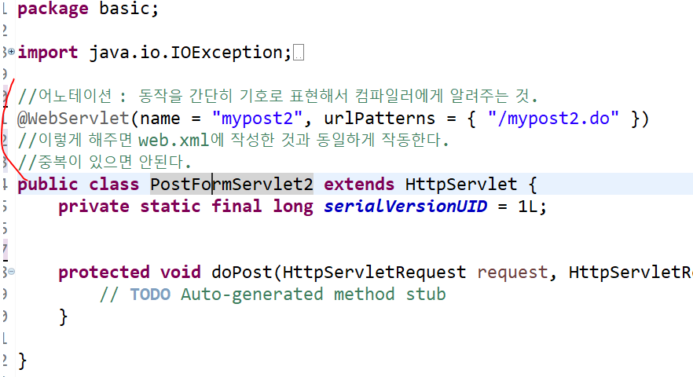


여기서 name은 연동할 데이터베이스의 컬럼명과 동일하게 작성해야 한다. 

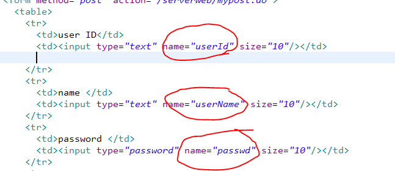


#### 3) 응답

클라이언트가 요청한 내용을 처리하고 처리결과를 웹 페이지에 출력되도록 응답해야 한다.

서블릿에서는 응답을 할 수 있도록 출력스트림을 지원한다.

**① 응답하는 문서의 타입과 인코딩방식을 정의**

```java
	res.setContentType("응답형식(MIME타입);문자셋")
    res.setContentType("text/html;charset=euc-kr")
```

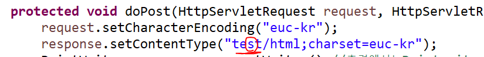

위와같이 응답형식을 잘못 쓰면, 페이지에서 뭔가(잘못된 타입이라)를 다운로드 받으려고 한다. 
따라서 꼭 MIME형식에 맞게 써줘야 한다. 


**② 응답객체에서 출력 스트림 얻기**

* ServletResponse객체의 getWriter를 이용해서 리턴받는다.

  ```java
  PrintWriter pw = response.getWriter();
  ```

**③ 메소드의 매개변수로 응답할 내용을 명시한다. **

* 실제로 불가능(추후에 개선된 내용으로 해야함) => Ajax용

  pw.메소드("출력할 내용");
  		 			=========>html태그

4) 응답

* 200 : 정상요청

* 404: 요청한 url에 맞는 파일을 찾을 수 없습니다.

* 405 : 요청방식에 따라 실행되는메소드가 없다.

  ​			=>  요청방식과 메소드명을 확인


### 4. DB연동 


WEB-INF 의 lib에 ojdbc6.jar 붙여넣기


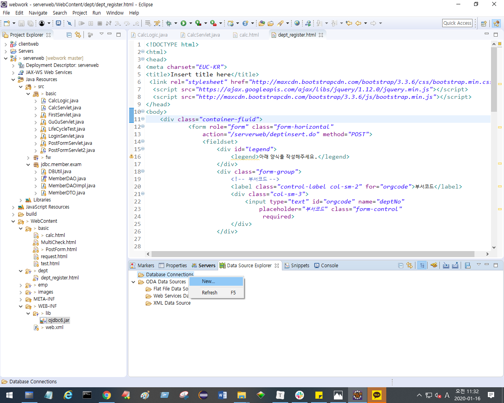

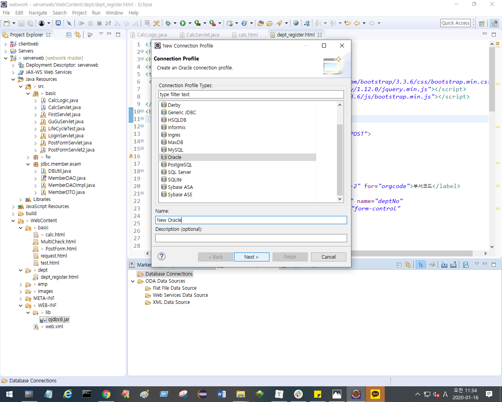

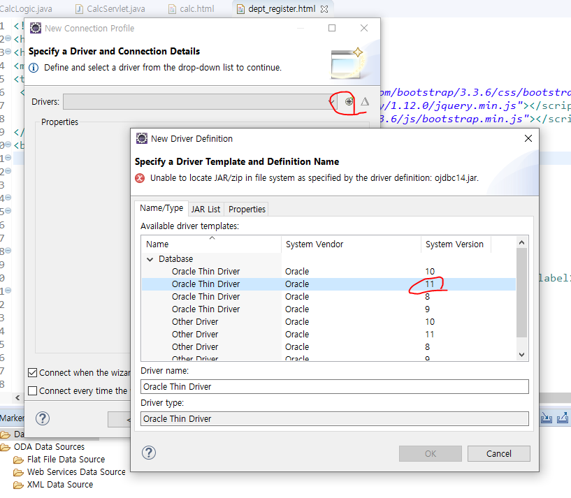

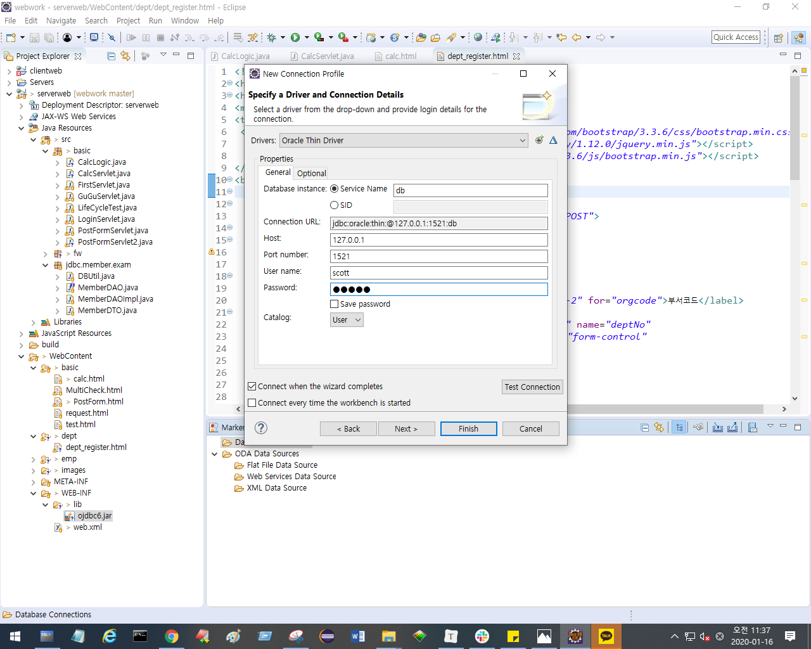

127.0.0.1 말고 원격 할 곳을 적어도 된다. 

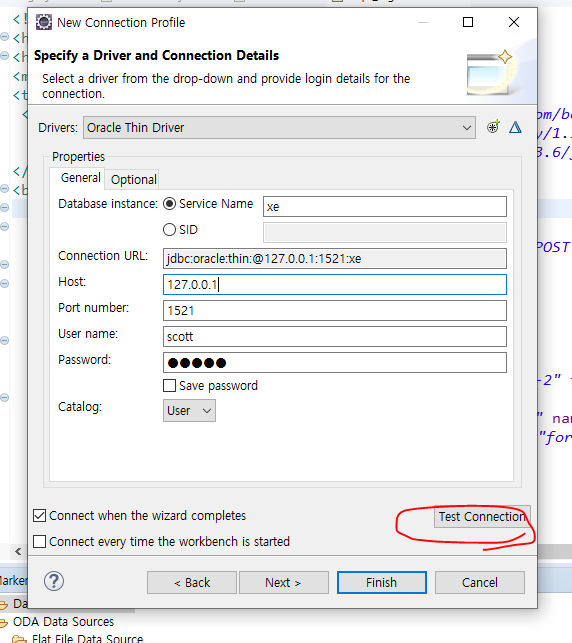

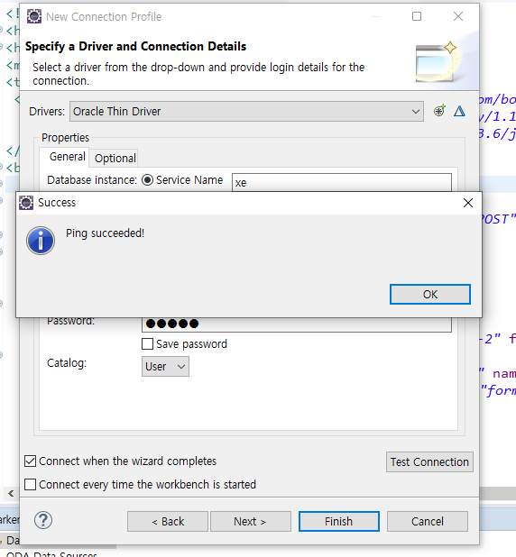

express edition이라 xe라고 적어줘야한다. 


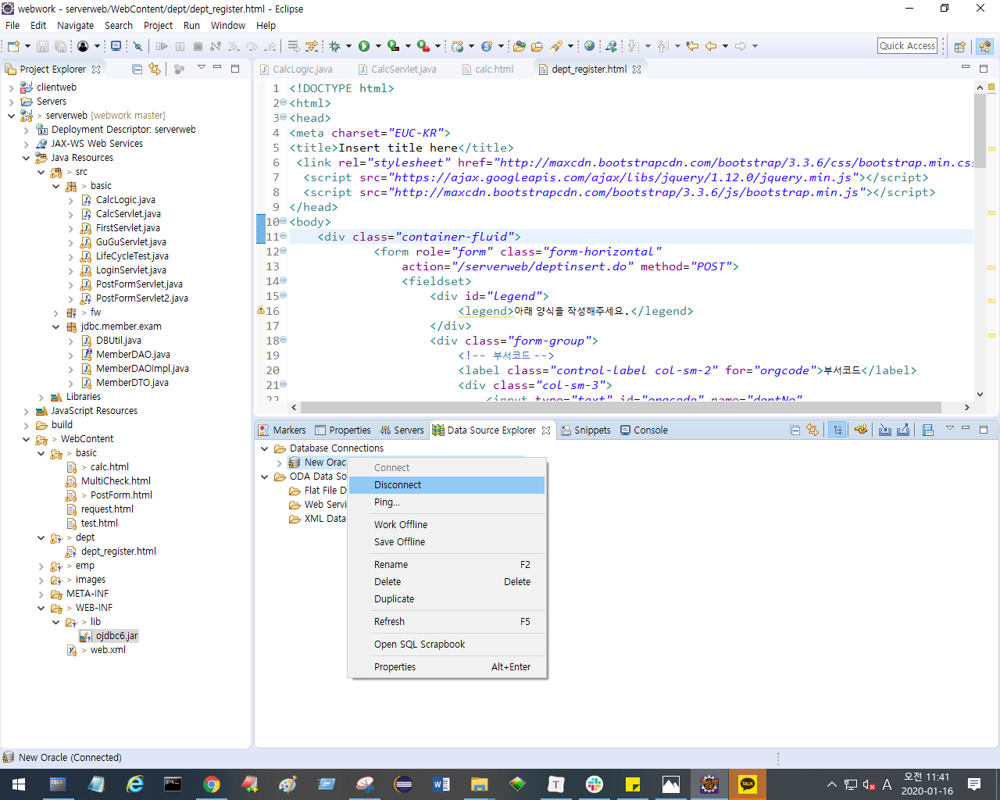

disconnect 하면 끊을 수 있다. 끊고나서 다시 오른쪽버튼 눌러서 connect 로 연결할 수 있다. 


새 패키지 만들자

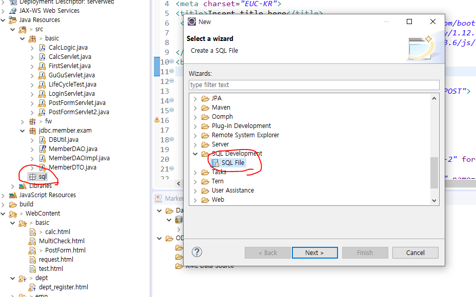

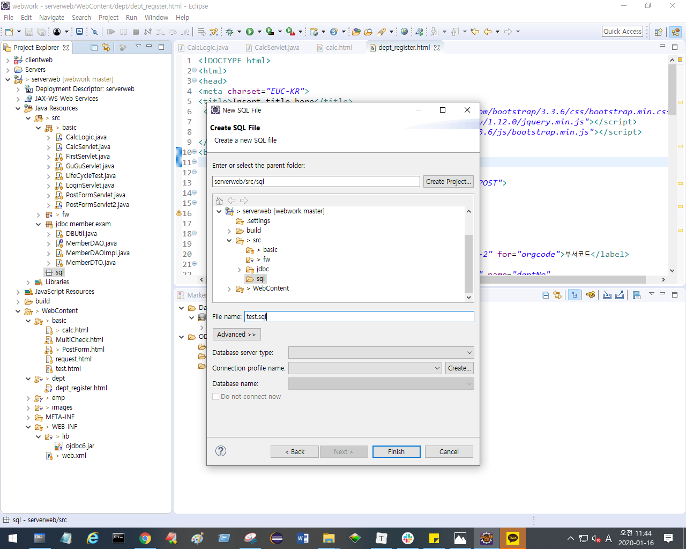


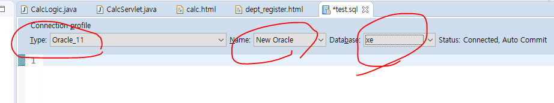


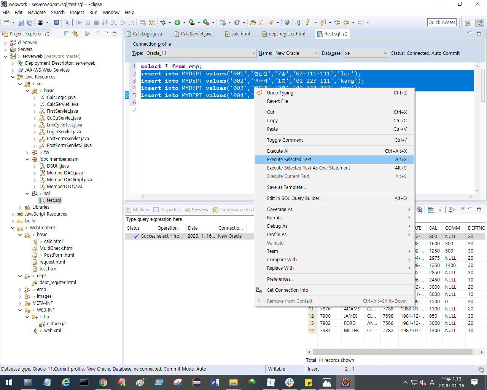


링크 연결하기 


[ deleteServlet ]

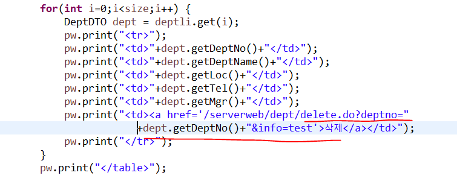


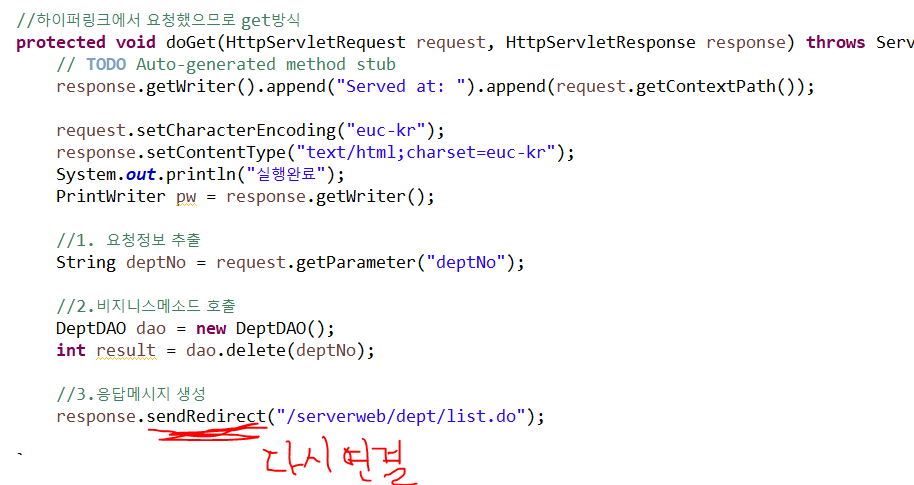


### <요청 재지정>

#### 1.리다이렉트(sendRedirect)

#### 2. forward

#### 3. include

html에서

servlet 로직 구현하는용도

jsp : html에서 자바코드 못쓰는데 가능하게 한다. 