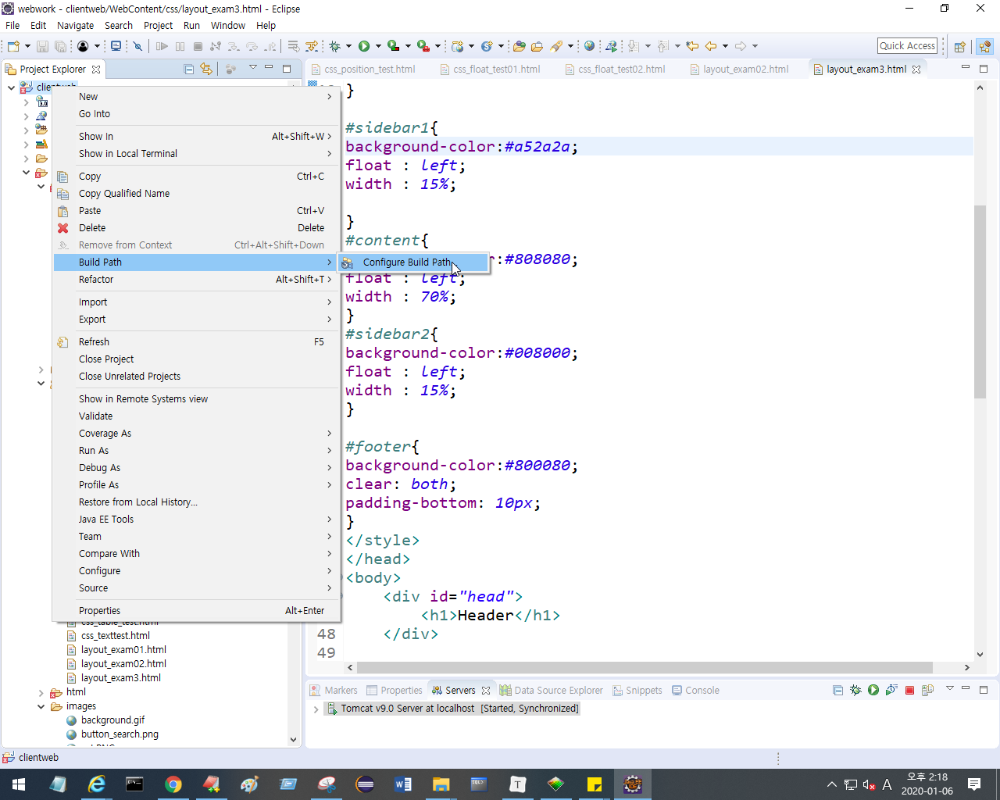
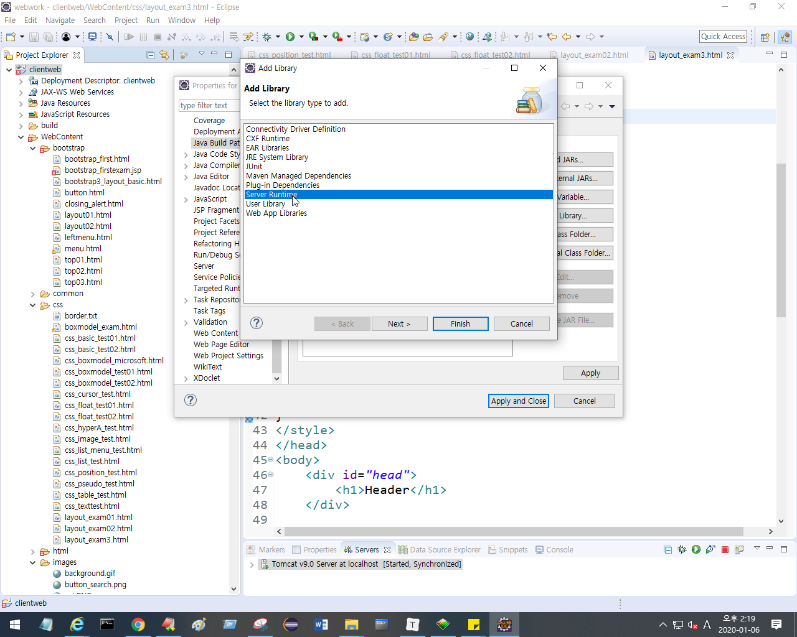
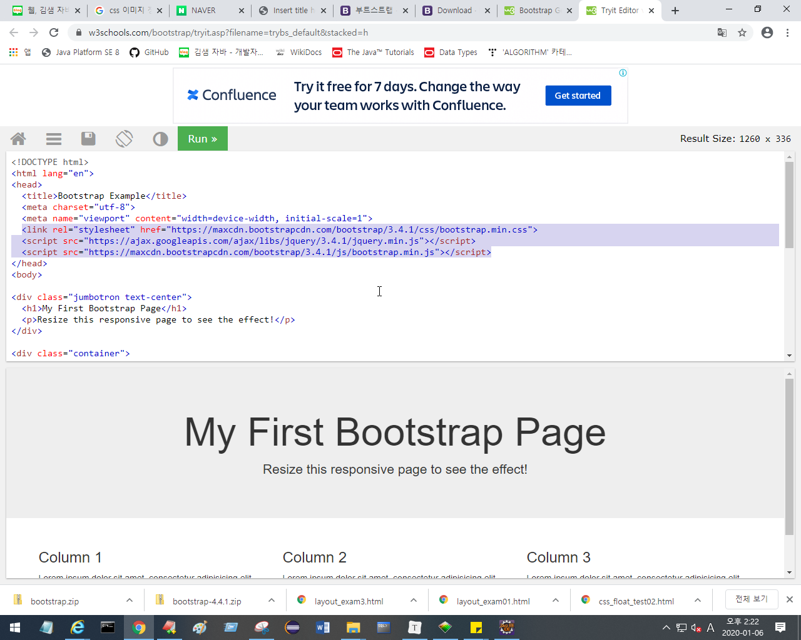
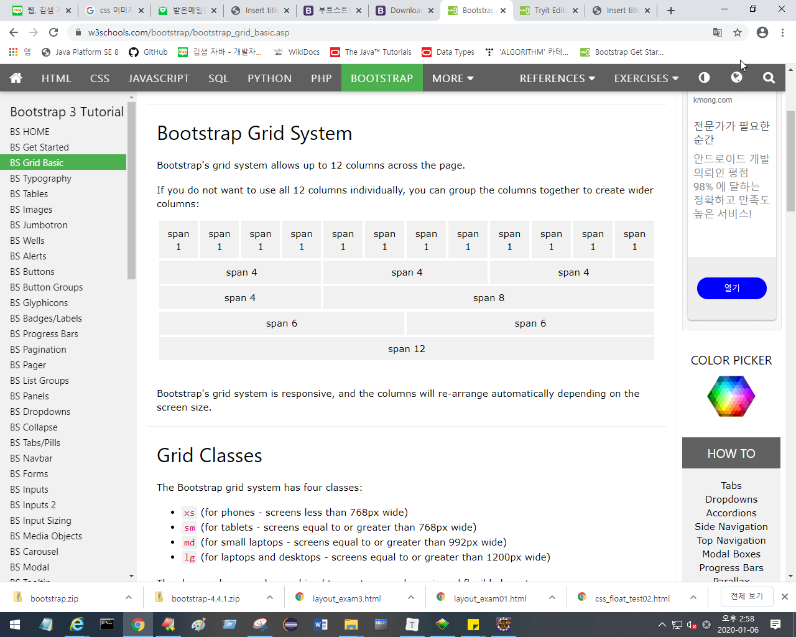
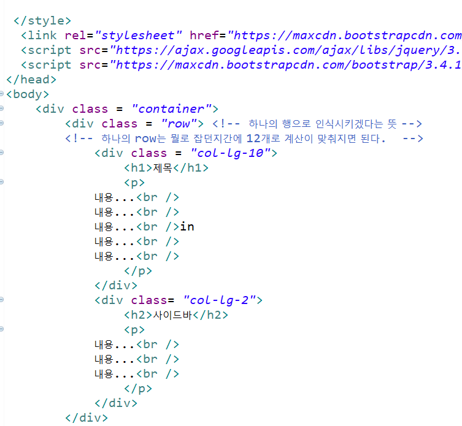
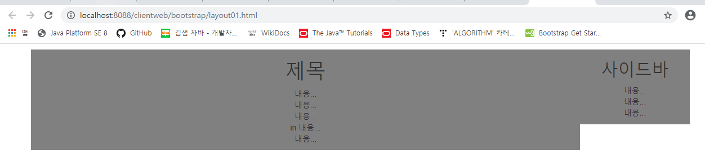
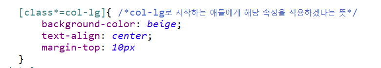

## 부트스트랩

html+css+javascript의 프레임워크

w3schools

내가 접속했던 사이트에 

여기서 top.js가

검색 기록 -> 파일보기 누르면 F12개발자도구에서 봤던 js파일이  여기 있다.
(자동으로 다운로드 되니까) 

따라서 어떤 사이트에서 사용하고 있는 css나 js파일명들 볼수 있다.

부트스트랩 링크 사용 장점 : 특정 서버에서 다운로드 받아서 쓰는 형식. 

이 서버들은 보통 부트스트랩을 만들어주는 회사거나, 

내가 어떤 사이트를 접속하려고 하는데, 이전에 접속한 다른 사이트와 같은 부트스트랩을 사용하는 경우 이미 다운로드 받아져있기 때문에, 다운로드 받는 시간을 줄일 수 있다.

---

## 부트스트랩 활용

### 대체적으로 class를 수정 추가 해주는 방식이다.

여기에 맞춰 쓰기

실행 결과

**`[]{  }` 생성자** : 해당 값으로 시작하는 것들에게 속성을 적용함.

**`offset`** : 건너뛴다는 뜻. 총 합이 12가 되어야하는데 offset값 합쳐서 12되면 된다. 

**`<nav>`** : html5부터추가된 시맨틱 태그. nav로 감싸진 것은, 이 곳이 메뉴라는 것을 알려준다. 

### 고도몰 : 무료 디자인 있음 

 